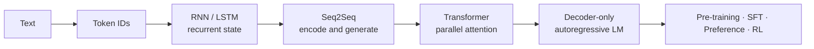

# Learning LLMs: from tokens to generation

[中文](README.md) · **English**

> Reading time: ~6 min · Type: learning map · Last reviewed: 2026-08

This is not a history of papers. It is a path you can actually finish: build intuition first, unpack the mathematics and module boundaries second, then verify each mechanism in code.

The path follows five questions. How does text become numbers? How can a sequence retain the past? How do input and output sequences align? How does attention move information in parallel? Why are modern language models usually decoder-only?

<div class="curriculum-hero">
  <div><span class="level-chip core">Core</span><strong>Build a usable mental model</strong><p>Each note focuses on the central computation, tensor shapes, and one defining limitation.</p></div>
  <div><span class="level-chip deep">Deep dive</span><strong>Enter the mathematics</strong><p>Trace gradients, masks, objectives, and the boundary between training and inference.</p></div>
  <div><span class="level-chip lab">Lab</span><strong>Verify it yourself</strong><p>Implement the same mechanisms with pure Python / NumPy and with PyTorch.</p></div>
</div>

## One path, end to end

<div class="learning-path">
  <a href="core/tokenization.en.md"><span>01</span><strong>Tokenization</strong><small>Turn strings into discrete IDs</small></a>
  <a href="core/recurrent-models.en.md"><span>02</span><strong>RNN → LSTM</strong><small>Compress the past into recurrent state</small></a>
  <a href="core/seq2seq.en.md"><span>03</span><strong>Seq2Seq</strong><small>Encode an input and generate an output</small></a>
  <a href="core/vanilla-transformer.en.md"><span>04</span><strong>Vanilla Transformer</strong><small>Replace recurrence with attention</small></a>
  <a href="core/decoder-only.en.md"><span>05</span><strong>Decoder-only LM</strong><small>Unify tasks as next-token prediction</small></a>
</div>



## Level one: core knowledge

<div class="curriculum-grid">
  <a class="curriculum-card" href="core/tokenization.en.md"><span class="card-step">01 · Input</span><h3>Tokenization</h3><p>Vocabulary, subwords, BPE, encode/decode, and why tokenization changes sequence length and cost.</p><b>Start →</b></a>
  <a class="curriculum-card" href="core/recurrent-models.en.md"><span class="card-step">02 · State</span><h3>RNN and LSTM</h3><p>Hidden state, vanishing memory, and what the LSTM gates actually control.</p><b>Start →</b></a>
  <a class="curriculum-card" href="core/seq2seq.en.md"><span class="card-step">03 · Mapping</span><h3>Seq2Seq</h3><p>Encoder–decoder, teacher forcing, generation, and why attention became necessary.</p><b>Start →</b></a>
  <a class="curriculum-card" href="core/vanilla-transformer.en.md"><span class="card-step">04 · Attention</span><h3>Vanilla Transformer</h3><p>The three attention sites, positional encoding, FFN, residuals, and masks.</p><b>Start →</b></a>
  <a class="curriculum-card" href="core/decoder-only.en.md"><span class="card-step">05 · Generation</span><h3>Decoder-only</h3><p>Causal language modeling, next-token loss, prefill, decode, KV cache, and sampling.</p><b>Start →</b></a>
</div>

After this level, you should be able to draw the complete path from text to logits without hiding behind terminology.

## Level two: deep dives

| Topic | What to understand | Question you can answer |
| --- | --- | --- |
| [Sequence gradients and gates](deep-dives/recurrent-dynamics.en.md) | BPTT, Jacobian products, vanishing / exploding gradients, LSTM cell state | Why is remembering first an optimization problem? |
| [Attention mathematics and shapes](transformer.en.md) | $Q/K/V$, masks, heads, RoPE, GQA, RMSNorm, SwiGLU | Which matrices are multiplied in one attention call? |
| [Language-model objectives and generation](deep-dives/language-model-objective.en.md) | causal loss, teacher forcing, exposure gap, sampling, cache | Why is training parallel while generation remains sequential? |

## Level three: build it

<div class="lab-matrix">
  <div><span>Without PyTorch</span><strong>See where every number comes from</strong><p>Pure Python BPE; NumPy RNN, LSTM, and scaled dot-product attention.</p><a href="code/README.en.md#without-pytorch-see-the-computation">Open labs →</a></div>
  <div><span>With PyTorch</span><strong>Make the same mechanism learn</strong><p>Manual modules, autograd, seq2seq training, and Transformer causal/cache checks.</p><a href="code/README.en.md#with-pytorch-make-it-learn">Open labs →</a></div>
</div>

```bash
cd 00-foundations/code
python tokenizer_from_scratch.py
python sequence_numpy.py
python sequence_torch.py
python test_learning_path.py
```

## How to use the curriculum

- **Fast understanding:** read core notes 01 → 05 and skip every deep-dive block.
- **Research or interview preparation:** after each core note, write the central equation, label every tensor shape, and explain which earlier bottleneck the architecture removes.
- **Implementation:** run the framework-free version before PyTorch. Handling hidden state, causal masks, and cache positions once makes many “training instability” bugs much less mysterious.

The next stage is [Post-training](../05-post-training/README.en.md). For models that must gather external evidence, continue with [Search](../04-search/README.en.md).
