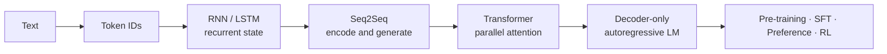

# Learning LLMs: from tokens to generation

[中文](README.md) · **English**

> Reading time: ~7 min · Type: learning map · Last reviewed: 2026-09

I have never much liked tutorials that open with the big Transformer block diagram: every box looks familiar, yet when you actually have to walk from a piece of text to the next token, it is easy to get lost somewhere in the middle.

So this is not ordered by paper year, and it is in no hurry to pile up today's most fashionable components. I want to take things apart slowly along **a path you can actually walk end to end**: how text first becomes numbers, how a sequence remembers the past, how input and output align, why attention replaced recurrence, and only at the end today's decoder-only large models. Intuition first, then the mathematics, and finally a check in code.

<div class="curriculum-hero">
  <div><span class="level-chip core">Core</span><strong>First know why it appeared</strong><p>Each page holds on to just the central computation, the tensor shapes, and where exactly the previous generation got stuck.</p></div>
  <div><span class="level-chip deep">Deep dive</span><strong>Dig further when something feels off</strong><p>Derive gradients, take masks apart, and see how the training objective connects to the inference path.</p></div>
  <div><span class="level-chip deep">Advanced</span><strong>Read model families sideways</strong><p>Not a list of brands: compare architecture, training, inference cost, and behaviour through one lens.</p></div>
  <div><span class="level-chip lab">Lab</span><strong>Don't just trust the diagram; run it once yourself</strong><p>The same mechanism written once in pure Python / NumPy and once in PyTorch.</p></div>
</div>

## One path, end to end

<div class="learning-path">
  <a href="core/tokenization.en.md"><span>01</span><strong>Tokenization</strong><small>How a string becomes discrete IDs the model can process</small></a>
  <a href="core/recurrent-models.en.md"><span>02</span><strong>RNN → LSTM</strong><small>Use a hidden state to compress the past into one recurrent computation</small></a>
  <a href="core/seq2seq.en.md"><span>03</span><strong>Seq2Seq</strong><small>The encoder understands the input; the decoder generates the output step by step</small></a>
  <a href="core/vanilla-transformer.en.md"><span>04</span><strong>Vanilla Transformer</strong><small>Replace recurrence with self-attention and cross-attention</small></a>
  <a href="core/decoder-only.en.md"><span>05</span><strong>Decoder-only LM</strong><small>Unify every task as next-token prediction</small></a>
</div>



## Level one: what you must know

<div class="curriculum-grid">
  <a class="curriculum-card" href="core/tokenization.en.md"><span class="card-step">01 · Input</span><h3>Tokenization</h3><p>A model cannot see text. Start by watching how a sentence is split, numbered, and then turned into vectors.</p><b>Read →</b></a>
  <a class="curriculum-card" href="core/recurrent-models.en.md"><span class="card-step">02 · State</span><h3>RNN and LSTM</h3><p>If you can only read left to right, what state should hold the past? And why does a plain RNN forget so easily?</p><b>Read →</b></a>
  <a class="curriculum-card" href="core/seq2seq.en.md"><span class="card-step">03 · Mapping</span><h3>Seq2Seq</h3><p>How one input sequence becomes an output of a different length, and why attention became a necessary mechanism.</p><b>Read →</b></a>
  <a class="curriculum-card" href="core/vanilla-transformer.en.md"><span class="card-step">04 · Attention</span><h3>Vanilla Transformer</h3><p>Use the 2017 original to see where the inputs of its three attention sites come from and what each one does, then understand the modern variants.</p><b>Read →</b></a>
  <a class="curriculum-card" href="core/decoder-only.en.md"><span class="card-step">05 · Generation</span><h3>Decoder-only</h3><p>Once the prompt and the answer sit in one sequence, why a single next-token loss is enough.</p><b>Read →</b></a>
</div>

After this level, the ideal state is not being able to recite terms. It is being able to take a blank sheet of paper and draw the whole way from text to logits, knowing why every step in between is there.

## Beyond the main line: two advanced routes

Once the main line is clear, you can continue in two directions. One goes inward into equations, gradients, and execution paths. The other goes sideways across model families to compare different solutions to the same problem. They meet again at systems cost and evaluation.

### 1. Dig into mechanisms

| Topic | What you really need to understand | What you can answer afterwards |
| --- | --- | --- |
| [From linear models to neural networks](from-linear-to-neural.en.md) | Sigmoid / Softmax / ReLU / Tanh, feature maps, backpropagation, XOR | Why are the four functions not interchangeable? What does nonlinearity actually change? |
| [Sequence gradients and gates](deep-dives/recurrent-dynamics.en.md) | BPTT, Jacobian products, vanishing / exploding gradients, LSTM cell state | Why is "being able to remember" first of all an optimization problem? |
| [Attention mathematics and shapes](transformer.en.md) | $Q/K/V$, masks, multiple heads, RoPE, GQA, RMSNorm, SwiGLU | Which matrices does one attention call actually multiply? |
| [Language-model objectives and generation](deep-dives/language-model-objective.en.md) | causal loss, teacher forcing, exposure gap, sampling, cache | Training computes everything in one parallel pass; why does generation still go token by token? |

### 2. Read model families sideways

Once you know the Transformer's parts, the next step is not to memorise more model names. It is to ask: **why did this family change this component, where did the cost move, and which training and evaluation choices made the capability real?**

<div class="curriculum-grid">
  <a class="curriculum-card" href="model-families/llama.en.md"><span class="card-step">Dense baseline</span><h3>Llama</h3><p>Use the modern dense decoder as a baseline: restrained architecture, with much of the story in data, scale, and the full post-training pipeline.</p><b>Deep dive →</b></a>
  <a class="curriculum-card" href="model-families/qwen.en.md"><span class="card-step">One family, many modes</span><h3>Qwen</h3><p>See how one family spans dense and MoE models, many sizes, and thinking and non-thinking inference modes.</p><b>Deep dive →</b></a>
  <a class="curriculum-card" href="model-families/deepseek.en.md"><span class="card-step">Co-design</span><h3>DeepSeek</h3><p>Read MLA, MoE, the training system, and reasoning post-training as one cost–capability chain.</p><b>Deep dive →</b></a>
  <a class="curriculum-card" href="model-families/gemma.en.md"><span class="card-step">Compact & multimodal</span><h3>Gemma</h3><p>Start from smaller models and deployment constraints, then connect local/global attention, distillation, and vision.</p><b>Deep dive →</b></a>
</div>

Start with the [model-family map](model-families/README.en.md) for the reading method. To compare exactly what changes inside the block, open the [interactive architecture map](transformer-lab.en.md#tx-arch).

## Interview quick reference

| Topic | Focus |
| --- | --- |
| [ML interview mathematics: the main line](ml-math-interview.en.md) | Softmax / CE / LSE, L1 / L2, Bias–Variance, MLE / MAP, BLUE |
| [Whiteboard hand-writing kit](hand-write-kit.en.md) | stable implementations, gradients, and numerical checks |
| [Interview basics](interview-basics.en.md) | attention, normalization, training vs. inference, Egg Drop, and tree DP |

You can skip the advanced material at first. These chapters stay because, when a model misbehaves, these details are usually exactly what you need to locate: where the gradient broke, whom the mask wrongly hid, and why training and generation fail to line up.

## Build it yourself: make the understanding run

<div class="lab-matrix">
  <div><span>Without PyTorch</span><strong>See where every number comes from</strong><p>BPE in pure Python; RNN, LSTM, and scaled dot-product attention in NumPy.</p><a href="code/README.en.md#stage-one-verify-the-computation-with-pure-python-and-numpy">Open labs →</a></div>
  <div><span>With PyTorch</span><strong>Make the same mechanism actually learn</strong><p>Implement the modules yourself, use autograd, train seq2seq, and verify the Transformer's causality and KV cache.</p><a href="code/README.en.md#stage-two-train-it-with-pytorch">Open labs →</a></div>
</div>

```bash
cd 00-foundations/code
python tokenizer_from_scratch.py
python sequence_numpy.py
python sequence_torch.py
python test_learning_path.py
```

## How to use this material

Every note opens with the same card: what problem this section solves, which prerequisites it needs, what the core mechanism is, and where mistakes are most likely. After the body come a runnable experiment, a set of questions interviewers often ask, and a few self-checks. That way, when you reach a new architecture you don't have to readjust to a new way of telling it; you only compare: **which part did it swap out, why, and which problem of the previous version did that solve.**

### I just want to understand the main line first

Read the core notes 01 → 05 and ignore every **deeper** collapsible block and all the code. In about an hour you can build the complete main line.

### I want to be able to explain it, not just to have "heard of it"

After each core node, read the matching deep-dive page and do three things: write out the central equation, label every tensor shape, and say which bottleneck of the previous generation the architecture removes.

### I want to understand a new model report

Use the six questions in the [model family deep dives](model-families/README.en.md) as your skeleton, then return to the interactive diagram to compare blocks. Do not copy the parameter table first; decide whether the real change is in architecture, training, post-training, inference, or evaluation.

### I want to write it by hand until it breaks

Run the framework-free version first, then the PyTorch version. Don't start by calling high-level APIs; if you have never handled hidden state, a causal mask, and cache positions by hand even once, a lot of bugs will all look like "training instability."

## Where this path finally leads

Only once the base model has been trained does the question move from "how does it predict the next token" to "how do we make it fit tasks, preferences, and real feedback better." The next stop is [Post-Training](../05-post-training/README.en.md); if you care about how a model finds external evidence, continue with [Search](../04-search/README.en.md).
