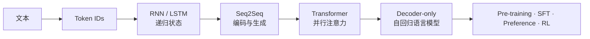

# 大模型学习：从 Token 到生成

**中文** · [English](README.en.md)

> 阅读时间：约 6 分钟 · 类型：学习地图 · 最近审阅：2026-08

这不是一份按论文年份排列的历史课，而是一条**可以真正走完的学习路径**：先建立直觉，再拆数学与模块，最后用代码把每个关键机制跑起来。

目标不是背出 Transformer 的所有组件，而是回答五个逐层递进的问题：文本怎样变成数字？序列怎样保留过去？输入和输出怎样对齐？注意力怎样并行搬运信息？为什么今天的大语言模型几乎都是 decoder-only？

<div class="curriculum-hero">
  <div><span class="level-chip core">必修</span><strong>先建立一张能用的心智地图</strong><p>每页只抓住核心计算、张量形状和一个最重要的局限。</p></div>
  <div><span class="level-chip deep">进阶</span><strong>再进入数学和组件边界</strong><p>推梯度、拆 mask、看训练目标与推理路径怎样连接。</p></div>
  <div><span class="level-chip lab">实验</span><strong>最后亲手验证</strong><p>同一个机制分别用纯 Python / NumPy 与 PyTorch 实现。</p></div>
</div>

## 一条主线走到底

<div class="learning-path">
  <a href="core/tokenization.md"><span>01</span><strong>Tokenization</strong><small>字符串怎样变成模型能处理的离散 ID</small></a>
  <a href="core/recurrent-models.md"><span>02</span><strong>RNN → LSTM</strong><small>用隐藏状态把过去压进一个递归计算</small></a>
  <a href="core/seq2seq.md"><span>03</span><strong>Seq2Seq</strong><small>encoder 理解输入，decoder 逐步生成输出</small></a>
  <a href="core/vanilla-transformer.md"><span>04</span><strong>Vanilla Transformer</strong><small>用 self-attention 与 cross-attention 取代递归</small></a>
  <a href="core/decoder-only.md"><span>05</span><strong>Decoder-only LM</strong><small>把所有任务统一成 next-token prediction</small></a>
</div>



## 第一层：必须知道

<div class="curriculum-grid">
  <a class="curriculum-card" href="core/tokenization.md"><span class="card-step">01 · Input</span><h3>Tokenization</h3><p>词表、subword、BPE、encode/decode，以及 tokenizer 为什么会改变序列长度和计算成本。</p><b>开始 →</b></a>
  <a class="curriculum-card" href="core/recurrent-models.md"><span class="card-step">02 · State</span><h3>RNN 与 LSTM</h3><p>隐藏状态是什么，为什么普通 RNN 忘得太快，LSTM 的门到底在控制什么。</p><b>开始 →</b></a>
  <a class="curriculum-card" href="core/seq2seq.md"><span class="card-step">03 · Mapping</span><h3>Seq2Seq</h3><p>encoder–decoder、teacher forcing、训练与生成的差别，以及 attention 为什么必然出现。</p><b>开始 →</b></a>
  <a class="curriculum-card" href="core/vanilla-transformer.md"><span class="card-step">04 · Attention</span><h3>Vanilla Transformer</h3><p>原版 encoder–decoder 的三处注意力、位置编码、FFN、残差与 mask。</p><b>开始 →</b></a>
  <a class="curriculum-card" href="core/decoder-only.md"><span class="card-step">05 · Generation</span><h3>Decoder-only</h3><p>因果语言模型、next-token loss、prefill、decode、KV cache 与采样。</p><b>开始 →</b></a>
</div>

读完这一层，你应该能不用术语堆砌，画出从文本到 logits 的完整数据流。

## 第二层：进阶拆解

| 专题 | 真正要弄懂的东西 | 读完能回答 |
| --- | --- | --- |
| [序列梯度与门控](deep-dives/recurrent-dynamics.md) | BPTT、Jacobian 连乘、梯度消失 / 爆炸、LSTM cell state | 为什么“能记住”首先是一个优化问题？ |
| [注意力的数学与形状](transformer.md) | $Q/K/V$、mask、多头、RoPE、GQA、RMSNorm、SwiGLU | 一次 attention 到底乘了哪些矩阵？ |
| [语言模型目标与生成](deep-dives/language-model-objective.md) | causal loss、teacher forcing、exposure gap、sampling、cache | 训练时一次并行算完，为什么生成时仍要逐 token？ |

进阶内容默认可以折叠或跳过。它们不是“更高级的术语”，而是用来解释**模型什么时候会坏、为什么会坏**。

## 第三层：手搓实验

<div class="lab-matrix">
  <div><span>不调用 PyTorch</span><strong>看清每个数字从哪来</strong><p>纯 Python 写 BPE；NumPy 写 RNN、LSTM 与 scaled dot-product attention。</p><a href="code/README.md#不用-pytorch先看清计算">查看实验 →</a></div>
  <div><span>调用 PyTorch</span><strong>让同一机制真的学起来</strong><p>手写 module、自动求导、训练 seq2seq，并验证 Transformer 的因果性与 KV cache。</p><a href="code/README.md#用-pytorch让它真正训练">查看实验 →</a></div>
</div>

```bash
cd 00-foundations/code
python tokenizer_from_scratch.py
python sequence_numpy.py
python sequence_torch.py
python test_learning_path.py
```

## 怎样使用这套内容

### 只想快速理解

按 01 → 05 读“必修”，忽略所有 **进阶** 折叠块和代码。大约一小时可以建立完整主线。

### 想准备研究或面试

每读完一个必修节点，就去读对应进阶页，并做到三件事：写出核心公式、标出每个张量形状、说出该架构解决了前一代的哪个瓶颈。

### 想真正实现

先跑无框架版本，再跑 PyTorch 版本。不要一开始就调用高层 API；如果你没亲手处理过一次 hidden state、causal mask 和 cache position，很多 bug 看起来都会像“训练不稳定”。

## 这条路最终接到哪里

基础模型训练完成后，问题才从“它怎样预测下一个 token”转向“怎样让它更符合任务、偏好和真实反馈”。下一站是 [Post-Training](../05-post-training/)；如果关心模型怎样寻找外部证据，则继续读 [Search](../04-search/)。
