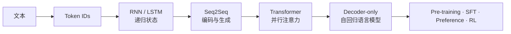

# 大模型学习：从 Token 到生成

**中文** · [English](README.en.md)

> 阅读时间：约 6 分钟 · 类型：学习地图 · 最近审阅：2026-08

我一直不太喜欢那种一上来就画 Transformer 大框图的教程：每个方块似乎都认识，真让你从一段文字走到下一个 token，却很容易在中间迷路。

所以这里不按论文年份排，也不急着堆今天最流行的组件。我想沿着一条**真的能走通的路**慢慢拆：文本先怎样变成数字，序列怎样记住过去，输入和输出怎样对齐，attention 为什么取代递归，最后才到今天的 decoder-only 大模型。先有直觉，再补数学，最后用代码验一遍。

<div class="curriculum-hero">
  <div><span class="level-chip core">必修</span><strong>先知道它为什么会出现</strong><p>每页只抓住核心计算、张量形状，以及上一代到底卡在哪里。</p></div>
  <div><span class="level-chip deep">进阶</span><strong>觉得“不对劲”时再往下挖</strong><p>推梯度、拆 mask，看训练目标和推理路径是怎么接上的。</p></div>
  <div><span class="level-chip lab">实验</span><strong>别只相信图，自己跑一次</strong><p>同一个机制分别用纯 Python / NumPy 与 PyTorch 写出来。</p></div>
</div>

## 一条主线走到底

<div class="learning-path">
  <a href="core/tokenization.md"><span>01</span><strong>Tokenization</strong><small>字符串怎样变成模型能处理的离散 ID</small></a>
  <a href="core/recurrent-models.md"><span>02</span><strong>RNN → LSTM</strong><small>用隐藏状态把过去压进一个递归计算</small></a>
  <a href="core/seq2seq.md"><span>03</span><strong>Seq2Seq</strong><small>encoder 理解输入，decoder 逐步生成输出</small></a>
  <a href="core/vanilla-transformer.md"><span>04</span><strong>Vanilla Transformer</strong><small>用 self-attention 与 cross-attention 取代递归</small></a>
  <a href="core/decoder-only.md"><span>05</span><strong>Decoder-only LM</strong><small>把所有任务统一成 next-token prediction</small></a>
</div>



## 第一层：必须知道

<div class="curriculum-grid">
  <a class="curriculum-card" href="core/tokenization.md"><span class="card-step">01 · Input</span><h3>Tokenization</h3><p>模型看不见文字。先看看一句话怎样被切分、编号，再变成向量。</p><b>阅读 →</b></a>
  <a class="curriculum-card" href="core/recurrent-models.md"><span class="card-step">02 · State</span><h3>RNN 与 LSTM</h3><p>如果只能从左往右读，过去该保存在什么状态里？普通 RNN 又为什么容易遗忘？</p><b>阅读 →</b></a>
  <a class="curriculum-card" href="core/seq2seq.md"><span class="card-step">03 · Mapping</span><h3>Seq2Seq</h3><p>一段输入怎样变成另一段不同长度的输出，以及 attention 为什么会成为必要机制。</p><b>阅读 →</b></a>
  <a class="curriculum-card" href="core/vanilla-transformer.md"><span class="card-step">04 · Attention</span><h3>Vanilla Transformer</h3><p>先从 2017 原版看清三处 attention 的输入来源和作用，再理解现代变体。</p><b>阅读 →</b></a>
  <a class="curriculum-card" href="core/decoder-only.md"><span class="card-step">05 · Generation</span><h3>Decoder-only</h3><p>把 prompt 和答案放进同一条序列后，为什么一个 next-token loss 就足够。</p><b>阅读 →</b></a>
</div>

读完这一层，最理想的状态不是会背名词，而是能拿一张白纸，把文字一路画到 logits，中间每一步都知道为什么在那里。

## 第二层：进阶拆解

| 专题 | 真正要弄懂的东西 | 读完能回答 |
| --- | --- | --- |
| [序列梯度与门控](deep-dives/recurrent-dynamics.md) | BPTT、Jacobian 连乘、梯度消失 / 爆炸、LSTM cell state | 为什么“能记住”首先是一个优化问题？ |
| [注意力的数学与形状](transformer.md) | $Q/K/V$、mask、多头、RoPE、GQA、RMSNorm、SwiGLU | 一次 attention 到底乘了哪些矩阵？ |
| [语言模型目标与生成](deep-dives/language-model-objective.md) | causal loss、teacher forcing、exposure gap、sampling、cache | 训练时一次并行算完，为什么生成时仍要逐 token？ |

## 面试速查

| 专题 | 重点 |
| --- | --- |
| [ML 数学面试主线](ml-math-interview.md) | Softmax / CE / LSE、L1 / L2、Bias–Variance、MLE / MAP、BLUE |
| [白板手写工具箱](hand-write-kit.md) | 稳定实现、梯度与数值检查 |
| [面试基础题](interview-basics.md) | attention、normalization、训练与推理、Egg Drop 与树上 DP |

进阶内容可以先跳过。保留这些章节，是因为模型出现问题时，真正需要定位的往往正是这些细节：梯度从哪里断了、mask 遮错了谁、训练和生成为什么对不上。

## 第三层：从零实现实验

<div class="lab-matrix">
  <div><span>不调用 PyTorch</span><strong>看清每个数字从哪来</strong><p>纯 Python 写 BPE；NumPy 写 RNN、LSTM 与 scaled dot-product attention。</p><a href="code/README.md#不用-pytorch先看清计算">查看实验 →</a></div>
  <div><span>调用 PyTorch</span><strong>让同一机制真的学起来</strong><p>自行实现 module、使用自动求导、训练 seq2seq，并验证 Transformer 的因果性与 KV cache。</p><a href="code/README.md#用-pytorch让它真正训练">查看实验 →</a></div>
</div>

```bash
cd 00-foundations/code
python tokenizer_from_scratch.py
python sequence_numpy.py
python sequence_torch.py
python test_learning_path.py
```

## 怎样使用这套内容

每一篇都用同一张卡片开头：这一节解决什么问题、需要哪些前置知识、核心机制是什么、最容易错在哪；正文之后是一个可以运行的实验、一组面试常问的问题，和几道自检。这样读到新架构时不用重新适应讲法，只需要比较：**它换掉了哪个部件，为什么换，又解决了上一版的什么问题。**

### 我只想先把主线看懂

按 01 → 05 读“必修”，忽略所有 **进阶** 折叠块和代码。大约一小时可以建立完整主线。

### 我想把它讲清楚，而不只是“听说过”

每读完一个必修节点，就去读对应进阶页，并做到三件事：写出核心公式、标出每个张量形状、说出该架构解决了前一代的哪个瓶颈。

### 我想亲手写到它出 bug

先跑无框架版本，再跑 PyTorch 版本。不要一开始就调用高层 API；如果你没亲手处理过一次 hidden state、causal mask 和 cache position，很多 bug 看起来都会像“训练不稳定”。

## 这条路最终接到哪里

基础模型训练完成后，问题才从“它怎样预测下一个 token”转向“怎样让它更符合任务、偏好和真实反馈”。下一站是 [Post-Training](../05-post-training/)；如果关心模型怎样寻找外部证据，则继续读 [Search](../04-search/)。
