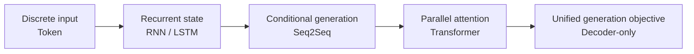

# Core knowledge: from tokens to generation

[中文](README.md) · **English**

This level does not yet try to derive every formula to the bottom. I would rather answer three plain questions first: **what is it actually computing, why was it needed at the time, and what trouble did it leave for the next generation.**

If all you can remember after reading a page is one name, then I did not explain it well; ideally you can see the data actually flowing through in your head.

1. [Tokenization](tokenization.en.md): string → token → ID → embedding.
2. [RNN and LSTM](recurrent-models.en.md): carry the past in a recurrent state, and how gating mitigates forgetting.
3. [Seq2Seq](seq2seq.en.md): separate encoding the input from generating the output; attention reads the input dynamically.
4. [Vanilla Transformer](vanilla-transformer.en.md): delete recurrence and exchange information in parallel with attention.
5. [Decoder-only](decoder-only.en.md): unify tasks as causal next-token prediction.

Once the main line makes sense, go to the [deep dives](../deep-dives/README.en.md) to fill in the math; if you prefer to run code first, go straight to the [build-it-yourself labs](../code/README.en.md).
