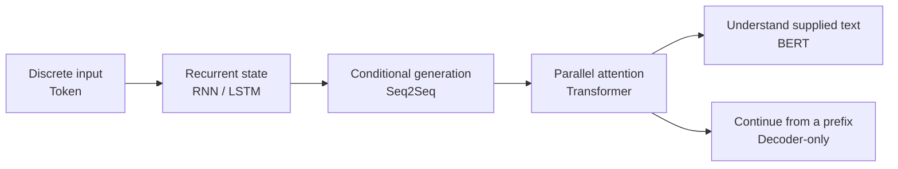

# Core knowledge: from tokens to generation

[中文](README.md) · **English**

Before deriving every formula, start with three questions: **what does this component compute, why does it work this way, and what does it leave unresolved?**

After each note, try following one sentence through the computation. Explaining that path is more useful than remembering a list of model names.

1. [Tokenization](tokenization.en.md): split text into units, assign IDs, then map them to vectors the model can compute with.
2. [Recurrent networks: RNN and LSTM](recurrent-models.en.md): update a state as the input arrives; LSTM gates control what to keep and forget.
3. [Sequence-to-sequence (Seq2Seq)](seq2seq.en.md): encode the input, then generate the output; attention lets each step revisit relevant inputs.
4. [Vanilla Transformer](vanilla-transformer.en.md): replace recurrent state updates with attention between positions.
5. After the Transformer, choose a task: [BERT](bert.en.md) restores hidden tokens using both contexts and fine-tunes for tasks such as classification; [Decoder-only](decoder-only.en.md) generates from a prefix, one token at a time.

```mermaid
flowchart LR
    A["Discrete input<br/>Token"] --> B["Recurrent state<br/>RNN / LSTM"]
    B --> C["Conditional generation<br/>Seq2Seq"]
    C --> D["Parallel attention<br/>Transformer"]
    D --> E["Understand supplied text<br/>BERT"]
    D --> F["Continue from a prefix<br/>Decoder-only"]
```

Once the main line makes sense, go to the [deep dives](../deep-dives/README.en.md) to fill in the math; if you prefer to run code first, go straight to the [build-it-yourself labs](../code/README.en.md).

## Fill in unfamiliar foundations

- [Embeddings and similarity](embeddings-and-similarity.en.md): distinguish input embeddings, hidden states, and retrieval vectors; compare dot product with cosine.
- [FFN and SwiGLU](ffn-and-gates.en.md): follow feature transformations after attention, gate gradients, and matched parameter budgets.
- [One training step](../deep-dives/training-step.en.md): connect tokens, masks, loss, and parameter updates in one computation.
- [CLIP alignment](../../03-multimodal-learning/clip.en.md): apply these ideas to images and text with a 3 × 3 example.
