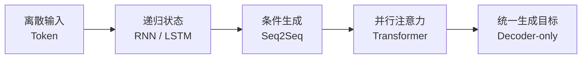

# 必修知识：从 Token 到生成

**中文** · [English](README.en.md)

这一层只建立主线：每页回答“它在算什么、解决了什么、留下了什么问题”。公式只保留理解数据流所需的最小集合。

1. [Tokenization](tokenization.md)：字符串 → token → ID → embedding。
2. [RNN 与 LSTM](recurrent-models.md)：用递归状态携带过去，以及门控怎样缓解遗忘。
3. [Seq2Seq](seq2seq.md)：把输入编码与输出生成分开，attention 动态读取输入。
4. [Vanilla Transformer](vanilla-transformer.md)：删除 recurrence，用注意力并行交换信息。
5. [Decoder-only](decoder-only.md)：把任务统一成 causal next-token prediction。

读完后再进入 [进阶拆解](../deep-dives/) 或直接去 [手搓实验](../code/)。
