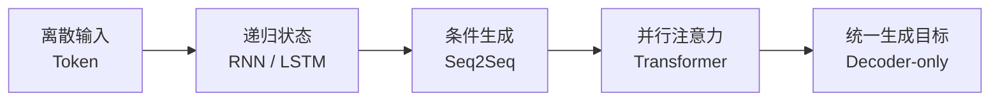

# 必修知识：从 Token 到生成

**中文** · [English](README.en.md)

这一层先不追求把每个公式都推到底。我更想先回答三个朴素问题：**它在算什么，为什么需要这样做，还有哪些问题没解决。**

如果一页读完只能记住一个名词，那就算我没讲好；最好是你能在脑子里看到数据真的流过去。

1. [Tokenization](tokenization.md)：字符串 → token → ID → embedding。
2. [RNN 与 LSTM](recurrent-models.md)：用隐藏状态保存历史信息，看看门控怎样帮助保留这些信息。
3. [Seq2Seq](seq2seq.md)：把输入编码与输出生成分开，attention 动态读取输入。
4. [Vanilla Transformer](vanilla-transformer.md)：不再按时间步递推，改用 attention 让各个位置交换信息。
5. [Decoder-only](decoder-only.md)：把任务统一成 causal next-token prediction。

理解主线以后，可以去 [进阶拆解](../deep-dives/) 补数学；如果更喜欢先运行代码，也可以直接进入 [从零实现实验](../code/)。
