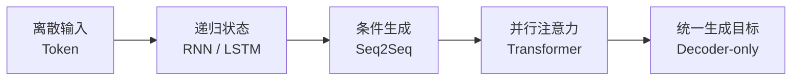

# 必修知识：从 Token 到生成

**中文** · [English](README.en.md)

这一部分不急着推完每个公式，先回答三个问题：**它在算什么，为什么这样算，还有什么没解决。**

读完以后，试着拿一句话当输入，说说它经过了哪些计算。能把这个过程讲出来，就不只是记住几个名词了。

1. [文本切分（Tokenization）](tokenization.md)：把文字切成小单元，编号后再映射成模型能计算的向量。
2. [循环神经网络：RNN 与 LSTM](recurrent-models.md)：边读边更新一份状态；LSTM 用门控决定保留和忘掉哪些信息。
3. [序列到序列（Seq2Seq）](seq2seq.md)：先理解输入，再逐步生成输出；注意力让模型每一步都能回看相关输入。
4. [原始 Transformer](vanilla-transformer.md)：不再逐步传递一个状态，改用注意力让不同位置交换信息。
5. [仅解码器模型（Decoder-only）](decoder-only.md)：根据前面的内容预测下一个单元，一步步生成完整文本。

```mermaid
flowchart LR
    A["离散输入<br/>Token"] --> B["递归状态<br/>RNN / LSTM"]
    B --> C["条件生成<br/>Seq2Seq"]
    C --> D["并行注意力<br/>Transformer"]
    D --> E["统一生成目标<br/>Decoder-only"]
```

理解主线以后，可以去 [进阶拆解](../deep-dives/) 补数学；如果更喜欢先运行代码，也可以直接进入 [从零实现实验](../code/)。

## 不太熟的基础，先在这里补

- [向量与相似度](embeddings-and-similarity.md)：输入 embedding、hidden state 和检索向量有什么区别，点积为什么不等于余弦。
- [FFN 与 SwiGLU](ffn-and-gates.md)：attention 之后怎样变换特征，门控的梯度和参数预算怎样算。
- [一次训练怎么走](../deep-dives/training-step.md)：把 token、mask、loss 和参数更新连成一次完整计算。
- [CLIP 图文对齐](../../03-multimodal-learning/clip.md)：用一个 3 × 3 的例子，看看这些基础怎样用到图片和文字上。
