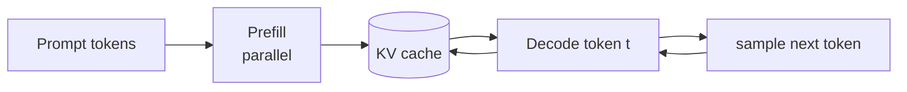

# Decoder-only: autoregressive generation

[中文](decoder-only.md) · **English**

> Reading time: ~28 min · Level: core · Last reviewed: 2026-08

<div class="lesson-recipe">
  <div><span>Problem</span><strong>Unify understanding, conditional generation, and dialogue as next-token prediction</strong></div>
  <div><span>Prerequisites</span><strong>One token stream · causal mask · target shift</strong></div>
  <div><span>Core mechanism</span><strong>LM loss · prefill · KV cache · sampling</strong></div>
  <div><span>Common mistake</span><strong>Assuming parallel training means generation can also be parallel</strong></div>
</div>

## Quick learning: the complete generation path of a modern LLM

<details class="interview" markdown="1">
<summary>From messages to logits, then to KV-cached decode</summary>

**Quick memory**: a chat template lays every role out in one sequence; a causal Transformer predicts the next token at every position; prefill processes the prompt in parallel, and decode adds one token per step while reusing the KV cache.

**Interview answer**

> A decoder-only model serializes system, user, assistant, and tool messages into one context and uses causal self-attention so that every position sees only what is to its left. Training does next-token prediction at all positions in parallel; inference first prefills the prompt and then decodes token by token, caching each layer's historical K/V to avoid repeating the projections.

<details markdown="1">
<summary><b>Deep dive</b>: what does the KV cache store, and why not Q?</summary>

The K/V of historical tokens are read again by every future query, so once they are cached, K/V only have to be computed once, for the new token. A query is used only by the current token to issue its read; the next step produces a new query, so there is nothing to reuse across steps. The cache optimizes computation without changing attention semantics, and the incremental result must be equivalent to a full causal forward pass.

</details>
</details>

## Everything goes into one sequence

Put the instruction, the context, and the answer into one token sequence, block the future with a causal mask, and then have every position do exactly one thing: guess the next token. This is what I find most appealing about decoder-only: the structure ends up more uniform than encoder–decoder.

## A sequence is its own training data

Given a token sequence $x_1,\ldots,x_T$:

$$\mathcal{L}_{\text{LM}}=-\sum_{t=1}^{T-1}\log p_\theta(x_{t+1}\mid x_{\le t})$$

Inputs and labels are the same sequence, offset by one position:

```text
input:   [BOS,   today, the,     weather, is]
target:  [today, the,   weather, is,      nice]
```

Every position supplies one unit of supervision, so large-scale unlabeled text naturally turns into training examples.

## Why the encoder can be dropped

Just chain the “input” and the “output” into the same sequence:

```text
[system] ... [user] question [assistant] answer
```

Answer tokens can see the prompt to their left through self-attention; prompt tokens have no need to see the future answer. The conditioning that encoder–decoder expressed with two modules is now expressed by the causal sequence itself.

This does not mean encoders have no value. Bidirectional representations, classification, and some retrieval tasks still commonly use an encoder. The advantage of decoder-only is that **one objective unifies pre-training, conditional generation, and dialogue**.

## From messages to single-turn or multi-turn generation

### 1. Inference: the final assistant marker is the generation boundary

After the user submits structured messages, the application uses a
[chat template and tokenizer](tokenization.en.md) to create token IDs with role boundaries.
A typical prompt ends at the assistant-start marker:

```text
<system> You are helpful <end>
<user> How are you? <end>
<assistant>
```

The model then repeats one loop: predict the next token, append it to the context, and
predict again. Generation stops on an end-of-message or EOS token, another configured
stop condition, or a maximum-length limit.

```text
<assistant> → I → am fine → . → <end>
```

Role structure does not change the decoder equation. It makes “whose turn is next” part
of the token context while the model continues ordinary causal next-token prediction.

### 2. Multi-turn dialogue is a longer left context

For the second response, the sequence usually contains the system message, first user
turn, first assistant turn, second user turn, and a new assistant-start marker. Causal
attention can read every untruncated token to the left, so the new response can remain
consistent with earlier dialogue.

This is not permanent memory independent of the input. If history is not placed back in
the prompt, the current forward pass cannot see it. When the sequence exceeds the
context window, the application must truncate, summarize, or recover important facts
through retrieval or external memory.

KV cache stores already-computed K/V for the **current inference sequence** to avoid
recomputation. It does not turn one session into a cross-session knowledge base or decide
which history deserves long-term retention.

## The modern decoder block: what actually changed

### 1. The modern block at a glance

A typical pre-norm decoder block can be written as

$$H=X+\operatorname{Attention}(\operatorname{RMSNorm}(X)),$$

$$Y=H+\operatorname{SwiGLU}(\operatorname{RMSNorm}(H)).$$

The full path is RMSNorm → Q/K/V projections → RoPE on Q and K → causal attention
→ output projection → residual addition → RMSNorm → SwiGLU → a second residual
addition. A final norm usually follows the entire stack before the vocabulary logits.

This is a common design, not a universal law. Relative to the 2017 encoder–decoder,
modern LLMs are often decoder-only, use pre-norm instead of post-norm, RMSNorm instead
of LayerNorm, RoPE instead of additive sinusoidal positions, SwiGLU instead of a ReLU
FFN, and sometimes GQA or MQA instead of standard MHA.

### 2. RoPE: relative phase in Q and K

The original Transformer adds positional encoding to input embeddings. RoPE first
forms Q and K, then rotates them according to token position:

$$Q=XW_Q,\quad K=XW_K,\qquad
Q'_m=R_mQ_m,\quad K'_n=R_nK_n.$$

The two-dimensional rotation matrix is

$$R(\theta)=\begin{bmatrix}\cos\theta&-\sin\theta\\\sin\theta&\cos\theta\end{bmatrix}.$$

Real implementations pair channels and use different frequencies across channel
pairs. Their dot product obeys

$$(R_mq_m)^\top(R_nk_n)=q_m^\top R_{n-m}k_n,$$

so attention scores naturally depend on relative distance $n-m$. V is normally not
rotated because position controls where to read rather than the content being read.
RoPE does not provide unlimited extrapolation: positions far beyond the training
length may still require frequency adjustment or RoPE scaling.

### 3. Pre-norm and RMSNorm: protecting the residual stream

The original post-norm form is

$$Y=\operatorname{LayerNorm}(X+F(X)).$$

Modern pre-norm blocks commonly use

$$Y=X+F(\operatorname{Norm}(X)).$$

Pre-norm preserves a more direct identity path for residual states and gradients,
which usually makes very deep networks easier to train. A final norm is typically
applied after the full block stack.

LayerNorm centers and scales:

$$\operatorname{LN}(x)=\gamma\frac{x-\mu}{\sqrt{\sigma^2+\epsilon}}+\beta.$$

RMSNorm controls only root-mean-square magnitude:

$$\operatorname{RMSNorm}(x)=\gamma\frac{x}{\sqrt{\frac1d\sum_i x_i^2+\epsilon}}.$$

Thus LayerNorm adjusts center and scale; RMSNorm usually has no mean subtraction or
bias and adjusts only scale. It is simpler to compute, but choosing RMSNorm does not
by itself guarantee a better model.

### 4. SwiGLU: content and a learned gate

The original FFN expands, applies ReLU, and projects back down:

$$\operatorname{FFN}(x)=W_2\operatorname{ReLU}(W_1x).$$

Modern models often use SwiGLU:

$$\operatorname{SwiGLU}(x)=W_{\text{down}}\left[
\operatorname{SiLU}(xW_{\text{gate}})\odot(xW_{\text{up}})\right],$$

$$\operatorname{SiLU}(z)=z\sigma(z).$$

$xW_{\text{up}}$ produces candidate content, while
$\operatorname{SiLU}(xW_{\text{gate}})$ controls how much of each feature passes.
Their elementwise product is projected back down. Because SwiGLU uses three
projections rather than two, its hidden width is usually adjusted to keep a similar
parameter budget instead of blindly retaining $4d$.

### 5. MHA, MQA, and GQA: reducing KV width

Standard MHA gives every query head its own K and V head:

```text
Q heads: 32   K heads: 32   V heads: 32
```

MQA shares one K/V head across all query heads. GQA shares one K/V head within each
group of query heads:

```text
MQA: Q=32, KV=1
GQA: Q=32, KV=8   # four Q heads share each KV head
```

Query heads can still produce different attention distributions because their Q
vectors differ even when K and V are shared. MQA saves the most memory bandwidth but
may lose representational capacity; GQA trades between quality and inference
efficiency. The primary motivation is narrower K/V state during inference, not merely
fewer total parameters.

### 6. KV cache: trading memory for historical recomputation

At generation step $t$, K and V for earlier tokens have already been computed and
model parameters have not changed. Each layer therefore stores

$$K_{\text{cache}}=[K_{\text{past}};k_t],\qquad
V_{\text{cache}}=[V_{\text{past}};v_t],$$

computes only $q_t,k_t,v_t$ for the new token, and lets the query read the full cache:

$$o_t=\operatorname{softmax}\!\left(
\frac{q_tK_{\text{cache}}^\top}{\sqrt{d_k}}\right)V_{\text{cache}}.$$

KV caching does not change the model's mathematical result; it is an inference-state
optimization. The cache grows linearly with layer count, context length, and KV-head
count, so it can become a capacity and bandwidth bottleneck. GQA and MQA shrink this
state by reducing the number of KV heads.

### 7. FlashAttention: the same formula with less memory traffic

A naive implementation materializes and writes

$$S=QK^\top,\qquad A=\operatorname{softmax}(S),\qquad S,A\in\mathbb{R}^{L\times L}.$$

FlashAttention tiles Q, K, and V, computes blocks in fast on-chip memory, and uses an
online softmax to maintain the exact normalization without writing the full
$L\times L$ intermediates to high-bandwidth memory.

It is not sparse attention and does not approximate the result by dropping token
pairs. It evaluates the same mathematical attention, up to small floating-point
reordering differences. FLOP complexity remains approximately $O(L^2)$; the main
gain comes from IO-aware tiling, less memory traffic, and smaller intermediate state.

### 8. Long context: position extrapolation and quadratic cost are different problems

RoPE scaling changes rotation frequencies to extend positional behavior to longer
sequences. It does not remove the $O(L^2)$ cost of full attention.

Sliding-window attention limits each token to a neighborhood, approaching $O(Lw)$
cost but potentially losing distant information. Sparse attention keeps only selected
connections; some architectures mix local and global layers or special global tokens
to restore long-range paths.

Diagnose the bottleneck first:

- distribution shift beyond trained positions → RoPE scaling or frequency adjustment;
- quadratic full-attention compute and intermediates → windowed/sparse connectivity or
  a more efficient kernel;
- distant evidence cannot propagate → explicit global paths, retrieval, or layer mixing.

### 9. MoE: scaling FFN capacity, not attention heads

Mixture-of-Experts usually replaces the FFN. A router selects a small number of
experts for each token, for example top-2 routing:

$$y=p_1E_1(x)+p_2E_2(x).$$

The model may contain many expert parameters while activating only a few per token,
so total parameter capacity can grow much faster than per-token compute. The cost is
greater complexity in routing quality, load balancing, expert capacity, cross-device
all-to-all communication, and training stability.

Experts may develop some functional specialization, but—as with attention heads—one
should not assume every expert has a clean, fixed, human-nameable semantic role.

### 10. Walking through one modern block end to end

For layer-$l$ input $X_l$, first normalize and form Q, K, and V:

$$U=\operatorname{RMSNorm}(X_l),$$

$$Q=UW_Q,\qquad K=UW_K,\qquad V=UW_V.$$

K and V may use GQA. Next rotate only Q and K, then apply causal attention:

$$Q'=\operatorname{RoPE}(Q),\qquad K'=\operatorname{RoPE}(K),$$

$$A=\operatorname{softmax}\!\left(
\frac{Q'K'^\top+M_{\text{causal}}}{\sqrt{d_k}}
\right),\qquad O=AV.$$

FlashAttention can implement this step efficiently without changing the formula.
Apply the output projection and first residual connection:

$$H=X_l+OW_O.$$

Then follow the second pre-norm branch:

$$G=\operatorname{RMSNorm}(H),$$

$$F=W_{\text{down}}\left[
\operatorname{SiLU}(GW_{\text{gate}})\odot(GW_{\text{up}})
\right],$$

$$X_{l+1}=H+F.$$

Some models replace this SwiGLU FFN with MoE. After repeating $N$ layers:

$$H_{\text{final}}=\operatorname{RMSNorm}(X_N),\qquad
\text{logits}=H_{\text{final}}W_{\text{vocab}}.$$

These terms therefore operate at different levels: RoPE changes positional relations
in Q/K; GQA changes KV heads; KV cache stores historical state; FlashAttention
optimizes the attention kernel; and MoE replaces the FFN.

## Prefill is fast; decode is long

### Prefill

The whole prompt is known, so all positions can be computed in parallel and each layer's K/V are saved.

### Decode

Each step takes only the new token as input, queries the historical KV cache, and produces the next token. The compute per step is small, but the steps must run serially, and the phase is often limited by memory bandwidth and cache size.



## The model gives scores; sampling decides how to choose

The last layer's hidden state passes through a linear layer to give a logit for every token in the vocabulary:

$$z_t=W_{\text{vocab}}h_t, \qquad p_t=\text{softmax}(z_t / \tau)$$

- temperature $\tau$ adjusts how sharp the distribution is;
- top-$k$ keeps only the $k$ most probable candidates;
- top-$p$ keeps the smallest candidate set whose cumulative probability reaches the threshold;
- greedy takes the maximum at every step, which is not the same as maximizing the probability of the whole sequence.

Sampling decides how a token is chosen from the probability distribution the model provides; it does not change the model's own logits. A higher temperature does not mean the model has suddenly become more creative, only that low-probability tokens are more likely to be picked.

## How post-training acts on the same architecture

| Stage | What the data tells the model | Common objective |
| --- | --- | --- |
| pre-training | language, knowledge, and patterns | next-token cross-entropy |
| SFT | which response should go with which input | cross-entropy on the target response tokens |
| preference learning | which of two responses is better | pairwise / policy objective |
| RL | which behavior earns higher return | trajectory-level objective |

These stages usually leave the decoder-only backbone unchanged. What changes is the data distribution, the loss, and which tokens count toward the gradient.

<details markdown="1">
<summary><b>deeper</b>: why SFT often masks out the prompt tokens</summary>

A training example contains both the prompt and the response, but the goal is usually to learn “how to respond given this prompt,” not to relearn how to repeat the user's input. The loss mask therefore often keeps only the assistant response. If every assistant turn in a multi-turn conversation is trained on, the role template and the boundary tokens have to be handled precisely.

</details>

## Experiment: verify the training and generation paths

[`../code/model.py`](../code/model.py) is a hand-written modern decoder-only model; [`../code/test_model.py`](../code/test_model.py) verifies the causal mask, RoPE, GQA, and the KV cache; [`../code/train.py`](../code/train.py) has the model learn a task that requires copying across positions.

## Self-check

<div class="taste-check">
  <strong>What this lesson really wants you to take away:</strong>
  <ol>
    <li>Why do inputs and labels only need to be offset by one token?</li>
    <li>Prefill and decode use the same model, so why are their performance characteristics completely different?</li>
    <li>Do temperature, top-k, and top-p change the model, or the way the model's distribution is read?</li>
  </ol>
</div>

## Where to read next

Continue with [language-model objectives and generation](../deep-dives/language-model-objective.en.md), then move on to [Post-Training](../../05-post-training/README.en.md).
