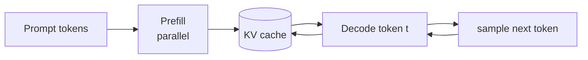

# Decoder-only：自回归生成

**中文** · [English](decoder-only.en.md)

> 阅读时间：约 28 分钟 · 难度：必修 · 最近审阅：2026-08

<div class="lesson-recipe">
  <div class="recipe-flip" data-concept-card>
    <div class="recipe-face" data-concept-zh><span>解决什么问题 · PROBLEM</span><strong>把理解、条件生成和对话统一成 next-token prediction</strong></div>
    <div class="recipe-face" data-concept-en><span>Problem · 问题</span><strong>Unify understanding, conditional generation, and dialogue as next-token prediction</strong></div>
  </div>
  <div class="recipe-flip" data-concept-card>
    <div class="recipe-face" data-concept-zh><span>前置知识 · PREREQUISITES</span><strong>一条 token stream · causal mask · target shift</strong></div>
    <div class="recipe-face" data-concept-en><span>Prerequisites · 前置知识</span><strong>One token stream · causal mask · target shift</strong></div>
  </div>
  <div class="recipe-flip" data-concept-card>
    <div class="recipe-face" data-concept-zh><span>核心机制 · CORE MECHANISM</span><strong>LM loss · prefill · KV cache · sampling</strong></div>
    <div class="recipe-face" data-concept-en><span>Core mechanism · 核心机制</span><strong>LM loss · prefill · KV cache · sampling</strong></div>
  </div>
  <div class="recipe-flip" data-concept-card>
    <div class="recipe-face" data-concept-zh><span>常见错误 · COMMON MISTAKES</span><strong>把训练并行误解成生成也能并行</strong></div>
    <div class="recipe-face" data-concept-en><span>Common mistake · 常见错误</span><strong>Assuming parallel training means generation can also be parallel</strong></div>
  </div>
</div>

## 所有东西都排进同一条序列

把 instruction、context 和 answer 全都排进同一条 token 序列，用 causal mask 挡住未来，然后每个位置只做一件事：猜下一个 token。这就是 decoder-only 最迷人的地方——结构反而比 encoder–decoder 更统一。

## 一条序列自己就能当训练数据

给定 token 序列 $x_1,\ldots,x_T$：

$$\mathcal{L}_{\text{LM}}=-\sum_{t=1}^{T-1}\log p_\theta(x_{t+1}\mid x_{\le t})$$

输入与标签只是错开一位：

```text
input:   [BOS, 今, 天, 天, 气]
target:  [今,  天, 天, 气, 好]
```

每个位置都提供一次监督，因此大规模无标注文本天然能构造训练样本。

## Encoder 去哪了

把“输入”和“输出”串在同一条序列里即可：

```text
[system] ... [user] 问题 [assistant] 回答
```

回答 token 能通过 self-attention 看见左侧 prompt；prompt token 不需要看见未来回答。原来 encoder–decoder 的条件关系，被 causal sequence 本身表达了。

这不代表 encoder 没价值。双向表征、分类和部分检索任务仍常使用 encoder；decoder-only 的优势是**一个目标统一预训练、条件生成与对话**。

## 从 Messages 到一轮或多轮生成

<div class="bilingual-note bilingual-intro">
  <span>逐概念双语 · CONCEPT-BY-CONCEPT</span>
  <p>下面两张卡默认中文；点 <strong>English ↻</strong> 可在当前位置查看等价英文。</p>
</div>

<section class="concept-card" data-concept-card markdown="1">
<div class="concept-face concept-zh" data-concept-zh markdown="1">

### 1. 推理：最后一个 Assistant 标记是生成起点

用户提交结构化 messages 后，应用先用 [chat template 与 tokenizer](tokenization.md)
生成带角色边界的 token IDs。典型 prompt 结束在 assistant 起始标记：

```text
<system> You are helpful <end>
<user> 你好吗？ <end>
<assistant>
```

然后模型重复同一循环：预测下一个 token，把它追加回上下文，再预测下一个；直到产生
end-of-message / EOS、命中其他 stop condition，或达到长度上限。

```text
<assistant> → 我 → 很好 → 。 → <end>
```

角色结构没有改变 decoder 的公式。它只是让“现在该由谁继续说”也成为 token context
的一部分；模型仍然执行 causal next-token prediction。

</div>
<div class="concept-face concept-en" data-concept-en markdown="1">

<div class="concept-title-en" role="heading" aria-level="3">1. Inference: the final assistant marker is the generation boundary</div>

After the user submits structured messages, the application uses a
[chat template and tokenizer](tokenization.md) to create token IDs with role boundaries.
A typical prompt ends at the assistant-start marker:

```text
<system> You are helpful <end>
<user> How are you? <end>
<assistant>
```

The model then repeats one loop: predict the next token, append it to the context, and
predict again. Generation stops on an end-of-message or EOS token, another configured
stop condition, or a maximum-length limit.

```text
<assistant> → I → am fine → . → <end>
```

Role structure does not change the decoder equation. It makes “whose turn is next” part
of the token context while the model continues ordinary causal next-token prediction.

</div>
</section>

<section class="concept-card" data-concept-card markdown="1">
<div class="concept-face concept-zh" data-concept-zh markdown="1">

### 2. 多轮对话只是更长的左侧上下文

第二轮生成时，序列通常包含 system、第一轮 user、第一轮 assistant、第二轮 user，
最后再加新的 assistant 起始标记。由于 causal attention 可以读取左侧所有未被截断的
token，新回答能利用此前对话保持连贯。

这不等于模型拥有脱离输入的永久记忆。若历史消息没有重新放进 prompt，模型在当前
forward pass 里就看不到它；如果总长度超过 context window，应用还必须截断、总结，
或通过 retrieval / external memory 选回重要信息。

KV cache 只缓存**本次推理序列**里已计算的 K/V，减少重复计算；它不会自动把一次会话
变成跨会话知识库，也不会替你决定哪些历史值得长期保留。

</div>
<div class="concept-face concept-en" data-concept-en markdown="1">

<div class="concept-title-en" role="heading" aria-level="3">2. Multi-turn dialogue is a longer left context</div>

For the second response, the sequence usually contains the system message, first user
turn, first assistant turn, second user turn, and a new assistant-start marker. Causal
attention can read every untruncated token to the left, so the new response can remain
consistent with earlier dialogue.

This is not permanent memory independent of the input. If history is not placed back in
the prompt, the current forward pass cannot see it. When the sequence exceeds the
context window, the application must truncate, summarize, or recover important facts
through retrieval or external memory.

KV cache stores already-computed K/V for the **current inference sequence** to avoid
recomputation. It does not turn one session into a cross-session knowledge base or decide
which history deserves long-term retention.

</div>
</section>

## 现代 Decoder Block：哪些东西真的变了

<div class="bilingual-note bilingual-intro">
  <span>逐概念双语 · CONCEPT-BY-CONCEPT</span>
  <p>下面十张卡默认中文；点 <strong>English ↻</strong> 可在当前位置查看等价英文。</p>
</div>

<section class="concept-card" data-concept-card markdown="1">
<div class="concept-face concept-zh" data-concept-zh markdown="1">

### 1. 先看一整块现代配方

典型的 pre-norm decoder block 可以写成：

$$H=X+\operatorname{Attention}(\operatorname{RMSNorm}(X)),$$

$$Y=H+\operatorname{SwiGLU}(\operatorname{RMSNorm}(H)).$$

实际路径是：RMSNorm → Q/K/V projection → 对 Q/K 应用 RoPE → causal
attention → output projection → residual addition → RMSNorm → SwiGLU → 第二次
residual addition。堆完所有 block 后通常还有一次 final norm，再投影到词表 logits。

这不是所有模型的硬性标准，而是一套常见配方。与 2017 原版相比，主体从
encoder–decoder 变为 decoder-only，post-norm 常被 pre-norm 替代，LayerNorm 常被
RMSNorm 替代，正弦位置编码常被 RoPE 替代，FFN 常使用 SwiGLU，注意力头也可能从
MHA 变为 GQA 或 MQA。

</div>
<div class="concept-face concept-en" data-concept-en markdown="1">

<div class="concept-title-en" role="heading" aria-level="3">1. The modern block at a glance</div>

A typical pre-norm decoder block can be written as

$$H=X+\operatorname{Attention}(\operatorname{RMSNorm}(X)),$$

$$Y=H+\operatorname{SwiGLU}(\operatorname{RMSNorm}(H)).$$

The full path is RMSNorm → Q/K/V projections → RoPE on Q and K → causal attention
→ output projection → residual addition → RMSNorm → SwiGLU → a second residual
addition. A final norm usually follows the entire stack before the vocabulary logits.

This is a common recipe, not a universal law. Relative to the 2017 encoder–decoder,
modern LLMs are often decoder-only, use pre-norm instead of post-norm, RMSNorm instead
of LayerNorm, RoPE instead of additive sinusoidal positions, SwiGLU instead of a ReLU
FFN, and sometimes GQA or MQA instead of standard MHA.

</div>
</section>

<section class="concept-card" data-concept-card markdown="1">
<div class="concept-face concept-zh" data-concept-zh markdown="1">

### 2. RoPE：把位置放进 Q/K 的相对相位

原版把 position encoding 加到输入 embedding。RoPE 则先产生 Q/K，再按 token
位置旋转它们：

$$Q=XW_Q,\quad K=XW_K,\qquad
Q'_m=R_mQ_m,\quad K'_n=R_nK_n.$$

二维旋转矩阵是

$$R(\theta)=\begin{bmatrix}\cos\theta&-\sin\theta\\\sin\theta&\cos\theta\end{bmatrix}.$$

真实向量会把通道两两成对，并让不同通道对使用不同频率。注意力点积满足

$$(R_mq_m)^\top(R_nk_n)=q_m^\top R_{n-m}k_n,$$

所以分数自然依赖相对距离 $n-m$。通常不旋转 V，因为位置主要影响“从哪里读”，
而不是被读取的内容。RoPE 也不意味着无限长度外推；远超训练长度后仍可能分布失配，
因此长上下文模型会使用频率调整或 RoPE scaling。

</div>
<div class="concept-face concept-en" data-concept-en markdown="1">

<div class="concept-title-en" role="heading" aria-level="3">2. RoPE: relative phase in Q and K</div>

The original Transformer adds positional encoding to input embeddings. RoPE first
forms Q and K, then rotates them according to token position:

$$Q=XW_Q,\quad K=XW_K,\qquad
Q'_m=R_mQ_m,\quad K'_n=R_nK_n.$$

The two-dimensional rotation matrix is

$$R(\theta)=\begin{bmatrix}\cos\theta&-\sin\theta\\\sin\theta&\cos\theta\end{bmatrix}.$$

Real implementations pair channels and use different frequencies across channel
pairs. Their dot product obeys

$$(R_mq_m)^\top(R_nk_n)=q_m^\top R_{n-m}k_n,$$

so attention scores naturally depend on relative distance $n-m$. V is normally not
rotated because position controls where to read rather than the content being read.
RoPE does not provide unlimited extrapolation: positions far beyond the training
length may still require frequency adjustment or RoPE scaling.

</div>
</section>

<section class="concept-card" data-concept-card markdown="1">
<div class="concept-face concept-zh" data-concept-zh markdown="1">

### 3. Pre-Norm 与 RMSNorm：保护残差主干

原版 post-norm 是

$$Y=\operatorname{LayerNorm}(X+F(X)).$$

现代 pre-norm 常写成

$$Y=X+F(\operatorname{Norm}(X)).$$

后者给残差状态和梯度保留了一条更直接的 identity path，通常更适合训练深层网络；
所有 block 结束后一般再做 final norm。

LayerNorm 会减均值并除以标准差：

$$\operatorname{LN}(x)=\gamma\frac{x-\mu}{\sqrt{\sigma^2+\epsilon}}+\beta.$$

RMSNorm 只控制均方根尺度：

$$\operatorname{RMSNorm}(x)=\gamma\frac{x}{\sqrt{\frac1d\sum_i x_i^2+\epsilon}}.$$

所以 LayerNorm 调整中心与大小；RMSNorm 通常不减均值、没有 bias，只调整大小。
它计算更简单，但“用了 RMSNorm”本身不代表模型必然更好。

</div>
<div class="concept-face concept-en" data-concept-en markdown="1">

<div class="concept-title-en" role="heading" aria-level="3">3. Pre-norm and RMSNorm: protecting the residual stream</div>

The original post-norm form is

$$Y=\operatorname{LayerNorm}(X+F(X)).$$

Modern pre-norm blocks commonly use

$$Y=X+F(\operatorname{Norm}(X)).$$

Pre-norm preserves a more direct identity path for residual states and gradients,
which usually makes very deep networks easier to train. A final norm is typically
applied after the full block stack.

LayerNorm centers and scales:

$$\operatorname{LN}(x)=\gamma\frac{x-\mu}{\sqrt{\sigma^2+\epsilon}}+\beta.$$

RMSNorm controls only root-mean-square magnitude:

$$\operatorname{RMSNorm}(x)=\gamma\frac{x}{\sqrt{\frac1d\sum_i x_i^2+\epsilon}}.$$

Thus LayerNorm adjusts center and scale; RMSNorm usually has no mean subtraction or
bias and adjusts only scale. It is simpler to compute, but choosing RMSNorm does not
by itself guarantee a better model.

</div>
</section>

<section class="concept-card" data-concept-card markdown="1">
<div class="concept-face concept-zh" data-concept-zh markdown="1">

### 4. SwiGLU：让 FFN 同时生成内容和门

原版 FFN 是升维 → ReLU → 降维：

$$\operatorname{FFN}(x)=W_2\operatorname{ReLU}(W_1x).$$

现代模型常使用 SwiGLU：

$$\operatorname{SwiGLU}(x)=W_{\text{down}}\left[
\operatorname{SiLU}(xW_{\text{gate}})\odot(xW_{\text{up}})\right],$$

$$\operatorname{SiLU}(z)=z\sigma(z).$$

$xW_{\text{up}}$ 产生候选内容，$\operatorname{SiLU}(xW_{\text{gate}})$ 决定每个
特征开放多少，二者逐元素相乘后再降维。它比两矩阵 ReLU FFN 多一个投影，因此为了
保持参数预算，隐藏维通常不会继续照搬 $4d$。

</div>
<div class="concept-face concept-en" data-concept-en markdown="1">

<div class="concept-title-en" role="heading" aria-level="3">4. SwiGLU: content and a learned gate</div>

The original FFN expands, applies ReLU, and projects back down:

$$\operatorname{FFN}(x)=W_2\operatorname{ReLU}(W_1x).$$

Modern models often use SwiGLU:

$$\operatorname{SwiGLU}(x)=W_{\text{down}}\left[
\operatorname{SiLU}(xW_{\text{gate}})\odot(xW_{\text{up}})\right],$$

$$\operatorname{SiLU}(z)=z\sigma(z).$$

$xW_{\text{up}}$ produces candidate content, while
$\operatorname{SiLU}(xW_{\text{gate}})$ controls how much of each feature passes.
Their elementwise product is projected back down. Because SwiGLU uses three
projections rather than two, its hidden width is usually adjusted to keep a similar
parameter budget instead of blindly retaining $4d$.

</div>
</section>

<section class="concept-card" data-concept-card markdown="1">
<div class="concept-face concept-zh" data-concept-zh markdown="1">

### 5. MHA、MQA 与 GQA：省的是 KV 宽度

传统 MHA 为每个 query head 保留自己的 K/V head，例如

```text
Q heads: 32   K heads: 32   V heads: 32
```

MQA 让所有 query heads 共享一组 K/V；GQA 则让一组 query heads 共享一组 K/V：

```text
MQA: Q=32, KV=1
GQA: Q=32, KV=8   # 每 4 个 Q heads 共享一组 KV
```

不同 query heads 即使共享 K/V，仍能因 Q 不同而形成不同的 attention distributions。
MQA 最省内存带宽，但可能损失表示能力；GQA 在质量和推理效率之间折中。主要动机是
缩小推理时需要读取的 K/V 状态，而不是单纯减少总参数。

</div>
<div class="concept-face concept-en" data-concept-en markdown="1">

<div class="concept-title-en" role="heading" aria-level="3">5. MHA, MQA, and GQA: reducing KV width</div>

Standard MHA gives every query head its own K and V head:

```text
Q heads: 32   K heads: 32   V heads: 32
```

MQA shares one K/V head across all query heads. GQA shares one K/V head within each
group of query heads:

```text
MQA: Q=32, KV=1
GQA: Q=32, KV=8   # four Q heads share each KV head
```

Query heads can still produce different attention distributions because their Q
vectors differ even when K and V are shared. MQA saves the most memory bandwidth but
may lose representational capacity; GQA trades between quality and inference
efficiency. The primary motivation is narrower K/V state during inference, not merely
fewer total parameters.

</div>
</section>

<section class="concept-card" data-concept-card markdown="1">
<div class="concept-face concept-zh" data-concept-zh markdown="1">

### 6. KV Cache：用显存换掉历史重复计算

自回归生成到位置 $t$ 时，过去 token 的 K/V 已经算过，而且模型参数没有变化。
因此每层保存

$$K_{\text{cache}}=[K_{\text{past}};k_t],\qquad
V_{\text{cache}}=[V_{\text{past}};v_t],$$

新一步只计算 $q_t,k_t,v_t$，再让 query 读取整个缓存：

$$o_t=\operatorname{softmax}\!\left(
\frac{q_tK_{\text{cache}}^\top}{\sqrt{d_k}}\right)V_{\text{cache}}.$$

KV cache 不改变模型数学结果；它是 inference state optimization。代价是 cache 随
层数、上下文长度和 KV heads 线性增长，长上下文时可能成为显存容量与读取带宽瓶颈。
GQA/MQA 正是通过减少 KV heads 来缩小这块状态。

</div>
<div class="concept-face concept-en" data-concept-en markdown="1">

<div class="concept-title-en" role="heading" aria-level="3">6. KV cache: trading memory for historical recomputation</div>

At generation step $t$, K and V for earlier tokens have already been computed and
model parameters have not changed. Each layer therefore stores

$$K_{\text{cache}}=[K_{\text{past}};k_t],\qquad
V_{\text{cache}}=[V_{\text{past}};v_t],$$

computes only $q_t,k_t,v_t$ for the new token, and lets the query read the full cache:

$$o_t=\operatorname{softmax}\!\left(
\frac{q_tK_{\text{cache}}^\top}{\sqrt{d_k}}\right)V_{\text{cache}}.$$

KV caching does not change the model's mathematical result; it is an inference-state
optimization. The cache grows linearly with layer count, context length, and KV-head
count, so it can become a capacity and bandwidth bottleneck. GQA and MQA shrink this
state by reducing the number of KV heads.

</div>
</section>

<section class="concept-card" data-concept-card markdown="1">
<div class="concept-face concept-zh" data-concept-zh markdown="1">

### 7. FlashAttention：同一公式，更少显存读写

朴素实现会显式生成并写回

$$S=QK^\top,\qquad A=\operatorname{softmax}(S),\qquad S,A\in\mathbb{R}^{L\times L}.$$

FlashAttention 把 Q/K/V 分块，在 GPU 片上高速存储中逐块计算，并用 online softmax
维护正确的归一化结果，从而避免把完整 $L\times L$ 中间矩阵写回显存。

它不是稀疏注意力，也不是通过删 token pair 做近似；数学上计算的是同一 attention
（浮点重排会有微小数值差）。FLOP 复杂度仍约为 $O(L^2)$，主要收益来自 IO-aware
tiling、更少的高带宽显存访问和更小的中间状态。

</div>
<div class="concept-face concept-en" data-concept-en markdown="1">

<div class="concept-title-en" role="heading" aria-level="3">7. FlashAttention: the same formula with less memory traffic</div>

A naive implementation materializes and writes

$$S=QK^\top,\qquad A=\operatorname{softmax}(S),\qquad S,A\in\mathbb{R}^{L\times L}.$$

FlashAttention tiles Q, K, and V, computes blocks in fast on-chip memory, and uses an
online softmax to maintain the exact normalization without writing the full
$L\times L$ intermediates to high-bandwidth memory.

It is not sparse attention and does not approximate the result by dropping token
pairs. It evaluates the same mathematical attention, up to small floating-point
reordering differences. FLOP complexity remains approximately $O(L^2)$; the main
gain comes from IO-aware tiling, less memory traffic, and smaller intermediate state.

</div>
</section>

<section class="concept-card" data-concept-card markdown="1">
<div class="concept-face concept-zh" data-concept-zh markdown="1">

### 8. 长上下文：位置外推与平方成本是两件事

RoPE scaling 调整旋转频率，解决“位置编码怎样延伸到更长序列”；它并不会消除
full attention 的 $O(L^2)$ 计算。

Sliding-window attention 让每个 token 只看固定邻域，成本接近 $O(Lw)$，但可能丢失
远距离信息。Sparse attention 只保留部分连接；一些架构混合局部层、全局层或特殊
global tokens 来恢复长距离通路。

所以要先问瓶颈是哪一种：

- 训练长度外的位置分布失配 → RoPE scaling / frequency adjustment；
- 完整 attention 的平方计算与中间状态 → windowed / sparse connectivity 或高效 kernel；
- 长距离证据无法到达 → 设计全局通路、检索或层间混合。

</div>
<div class="concept-face concept-en" data-concept-en markdown="1">

<div class="concept-title-en" role="heading" aria-level="3">8. Long context: position extrapolation and quadratic cost are different problems</div>

RoPE scaling changes rotation frequencies to extend positional behavior to longer
sequences. It does not remove the $O(L^2)$ cost of full attention.

Sliding-window attention limits each token to a neighborhood, approaching $O(Lw)$
cost but potentially losing distant information. Sparse attention keeps only selected
connections; some architectures mix local and global layers or special global tokens
to restore long-range paths.

Diagnose the bottleneck first:

- distribution shift beyond trained positions → RoPE scaling or frequency adjustment;
- quadratic full-attention compute and intermediates → windowed/sparse connectivity or
  a more efficient kernel;
- distant evidence cannot propagate → explicit global paths, retrieval, or layer mixing.

</div>
</section>

<section class="concept-card" data-concept-card markdown="1">
<div class="concept-face concept-zh" data-concept-zh markdown="1">

### 9. MoE：扩大 FFN 容量，而不是注意力头

Mixture-of-Experts 通常替换 FFN。Router 为每个 token 选择少数专家，例如 top-2：

$$y=p_1E_1(x)+p_2E_2(x).$$

模型可以拥有很多 expert parameters，但单个 token 只激活少量专家，因此总参数容量
可以远大于每 token 计算量。代价是 router quality、load balancing、expert capacity、
跨设备 all-to-all communication 和训练稳定性都更复杂。

专家可能形成一定功能分工，但和注意力头一样，不应假设每个 expert 都有清晰、固定、
可人工命名的语义。

</div>
<div class="concept-face concept-en" data-concept-en markdown="1">

<div class="concept-title-en" role="heading" aria-level="3">9. MoE: scaling FFN capacity, not attention heads</div>

Mixture-of-Experts usually replaces the FFN. A router selects a small number of
experts for each token, for example top-2 routing:

$$y=p_1E_1(x)+p_2E_2(x).$$

The model may contain many expert parameters while activating only a few per token,
so total parameter capacity can grow much faster than per-token compute. The cost is
greater complexity in routing quality, load balancing, expert capacity, cross-device
all-to-all communication, and training stability.

Experts may develop some functional specialization, but—as with attention heads—one
should not assume every expert has a clean, fixed, human-nameable semantic role.

</div>
</section>

<section class="concept-card" data-concept-card markdown="1">
<div class="concept-face concept-zh" data-concept-zh markdown="1">

### 10. 把一个现代 Block 从头走一遍

对于第 $l$ 层输入 $X_l$，先归一化并产生 Q、K、V：

$$U=\operatorname{RMSNorm}(X_l),$$

$$Q=UW_Q,\qquad K=UW_K,\qquad V=UW_V.$$

K/V 可能使用 GQA。接着只旋转 Q/K，并做 causal attention：

$$Q'=\operatorname{RoPE}(Q),\qquad K'=\operatorname{RoPE}(K),$$

$$A=\operatorname{softmax}\!\left(
\frac{Q'K'^\top+M_{\text{causal}}}{\sqrt{d_k}}
\right),\qquad O=AV.$$

这一步底层可以由 FlashAttention 高效实现，但公式不变。完成输出投影和第一次残差：

$$H=X_l+OW_O.$$

然后走第二条 pre-norm 分支：

$$G=\operatorname{RMSNorm}(H),$$

$$F=W_{\text{down}}\left[
\operatorname{SiLU}(GW_{\text{gate}})\odot(GW_{\text{up}})
\right],$$

$$X_{l+1}=H+F.$$

有些模型会把这里的 SwiGLU FFN 换成 MoE。重复 $N$ 层后：

$$H_{\text{final}}=\operatorname{RMSNorm}(X_N),\qquad
\text{logits}=H_{\text{final}}W_{\text{vocab}}.$$

因此这些名词并不在同一层面：RoPE 改 Q/K 的位置关系；GQA 改 KV heads；KV cache
保存历史状态；FlashAttention 优化 attention kernel；MoE 则替换 FFN。

</div>
<div class="concept-face concept-en" data-concept-en markdown="1">

<div class="concept-title-en" role="heading" aria-level="3">10. Walking through one modern block end to end</div>

For layer-$l$ input $X_l$, first normalize and form Q, K, and V:

$$U=\operatorname{RMSNorm}(X_l),$$

$$Q=UW_Q,\qquad K=UW_K,\qquad V=UW_V.$$

K and V may use GQA. Next rotate only Q and K, then apply causal attention:

$$Q'=\operatorname{RoPE}(Q),\qquad K'=\operatorname{RoPE}(K),$$

$$A=\operatorname{softmax}\!\left(
\frac{Q'K'^\top+M_{\text{causal}}}{\sqrt{d_k}}
\right),\qquad O=AV.$$

FlashAttention can implement this step efficiently without changing the formula.
Apply the output projection and first residual connection:

$$H=X_l+OW_O.$$

Then follow the second pre-norm branch:

$$G=\operatorname{RMSNorm}(H),$$

$$F=W_{\text{down}}\left[
\operatorname{SiLU}(GW_{\text{gate}})\odot(GW_{\text{up}})
\right],$$

$$X_{l+1}=H+F.$$

Some models replace this SwiGLU FFN with MoE. After repeating $N$ layers:

$$H_{\text{final}}=\operatorname{RMSNorm}(X_N),\qquad
\text{logits}=H_{\text{final}}W_{\text{vocab}}.$$

These terms therefore operate at different levels: RoPE changes positional relations
in Q/K; GQA changes KV heads; KV cache stores historical state; FlashAttention
optimizes the attention kernel; and MoE replaces the FFN.

</div>
</section>

## Prefill 很快，Decode 很长

### Prefill

整段 prompt 已知，可以并行计算所有位置，并把每层的 K/V 保存起来。

### Decode

每次只输入新 token，查询历史 KV cache，再产生下一个 token。计算量少，但必须串行，常受内存带宽和 cache 大小限制。



## 模型给分数，Sampling 决定怎么选

最后一层 hidden state 经过线性层得到词表上每个 token 的 logits：

$$z_t=W_{\text{vocab}}h_t, \qquad p_t=\text{softmax}(z_t / \tau)$$

- temperature $\tau$ 调整分布尖锐程度；
- top-$k$ 只保留概率最高的 $k$ 个候选；
- top-$p$ 保留累计概率达到阈值的最小候选集合；
- greedy 每步取最大值，不等于全序列概率最大。

Sampling 是推理时怎么“下筷子”，不会改掉锅里原本的概率分布。temperature 高不代表模型突然更有创造力，只是我们更愿意去尝那些本来概率较低的 token。

## 同一副骨架后来怎么 Post-Train

| 阶段 | 数据告诉模型什么 | 常见目标 |
| --- | --- | --- |
| pre-training | 语言、知识与模式 | next-token cross-entropy |
| SFT | 什么输入应该对应什么回答 | 对目标回答 token 做 cross-entropy |
| preference learning | 两个回答哪个更好 | pairwise / policy objective |
| RL | 行为怎样产生更高回报 | trajectory-level objective |

这些阶段通常不改变 decoder-only 的主体结构，改变的是数据分布、loss 和哪些 token 被计入梯度。

<details markdown="1">
<summary><b>进阶</b>：为什么 SFT 常把 prompt token mask 掉</summary>

训练样本包含 prompt 和 response，但目标通常是学习“在给定 prompt 下怎样回答”，而不是重新学习复述用户输入。因此 loss mask 常只保留 assistant response。若多轮对话里所有 assistant turns 都训练，需要精确处理角色模板和边界 token。

</details>

## 动手：把训练和生成两条路都验一遍

[`../code/model.py`](../code/model.py) 是手写的现代 decoder-only；[`../code/test_model.py`](../code/test_model.py) 验证 causal mask、RoPE、GQA 和 KV cache；[`../code/train.py`](../code/train.py) 让它学习一个需要跨位置复制的任务。

## 自检

<div class="taste-check">
  <strong>这一课真正要带走的是：</strong>
  <ol>
    <li>为什么输入和标签只需要错开一个 token？</li>
    <li>Prefill 与 decode 使用同一模型，性能特征为什么完全不同？</li>
    <li>temperature、top-k 和 top-p 改的是模型，还是读取模型分布的方法？</li>
  </ol>
</div>

## 继续读

继续读 [语言模型目标与生成](../deep-dives/language-model-objective.md)，再接到 [Post-Training](../../05-post-training/)。
