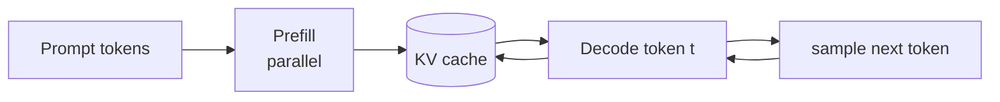

# Decoder-only：自回归生成

**中文** · [English](decoder-only.en.md)

> 阅读时间：约 9 分钟 · 难度：必修 · 最近审阅：2026-08

<div class="lesson-recipe">
  <div><span>这节要做什么</span><strong>把理解、条件生成和对话统一成 next-token prediction</strong></div>
  <div><span>手里的食材</span><strong>一条 token stream · causal mask · target shift</strong></div>
  <div><span>核心火候</span><strong>LM loss · prefill · KV cache · sampling</strong></div>
  <div><span>最容易翻车</span><strong>把训练并行误解成生成也能并行</strong></div>
</div>

## 先尝一口：所有东西都排进同一条序列

把 instruction、context 和 answer 全都排进同一条 token 序列，用 causal mask 挡住未来，然后每个位置只做一件事：猜下一个 token。这就是 decoder-only 最迷人的地方——结构反而比 encoder–decoder 更统一。

## 备菜：一条序列自己就能当训练数据

给定 token 序列 $x_1,\ldots,x_T$：

$$\mathcal{L}_{\text{LM}}=-\sum_{t=1}^{T-1}\log p_\theta(x_{t+1}\mid x_{\le t})$$

输入与标签只是错开一位：

```text
input:   [BOS, 今, 天, 天, 气]
target:  [今,  天, 天, 气, 好]
```

每个位置都提供一次监督，因此大规模无标注文本天然能构造训练样本。

## 少了一口锅：Encoder 去哪了

把“输入”和“输出”串在同一条序列里即可：

```text
[system] ... [user] 问题 [assistant] 回答
```

回答 token 能通过 self-attention 看见左侧 prompt；prompt token 不需要看见未来回答。原来 encoder–decoder 的条件关系，被 causal sequence 本身表达了。

这不代表 encoder 没价值。双向表征、分类和部分检索任务仍常使用 encoder；decoder-only 的优势是**一个目标统一预训练、条件生成与对话**。

## 两段火候：Prefill 很快，Decode 很长

### Prefill

整段 prompt 已知，可以并行计算所有位置，并把每层的 K/V 保存起来。

### Decode

每次只输入新 token，查询历史 KV cache，再产生下一个 token。计算量少，但必须串行，常受内存带宽和 cache 大小限制。



## 调味：模型给分数，Sampling 决定怎么选

最后一层 hidden state 经过线性层得到词表上每个 token 的 logits：

$$z_t=W_{\text{vocab}}h_t, \qquad p_t=\text{softmax}(z_t / \tau)$$

- temperature $\tau$ 调整分布尖锐程度；
- top-$k$ 只保留概率最高的 $k$ 个候选；
- top-$p$ 保留累计概率达到阈值的最小候选集合；
- greedy 每步取最大值，不等于全序列概率最大。

Sampling 是推理时怎么“下筷子”，不会改掉锅里原本的概率分布。temperature 高不代表模型突然更有创造力，只是我们更愿意去尝那些本来概率较低的 token。

## 回锅：同一副骨架后来怎么 Post-Train

| 阶段 | 数据告诉模型什么 | 常见目标 |
| --- | --- | --- |
| pre-training | 语言、知识与模式 | next-token cross-entropy |
| SFT | 什么输入应该对应什么回答 | 对目标回答 token 做 cross-entropy |
| preference learning | 两个回答哪个更好 | pairwise / policy objective |
| RL | 行为怎样产生更高回报 | trajectory-level objective |

这些阶段通常不改变 decoder-only 的主体结构，改变的是数据分布、loss 和哪些 token 被计入梯度。

<details markdown="1">
<summary><b>进阶</b>：为什么 SFT 常把 prompt token mask 掉</summary>

训练样本包含 prompt 和 response，但目标通常是学习“在给定 prompt 下怎样回答”，而不是重新学习复述用户输入。因此 loss mask 常只保留 assistant response。若多轮对话里所有 assistant turns 都训练，需要精确处理角色模板和边界 token。

</details>

## 动手：把训练和生成两条路都验一遍

[`../code/model.py`](../code/model.py) 是手写的现代 decoder-only；[`../code/test_model.py`](../code/test_model.py) 验证 causal mask、RoPE、GQA 和 KV cache；[`../code/train.py`](../code/train.py) 让它学习一个需要跨位置复制的任务。

## 出锅检查

<div class="taste-check">
  <strong>这一课真正要带走的是：</strong>
  <ol>
    <li>为什么输入和标签只需要错开一个 token？</li>
    <li>Prefill 与 decode 使用同一模型，性能特征为什么完全不同？</li>
    <li>temperature、top-k 和 top-p 改的是模型，还是读取模型分布的方法？</li>
  </ol>
</div>

## 下一道菜

继续读 [语言模型目标与生成](../deep-dives/language-model-objective.md)，再接到 [Post-Training](../../05-post-training/)。
