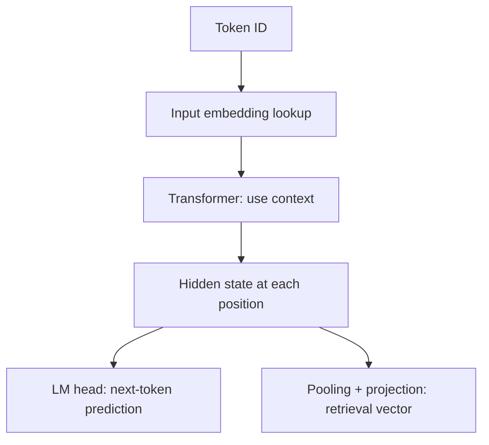

# Why vectors can represent meaning

[中文](embeddings-and-similarity.md) · **English**

> Reading time: about 6 minutes · Level: introductory · Last reviewed: 2026-10-09

“Turn text into a vector” skips an important question: why should a list of numbers mean anything? The answer lies in training—which things the model is rewarded for bringing together or separating.

## Start with a lookup, but do not stop there

With $V$ tokens and $d$ numbers per token, an embedding table is $E\in\mathbb{R}^{V\times d}$. Token ID 7 selects row 7. **An ID is an address, not a distance**; IDs 7 and 8 need not be more similar than 7 and 100.

That is the input embedding. A Transformer produces context-dependent hidden states. A retrieval vector for a sentence or image may then use pooling and a projection. Keep these distinct:



Last-valid-token, mean, and special-token pooling are design choices tied to training. Averaging a generative model's hidden states does not automatically make a good embedding model.

## What a dot product compares

Here is a hand-computable example: query $q=(1,0)$ and candidates $a=(2,2)$, $b=(1,0)$.

| Scoring rule | Score for $a$ | Score for $b$ | Winner |
| --- | --- | --- | --- |
| Dot product $q^\top x$ | 2 | 1 | $a$ |
| Cosine similarity | $1/\sqrt{2}\approx0.707$ | 1 | $b$ |

Neither calculation is wrong. Dot product depends on direction and length; cosine removes length:

$$\operatorname{cos}(q,x)=\frac{q^\top x}{\lVert q\rVert_2\lVert x\rVert_2}.$$

For unit-length vectors, dot product equals cosine. A zero vector has no well-defined direction; numerical handling must be explicit rather than dividing by zero.

A correct formula can still produce an incorrect numerical result. Scaling both vectors to around $10^{200}$ can overflow intermediate squares; scaling to $10^{-200}$ can underflow them to zero. The accompanying code first divides each vector by its own largest absolute component, then computes cosine. This positive rescaling preserves direction while avoiding extreme intermediate squares. Actual zero vectors still raise an error.

**Should everything be normalized?** Not necessarily. Magnitude may carry information learned for a task. Match the retrieval score to the training score before choosing a metric on intuition alone.

## Similarity is not probability

A cosine of 0.8 does not mean an 80% probability of relevance. Softmax can distribute probability over a chosen candidate set:

$$p_j=\frac{\exp(s_j/\tau)}{\sum_k\exp(s_k/\tau)},\qquad \tau>0.$$

For fixed scores, lowering temperature $\tau$ concentrates probability without changing the ranking. Adding candidates changes the denominator. This is a **relative distribution within a candidate set**, not calibrated real-world confidence.

Subtract the largest logit before exponentiating to avoid overflow without changing softmax. Try the temperature control in the [CLIP experiment](../../03-multimodal-learning/clip.en.md): the ranking stays fixed while probabilities and loss change.

## How the space learns what “close” means

Suppose training pairs an image with one caption among several candidates. A contrastive objective increases the paired caption's relative probability. Gradients update the encoders to produce vectors that help with this objective. [InfoNCE](https://arxiv.org/abs/1807.03748) is a classic contrastive formulation.

“Semantic similarity” is not a single target: describing the same object, answering the same question, and appealing to the same person are different relationships. Different data and objectives can induce different useful distances.

## Check it yourself

The accompanying [pure-Python lab](../code/multimodal_math.py) computes dot products, cosine, softmax, and a symmetric contrastive loss without downloading a model:

```bash
python 00-foundations/code/multimodal_math.py
```

Predict before running: what happens to dot product and cosine if $a$ is multiplied by 10? What happens to softmax if every logit increases by 100?

Continue with [CLIP](../../03-multimodal-learning/clip.en.md): two encoders learn to match images and text in a shared space, rather than starting with one mixed input sequence.
