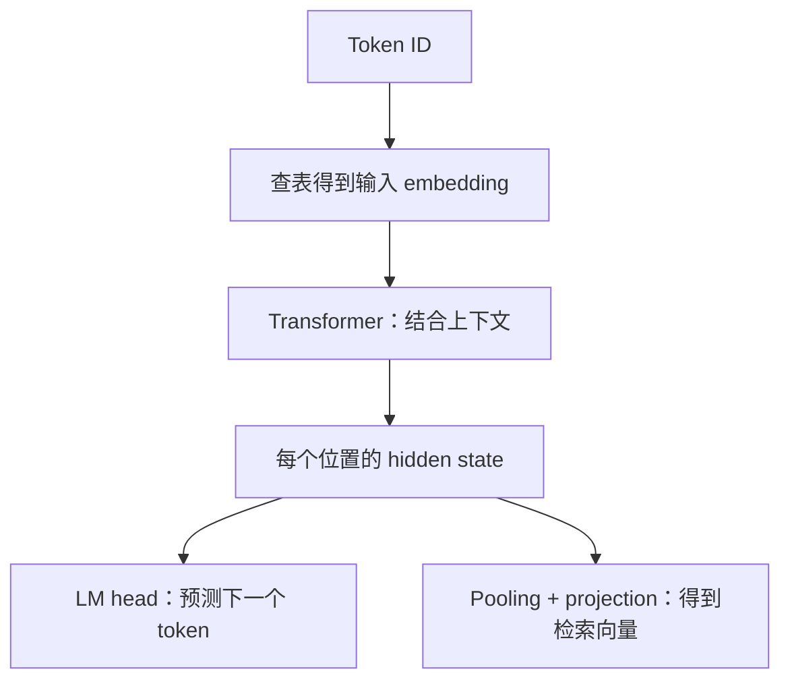

# 向量为什么能表示意思

**中文** · [English](embeddings-and-similarity.en.md)

> 阅读时间：约 6 分钟 · 难度：入门 · 最近审阅：2026-09

看到“把文本变成向量”，先别急着接受。一个数字列表怎么就有了意思？关键不在列表本身，而在训练时哪些东西被要求靠近、哪些需要分开。

## 从查表开始，但别停在查表

词表里有 $V$ 个 token，每个用 $d$ 个数表示，embedding table 就是 $E\in\mathbb{R}^{V\times d}$。输入 ID 是 7，就取第 7 行。**ID 只是地址，不是大小或距离**；ID 7 和 8 不一定比 7 和 100 更相似。

这只是输入向量。经过 Transformer 后，同一个 token 会结合上下文得到不同的 hidden state。句子或图片的检索向量，还可能经过 pooling 和 projection。三者不要混为一谈：



Pooling 是取最后一个有效位置、做平均，还是用特殊 token，要看模型的训练方式。随手平均一个生成模型的输出，不等于得到了好用的 embedding model。

## 点积到底比较了什么

先用一个自己能算的例子。查询向量 $q=(1,0)$，候选 $a=(2,2)$、$b=(1,0)$：

| 计算方式 | $a$ 的分数 | $b$ 的分数 | 谁更高 |
| --- | --- | --- | --- |
| 点积 $q^\top x$ | 2 | 1 | $a$ |
| 余弦相似度 | $1/\sqrt{2}\approx0.707$ | 1 | $b$ |

两种答案都没有算错。点积同时受方向和长度影响；余弦先除掉长度，只比较夹角：

$$\operatorname{cos}(q,x)=\frac{q^\top x}{\lVert q\rVert_2\lVert x\rVert_2}.$$

把向量归一化到长度 1 后，点积就等于余弦。零向量没有定义良好的方向，不能直接除以 0。实际实现要约定数值处理方式。

**是不是都应该归一化？** 不一定。长度可能携带训练任务学到的信号。该用哪一种，首先看训练分数和检索分数是否一致，而不是凭“余弦更高级”来选。

## 相似度不是概率

余弦 0.8 不表示“有 80% 的概率相关”。如果想在一组候选里做选择，可以把分数送进 softmax：

$$p_j=\frac{\exp(s_j/\tau)}{\sum_k\exp(s_k/\tau)},\qquad \tau>0.$$

固定分数时，较小的温度 $\tau$ 会让概率更集中，但不会改变排序。多放几个候选进分母，原候选的概率也会变。这是**给定候选集合下的相对分配**，不是经过校准的现实世界置信度。

数值实现时，先减去最大 logit 再取指数；softmax 不变，却不容易溢出。去 [CLIP 的交互实验](../../03-multimodal-learning/clip.md)拖一下温度：排名没变，概率和 loss 已经变了。

## 空间里的“近”是怎么学出来的

假设训练告诉模型：这张图片和这句描述是一对，另外几句作为候选。一个对比目标会提高正确配对的相对概率。梯度随后更新 encoder，让它产生更有利于这个目标的向量。对比学习的一个经典形式是 [InfoNCE](https://arxiv.org/abs/1807.03748)。

这也解释了为什么“语义相似”不是唯一标准：描述同一个物体、回答同一个问题、被同一个人喜欢，是不同的训练关系。数据和 loss 不同，学出的距离也会不同。

## 自己动手检查

配套的[纯 Python 实验](../code/multimodal_math.py)会计算点积、余弦、softmax 和双向对比 loss，不下载模型：

```bash
python 00-foundations/code/multimodal_math.py
```

先猜再运行：把 $a$ 乘以 10，点积和余弦各会怎么变？如果只是把所有 logits 同时加 100，softmax 呢？

下一篇读 [CLIP](../../03-multimodal-learning/clip.md)：不是把图片和文字混成一串输入，而是先让两个 encoder 学会在同一个空间里配对。
