# Normalization: BatchNorm, LayerNorm, and RMSNorm

[中文](normalization.md) · **English**

> Reading time: ~12 min · Level: core · Last reviewed: 2026-10-09

Take `[1, 3]`, temporarily ignoring epsilon and learned parameters. LayerNorm subtracts the mean, 2, and divides by the standard deviation, 1, giving `[-1, 1]`. RMSNorm instead divides by the root mean square, √5, without centering. Both change scale, but they are different operations. Next we place them inside a batch of sequences and identify the reduction axes.

## The core difference: normalization axes {#the-core-difference-normalization-axes}

**BatchNorm takes its statistics across a batch of examples. LayerNorm takes them across one example's own features.**

Start with the axes, then check running statistics and train / eval modes. Together they determine behavior with variable lengths, batch size 1, and autoregressive decoding. The axis alone is not the entire implementation contract.

## Three formulas {#three-formulas}

**BatchNorm** (for each feature $j$, statistics over the batch dimension):

$$\mu_j = \frac{1}{N}\sum_{i=1}^{N} x_{ij}, \qquad \sigma_j^2 = \frac{1}{N}\sum_{i=1}^{N}(x_{ij}-\mu_j)^2$$

$$\hat{x}_{ij} = \frac{x_{ij}-\mu_j}{\sqrt{\sigma_j^2+\epsilon}}, \qquad y_{ij} = \gamma_j \hat x_{ij} + \beta_j$$

**LayerNorm** (for each example $i$, statistics over the feature dimension):

$$\mu_i = \frac{1}{d}\sum_{j=1}^{d} x_{ij}, \qquad y_{ij} = \gamma_j\,\frac{x_{ij}-\mu_i}{\sqrt{\sigma_i^2+\epsilon}} + \beta_j$$

**RMSNorm** (root-mean-square scaling, commonly with learned gain $\gamma$ only):

$$y_{ij} = \gamma_j\,\frac{x_{ij}}{\sqrt{\frac{1}{d}\sum_{k} x_{ik}^2+\epsilon}}$$

The learned $\gamma$, and $\beta$ where present, run **per feature**, with length $d$. BatchNorm and LayerNorm differ in their reduction axes. LayerNorm and RMSNorm use the same feature axis but different statistics: variance versus the raw second moment. RMSNorm is not LayerNorm assuming that the mean is already zero.

Add 10 to the opening example: `[1, 3]` becomes `[11, 13]`. Ignoring epsilon, LayerNorm still returns `[-1, 1]`; the RMSNorm denominator changes from $\sqrt{5}$ to $\sqrt{145}$, so its output changes too. It does not remove the shift. **Pre-Norm versus Post-Norm is a separate choice** about placement, not the normalization formula. The [RMSNorm paper](https://arxiv.org/abs/1910.07467) investigates scale normalization without re-centering.

## Four concepts: answer first, then go deeper {#four-concepts-answer-first-then-go-deeper}

The BatchNorm formula above uses a two-dimensional input. On `[N,C,L]`, `BatchNorm1d` reduces over `N,L` per channel. Training-forward variance uses `correction=0`, whereas the running-variance update uses a different estimator. Evaluation uses running statistics by default; with `track_running_stats=False`, it uses batch statistics too. Mean / variance are statistical state, not optimizer-trained parameters like gamma / beta. See the [PyTorch documentation](https://docs.pytorch.org/docs/main/generated/torch.nn.BatchNorm1d.html).

For input-feature min–max and Z-score scaling, see [preprocessing versus network normalization](../deep-dives/generalization.en.md).

1. Why do deep networks need normalization?

**Quick learning**

A residual network repeatedly applies

$$
x_{\ell+1}=x_\ell+f_\ell(x_\ell).
$$

If branch outputs have uncontrolled scale, residual additions let activation scale drift with depth. During backpropagation, curvature and gradient scale may also differ sharply across layers and directions. This does not mean values must monotonically explode; it means **one learning rate has trouble serving every layer and direction**.

Normalization gives each sublayer more predictably scaled inputs, reducing sensitivity to initialization and parameter scale. It often improves effective conditioning, which makes it easier to use larger learning rates and train deeper networks.

**Interview answer**

> The residual stream accumulates updates from every layer. If sublayer input scales drift, activations and gradients become harder to control and the optimization problem becomes ill-conditioned. LayerNorm or RMSNorm brings each token's sublayer input back to a predictable scale, improving gradient propagation and making deep Transformers easier to train.

<b>Deep dive</b>: residual scale, conditioning, and what “stable” means

If residual updates are temporarily treated as approximately uncorrelated,

$$
\operatorname{Var}(x_L)
\approx
\operatorname{Var}(x_0)+
\sum_{\ell=0}^{L-1}\operatorname{Var}\big(f_\ell(x_\ell)\big).
$$

This explains why residual-stream scale may grow with depth. Real networks contain correlations and adaptive weights, so it is not a theorem that variance must grow linearly. The more precise statement is: **depth creates scale drift, while normalization gives each branch a controlled input scale.**

From an optimization view, a Hessian with widely separated eigenvalues makes one learning rate unstable in high-curvature directions and slow in low-curvature ones. Normalization does not guarantee a well-conditioned global Hessian, but it reduces scale disparities between layers and usually makes gradients smoother under parameter perturbations and the effective conditioning better.

Also note that Pre-LN does not keep the residual stream $x_\ell$ itself at unit variance; it only feeds $\operatorname{Norm}(x_\ell)$ into Attn / FFN. That is why a final LN is still needed at the end to bring back the scale handed to the output head.

2. Why do Transformers usually avoid BatchNorm?

**Quick learning**

1. **Variable length and padding**: sequence lengths differ within a batch, so padding can contaminate the statistics; even with masking, late positions have few valid samples.
2. **Batch-composition dependence**: changing neighboring examples changes this token's output, and small batches produce noisy statistics.
3. **Train/inference mismatch**: training uses current-batch statistics, while inference normally uses running statistics. Autoregressive decoding often runs with tiny batches or batch size one, so it cannot rely on statistics computed from the batch at hand.
4. **Possible causality violation**: if the reduction includes the time axis, future tokens affect the mean and variance used for past tokens, bypassing the causal attention mask.

LayerNorm reduces only over one token's hidden features. It is independent of the batch, other positions, and train versus inference mode.

**Interview answer**

> Transformers use LayerNorm because it normalizes every token independently over the hidden dimension. It is independent of batch size, sequence length, and other tokens, and it behaves identically in training and inference. BatchNorm introduces batch-composition, padding, and running-statistics problems; if its reduction also spans time, it leaks future tokens into past positions.

<b>Deep dive</b>: when does BatchNorm really leak the future?

The answer depends on tensor layout and reduction axes; “BatchNorm always leaks” is too broad.

- For $X\in\mathbb R^{B\times T\times d}$, a separate normalization at every position $t$ that reduces only over $B$ does not directly read future tokens from the same sequence. It still depends on other batch members, and each position may have a different valid sample count.
- A common sequence use of <code>BatchNorm1d</code> reduces each channel over both $B$ and $T$. Then $\mu_j$ and $\sigma_j$ include tokens with $t'>t$. The normalized result at position $t$ then already carries future information; a causal mask only restricts attention and cannot block this side channel.
- Flattening $B\times T$ before BatchNorm creates the same leak.

The precise conclusion is:

> **BatchNorm breaks autoregressive causality when its statistics include time. Even when time is excluded, batch dependence, padding, small batches, and train/eval mismatch still make it a poor default for language models.**

Batch size one does not mean BatchNorm must fail at inference: eval mode can use running statistics. The deeper issue is that those statistics came from the training distribution rather than the current token, and training and inference execute different functions.

3. Where do Pre-LN and Post-LN go, and why is Pre-LN more stable?

**Write the structure first**

<pre><code>Post-LN (2017 original)          Pre-LN (common today)
x = LN(x + Attn(x))             x = x + Attn(LN(x))
x = LN(x + FFN(x))              x = x + FFN(LN(x))
                                 ...
                                 x = LN(x)   ← final LN</code></pre>

**Interview answer**

> Post-LN places LayerNorm after residual addition, so the main-path gradient crosses an LN in every block. Pre-LN moves the LN into the branch and leaves a direct identity path in the residual stream. Every block Jacobian therefore contains an explicit identity term, making deep gradient propagation more stable. The trade-off is that the residual stream is not normalized after every addition, so standard Pre-LN uses a final LN after all blocks.

<b>Deep dive</b>: the identity path in the Jacobian

Ignoring the multi-branch details, Post-LN is

$$
x_{\ell+1}=\operatorname{LN}\big(x_\ell+f_\ell(x_\ell)\big),
$$

with Jacobian

$$
\frac{\partial x_{\ell+1}}{\partial x_\ell}
=
J_{\operatorname{LN}}\big(I+J_{f_\ell}\big).
$$

Across many layers, the gradient repeatedly multiplies by $J_{\operatorname{LN}}$. This does not imply that every layer necessarily shrinks the gradient, but it interrupts a pure identity highway and makes training more sensitive to initialization, residual scaling, and learning-rate warmup.

Pre-LN is

$$
x_{\ell+1}=x_\ell+f_\ell\big(\operatorname{LN}(x_\ell)\big),
$$

so

$$
\frac{\partial x_{\ell+1}}{\partial x_\ell}
=
I+J_{f_\ell}J_{\operatorname{LN}}.
$$

Even when the branch contribution is small, $I$ remains a direct gradient path. The more careful claim is that Pre-LN **significantly reduces** the dependence of deep training on warmup; it does not guarantee that every configuration needs no warmup at all.

Pre-LN has its own trade-off. Residual-stream scale can grow, and later-layer updates may become small relative to the main stream, reducing effective depth. Final LN repairs the output scale, not every expressivity issue.

4. Why can RMSNorm work with re-scaling alone?

**Quick learning**

LayerNorm performs both

$$
x\longmapsto x-\mu
\quad\text{(re-centering)},
\qquad
x\longmapsto \frac{x}{\sqrt{\operatorname{Var}(x)+\epsilon}}
\quad\text{(re-scaling)}.
$$

RMSNorm removes mean subtraction, usually omits $\beta$, and keeps

$$
x\longmapsto
\frac{x}{\sqrt{\frac{1}{d}\sum_jx_j^2+\epsilon}}\odot\gamma.
$$

Its success in modern LLMs suggests that controlling vector magnitude and sublayer input scale often matters more than forcing every token's feature mean to zero.

**Interview answer**

> RMSNorm keeps LayerNorm's scale control and learned gain, but removes mean subtraction and bias. It eliminates a mean reduction, simplifying computation and communication. In practice it often retains similar quality, suggesting that re-scaling is usually more important than re-centering.

<b>Deep dive</b>: does RMSNorm prove that the mean never matters?

No. Its success is strong empirical evidence, not a mathematical proof. LayerNorm divides by the standard deviation,

$$
\sqrt{\frac{1}{d}\sum_j(x_j-\mu)^2+\epsilon},
$$

while RMSNorm divides by the square root of the second moment plus epsilon,

$$
\sqrt{\frac{1}{d}\sum_jx_j^2+\epsilon}.
$$

They are close when feature means are near zero and differ when the mean shifts. Surrounding linear layers, bias-free designs, and training can adapt to that difference.

RMSNorm's engineering gain is one fewer mean reduction and less associated synchronization and memory traffic. Implementations normally accumulate sums of squares in fp32 to avoid bf16 or fp16 numerical error.

## How to choose a normalization method {#how-to-choose-a-normalization-method}

| Situation | Use | Why |
| --- | --- | --- |
| CNN classification, sufficient statistical samples | **BatchNorm** is a common baseline | Per-channel samples include spatial positions, not just batch members |
| Autoregressive Transformers | Commonly **LayerNorm / RMSNorm** | Token-wise feature statistics do not mix future positions or other samples |
| RNN / LSTM | Compare **LayerNorm** | Normalize within a timestep; placement relative to gates still matters |
| Small-batch detection or segmentation | Compare **GroupNorm / LayerNorm** | No batch statistics, but groups and axes must fit the architecture |
| RL and online learning | **LayerNorm** can be a baseline | No running batch mean; distribution shift does not rule out BatchNorm in every RL method |
| Objectives that disallow cross-sample coupling | Use within-sample statistics | Choose LN, GN, or another method from the objective's constraints, not the task name alone |

One rule: **whenever "the same input must produce the same output in different batches" is a hard requirement, do not let normalization use batch statistics.**

Modern LLMs often use RMSNorm. Removing mean centering can simplify computation, but actual speed and synchronization depend on kernel fusion and tensor partitioning, not just the number of sums in the formula.

<b>Supplement</b>: why internal covariate shift is not the full explanation

The original paper argued it reduces internal covariate shift. [How Does Batch Normalization Help Optimization?](https://arxiv.org/abs/1805.11604) later undercut that: injecting distribution noise *after* BN leaves training just as fast and stable.

The safer account is that normalization reduces sensitivity to parameter scale and often makes the loss landscape and gradients smoother. This is not an unconditional guarantee on the global condition number of every network.

A useful property needs its conditions: ignoring epsilon, with nonzero statistics recomputed from the current input and $\alpha>0$, $\text{Norm}(\alpha Wx)=\text{Norm}(Wx)$. This is invariance to positive uniform input scaling, not arbitrary weight changes. BatchNorm evaluation with fixed running statistics does not meet that condition. Epsilon generally makes it approximate. Whether the normalization gain $\gamma$ receives weight decay is a separate optimization decision, not a consequence of this identity.

## Verify it {#verify-it}

[`../code/norm_compare.py`](../code/norm_compare.py) compares reduction axes and three distinct cases: BatchNorm training on `[1,C]` raises an error; evaluation with running statistics works; training on `[1,C,L]` also works when `L>1`, but its statistics span time. These are not all the same “small-batch problem.”

The figure is generated by [`../code/make_norm_figures.py`](../code/make_norm_figures.py).

## Self-check {#self-check}

  <strong>You understand this if you can explain:</strong>
  <ol>
    <li>For activations shaped $B\times T\times d$, which axis does LayerNorm reduce over?</li>
    <li>Why is “BatchNorm always leaks the future” too broad? Which implementation really leaks?</li>
    <li>Write Pre-LN and Post-LN and locate the final LN.</li>
    <li>Why does the Pre-LN Jacobian contain an identity path?</li>
    <li>What does RMSNorm remove, and does its success prove re-centering never matters?</li>
  </ol>

## Next {#next}

Normalization makes the scale of each layer's input controllable, but depth only becomes truly feasible with the other half — the [residual connection](residual-connections.en.md).

## The 30-second mental model {#the-30-second-mental-model}

| Concept | One-line memory | Interview keywords |
| --- | --- | --- |
| Why normalize? | Give each sublayer predictably scaled inputs and reduce sensitivity to parameter scale | stable activations · conditioning · larger learning rate |
| Why not BatchNorm? | One token should not depend on other batch members or future positions | variable length · padding · train/eval mismatch · causality |
| Pre-LN vs Post-LN | Pre-LN moves Norm off the residual highway, preserving an identity gradient path | $I+J_fJ_{\mathrm{LN}}$ · final LN |
| RMSNorm | Keep re-scaling and drop re-centering | RMS only · no mean subtraction · cheaper reduction |

> **Normalization is not about keeping every representation permanently at mean zero and variance one. It is about controlling the numerical scale fed into each sublayer and making a deep network easier to optimize.**
