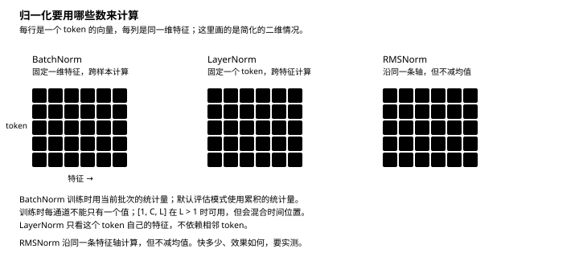

# 归一化：BatchNorm、LayerNorm 与 RMSNorm

**中文** · [English](normalization.en.md)

> 阅读时间：约 12 分钟 · 难度：必修 · 最近审阅：2026-10-09

拿向量 `[1, 3]` 看归一化会比较直观。暂时忽略 epsilon 和可学习参数：LayerNorm 先减均值 2，再除以标准差 1，得到 `[-1, 1]`；RMSNorm 不减均值，而是除以均方根 √5。两者都改变尺度，却没有做同一件事。下面再把这笔计算放回一批序列里，看清到底沿哪个轴统计。

## 核心区别：归一化轴不同 {#_1}

**BatchNorm 沿着「一批样本」求统计量，LayerNorm 沿着「一个样本自己的特征」求。**

先看统计轴，再看 running statistics 与 train / eval 模式，才能判断变长、batch size 为 1 和自回归生成时的行为。轴的选择很重要，但不是唯一的实现约定。

## 三个公式 {#_2}

**BatchNorm**（对每个特征 $j$，在批次维上统计）：

$$\mu_j = \frac{1}{N}\sum_{i=1}^{N} x_{ij}, \qquad \sigma_j^2 = \frac{1}{N}\sum_{i=1}^{N}(x_{ij}-\mu_j)^2$$

$$\hat{x}_{ij} = \frac{x_{ij}-\mu_j}{\sqrt{\sigma_j^2+\epsilon}}, \qquad y_{ij} = \gamma_j \hat x_{ij} + \beta_j$$

**LayerNorm**（对每个样本 $i$，在特征维上统计）：

$$\mu_i = \frac{1}{d}\sum_{j=1}^{d} x_{ij}, \qquad y_{ij} = \gamma_j\,\frac{x_{ij}-\mu_i}{\sqrt{\sigma_i^2+\epsilon}} + \beta_j$$

**RMSNorm**（按均方根缩放，常见写法只保留可学习增益 $\gamma$）：

$$y_{ij} = \gamma_j\,\frac{x_{ij}}{\sqrt{\frac{1}{d}\sum_{k} x_{ik}^2+\epsilon}}$$

这些写法中的 $\gamma$，以及使用时的 $\beta$，都是**按特征维**学习的，长度为 $d$。BatchNorm 与 LayerNorm 要先分清统计轴；LayerNorm 与 RMSNorm 则沿同一特征轴，但分母分别来自方差和原始二阶矩。RMSNorm 不是“假设均值已经等于 0 的 LayerNorm”。

把开头的 `[1, 3]` 整体加 10，得到 `[11, 13]`。忽略 epsilon，LayerNorm 仍输出 `[-1, 1]`；RMSNorm 的分母从 $\sqrt{5}$ 变成 $\sqrt{145}$，输出当然也变了。它没有去掉这次平移。至于 Norm 放在子层前还是后，那是 **Pre-Norm / Post-Norm 的另一个选择**，不能与使用哪种归一化公式混为一谈。[RMSNorm 原论文](https://arxiv.org/abs/1910.07467)讨论的正是去掉 re-centering 后的尺度归一化。

## 四个概念：先会答，再深挖 {#_3}

这里的 BatchNorm 公式用二维输入举例；在 `[N,C,L]` 上，`BatchNorm1d` 对每个 channel 沿 `N,L` 统计。训练前向的方差通常用 `correction=0`，更新 running variance 时使用的估计量则不同。默认 eval 使用 running statistics；`track_running_stats=False` 时 eval 也使用当前 batch。均值 / 方差是统计状态，不是像 gamma / beta 那样由梯度学习的参数。[PyTorch 文档](https://docs.pytorch.org/docs/main/generated/torch.nn.BatchNorm1d.html)明确区分了这些行为。

需要先补输入特征的 min–max 与 Z-score，可以看[预处理和网络 Norm 的区别](../deep-dives/generalization.md)。

1. 为什么深层网络需要 normalization？

**快速学习**

残差网络不断做

$$
x_{\ell+1}=x_\ell+f_\ell(x_\ell).
$$

如果每层分支输出的尺度都没有约束，残差相加会让不同深度的激活尺度逐渐漂移；反向传播时，不同方向的曲率和梯度尺度也可能相差很大。结果不是一定单调爆炸，而是**同一个学习率很难同时适合所有层和所有方向**。

Normalization 给每个 sublayer 一个尺度更可预测的输入，降低训练对初始化和参数尺度的敏感度，通常改善有效条件数（effective conditioning），因此更容易使用较大的学习率并训练更深的网络。

**面试版回答**

> 残差流会持续累积各层更新；若 sublayer 输入尺度不断漂移，激活和梯度的数值范围会越来越难控制，优化问题也会变得病态。LayerNorm / RMSNorm 把每个 token 送入子层前的尺度拉回稳定范围，改善梯度传播和优化条件，因此深层 Transformer 更容易训练。

<b>深挖</b>：残差尺度、condition number 与“稳定”到底指什么？

如果暂时假设各层残差更新近似不相关，

$$
\operatorname{Var}(x_L)
\approx
\operatorname{Var}(x_0)+
\sum_{\ell=0}^{L-1}\operatorname{Var}\big(f_\ell(x_\ell)\big).
$$

这解释了为什么残差流的尺度可能随深度增长。但真实网络里各项相关、权重也会适应，所以它不是“方差必然线性增长”的定理。更准确的说法是：**深度带来了 scale drift，Norm 负责让每个分支面对一个受控的输入尺度。**

从优化角度看，如果 Hessian 在不同方向的特征值跨度很大，一个学习率会在高曲率方向发散、在低曲率方向又走得太慢。Normalization 不能保证全局 Hessian 一定漂亮，但它减少了层与层之间的尺度差异，通常让梯度对参数扰动更平滑、有效 conditioning 更好。

还要注意：Pre-LN 并没有让残差流 $x_\ell$ 自身始终保持单位方差；它只是先把 $\operatorname{Norm}(x_\ell)$ 送进 Attn / FFN。因此末尾仍需要 final LN 把交给输出头的尺度收回来。

2. 为什么 Transformer 通常不用 BatchNorm？

**快速学习**

1. **Variable length + padding**：批内长度不同，统计量可能被 padding 污染；即使做 mask，后部位置的有效样本也很少。
2. **依赖 batch composition**：训练时换一组同行样本，同一个 token 的输出也会改变；小 batch 的统计量尤其噪。
3. **Train / inference mismatch**：训练用当前 batch statistics，推理通常改用 running statistics。自回归解码常是小 batch 或 batch size 1，不能依赖现场批统计量。
4. **可能破坏 causality**：如果实现把 time 轴也纳入统计，未来 token 会通过均值和方差影响过去 token，绕过 causal attention mask。

LayerNorm 对每个 token 自己的 hidden features 做统计，与 batch、序列中其他位置和训练/推理模式都无关。

**面试版回答**

> Transformer 使用 LayerNorm，是因为 LN 对每个 token 独立地沿 hidden dimension 归一化；它不依赖 batch size、序列长度或其他 token，训练与推理一致。BatchNorm 会引入 batch composition、padding 和 running statistics 问题；若统计还跨 time 轴，则会把未来 token 泄漏到过去位置。

<b>深挖</b>：BatchNorm 什么时候真的会泄漏未来？

必须看张量布局和 reduction axes，不能笼统说“BN 一定泄漏”。

- 若对 $X\in\mathbb R^{B\times T\times d}$ 的每个位置 $t$，只沿 $B$ 统计，那么当前位置不会直接读取同一序列的未来 token；但输出仍依赖同 batch 的其他样本，而且每个位置的有效样本数不同。
- 若像常见的 sequence <code>BatchNorm1d</code> 用法那样，对每个 channel 同时沿 $B$ 和 $T$ 统计，那么 $\mu_j,\sigma_j$ 包含 $t'>t$ 的 token。此时位置 $t$ 的归一化结果已经带有未来信息，causal mask 只限制 attention，挡不住这条旁路。
- 如果先把 $B\times T$ 展平再做 BN，也会出现同样的问题。

所以最准确的说法是：

> **BatchNorm 的统计轴一旦包含 time，就破坏自回归因果性；即使不包含 time，它仍有 batch dependence、padding、small-batch 和 train/eval mismatch，因此依然不是语言模型的好默认选择。**

推理时 batch size 1 并不意味着 BatchNorm 一定报错：在 eval mode 它可以使用 running statistics。真正的问题是这些统计来自训练分布，不是当前 token 自己，而且 train / inference 执行的是两套不同函数。

3. Pre-LN 和 Post-LN 放在哪里？为什么 Pre-LN 更稳？

**先会写结构**

<pre><code>Post-LN（2017 原版）             Pre-LN（现代常见）
x = LN(x + Attn(x))             x = x + Attn(LN(x))
x = LN(x + FFN(x))              x = x + FFN(LN(x))
                                 ...
                                 x = LN(x)   ← final LN</code></pre>

**面试版回答**

> Post-LN 把 LayerNorm 放在残差相加之后，因此残差主干的梯度每层都要穿过一次 LN。Pre-LN 把 LN 移进分支，主干保留直接的 identity path；每个 block 的 Jacobian 都显式包含 identity 项，所以深层梯度传播更稳定。代价是残差流本身不被逐层归一化，标准 Pre-LN 架构需要在所有 block 后补 final LN。

<b>深挖</b>：用 Jacobian 看 identity path

忽略多分支细节，Post-LN 写成

$$
x_{\ell+1}=\operatorname{LN}\big(x_\ell+f_\ell(x_\ell)\big).
$$

它的 Jacobian 是

$$
\frac{\partial x_{\ell+1}}{\partial x_\ell}
=
J_{\operatorname{LN}}\big(I+J_{f_\ell}\big).
$$

跨很多层时，梯度反复乘上 $J_{\operatorname{LN}}$。它不代表梯度必然每层缩小，但会打断纯粹的 identity highway，使深层训练更依赖初始化、residual scaling 和 learning-rate warmup。

Pre-LN 写成

$$
x_{\ell+1}=x_\ell+f_\ell\big(\operatorname{LN}(x_\ell)\big),
$$

于是

$$
\frac{\partial x_{\ell+1}}{\partial x_\ell}
=
I+J_{f_\ell}J_{\operatorname{LN}}.
$$

即使分支梯度很小，$I$ 仍提供一条直接路径。更严谨的说法是 Pre-LN **显著降低**深层训练对 warmup 的依赖，而不是保证所有配置都完全不需要 warmup。

Pre-LN 也有 trade-off：残差流尺度会增长，后期层的增量相对主干可能越来越小，产生“effective depth”不足的问题。final LN 解决输出尺度，不自动解决所有表达效率问题。

4. RMSNorm 为什么只做 re-scaling 也能工作？

**快速学习**

LayerNorm 做两件事：

$$
x\longmapsto x-\mu
\quad\text{（re-centering）},
\qquad
x\longmapsto \frac{x}{\sqrt{\operatorname{Var}(x)+\epsilon}}
\quad\text{（re-scaling）}.
$$

RMSNorm 去掉减均值，通常也不使用 $\beta$，只保留

$$
x\longmapsto
\frac{x}{\sqrt{\frac{1}{d}\sum_jx_j^2+\epsilon}}\odot\gamma.
$$

它仍能稳定现代 LLM，说明很多场景里最关键的是控制向量长度和子层输入尺度，而不是强制每个 token 的特征均值为 0。

**面试版回答**

> RMSNorm 保留了 LayerNorm 的尺度控制和可学习 gain，但去掉 mean subtraction 与 bias。它少一次均值归约，计算和通信更简单；实践上质量通常不受明显影响，说明 re-scaling 往往比 re-centering 更关键。

<b>深挖</b>：能否由 RMSNorm 成功推出“均值完全没用”？

不能。RMSNorm 的成功是很强的经验信号，但不是数学证明。LayerNorm 的分母是标准差，

$$
\sqrt{\frac{1}{d}\sum_j(x_j-\mu)^2+\epsilon},
$$

RMSNorm 的分母是二阶矩加 epsilon 后的平方根，

$$
\sqrt{\frac{1}{d}\sum_jx_j^2+\epsilon}.
$$

当特征均值接近 0 时，两者非常接近；当均值偏移明显时，两者不同。模型可以通过前后线性层、bias-free 设计和训练过程适应这种差异。

工程上 RMSNorm 的主要收益是少算一次 mean reduction，并减少相关的同步与内存流量。实现时平方和通常使用 fp32 accumulation，避免 bf16 / fp16 的数值误差。

## 怎样选择归一化方法 {#_4}

| 场景 | 用什么 | 为什么 |
| --- | --- | --- |
| CNN 图像分类，有足够统计样本 | **BatchNorm** 是常见基线 | 按 channel 统计；有效样本还包括空间位置，不只看 batch size |
| 自回归 Transformer | 常用 **LayerNorm / RMSNorm** | 按 token 的特征统计，不把未来位置或同行样本混进来 |
| RNN / LSTM | 可比较 **LayerNorm** | 每个时间步独立归一化；仍要检查放在门控前还是后 |
| 小 batch 的检测、分割 | 可比较 **GroupNorm / LayerNorm** | 不依赖批统计，但分组和归一化轴仍需与架构匹配 |
| 强化学习、在线学习 | **LayerNorm** 可作为基线 | 不维护批均值；分布变化并不意味着 BatchNorm 在所有 RL 方法中都不可用 |
| 不允许跨样本耦合的目标 | 使用样本内的统计量 | 先看目标约束，再选 LN、GN 或其他方案，不能只按任务名字决定 |

一句判据：**只要「同一个输入在不同批次里应该得到同一个输出」是硬要求，就不要让 normalization 使用 batch statistics。**

现代大模型常进一步选择 RMSNorm。少做均值中心化可以简化计算，但实际速度和同步次数还取决于融合 kernel 与张量切分，不能只数公式里的求和号。

<b>补充</b>：为什么 internal covariate shift 不是完整解释？

原论文的说法是减少 internal covariate shift。后来 [How Does Batch Normalization Help Optimization?](https://arxiv.org/abs/1805.11604) 用实验反驳了这个解释——他们在 BN 之后人为注入分布噪声，训练依然又快又稳。

更稳妥的表述是：归一化降低了模型对参数尺度的敏感度，并经常让 loss landscape 与梯度更平滑，从而改善优化；这不是对任意网络全局条件数的无条件保证。

还有一个值得分清的性质：忽略 epsilon、统计量非零且 $\alpha>0$，并从当前输入重算统计量时，$\text{Norm}(\alpha Wx)=\text{Norm}(Wx)$。这是对输入整体正向缩放的不变性，不是说任意改动权重都不影响网络。使用固定 running statistics 的 BatchNorm eval 不满足这个前提。保留 epsilon 时通常只有近似关系；Norm 自己的 $\gamma$ 是否做 weight decay，又是单独的优化选择，不能从这个等式直接推出。

## 动手验证 {#_5}

[`../code/norm_compare.py`](../code/norm_compare.py) 用同一批激活比较统计轴，再检查三个不同情况：`[1,C]` 的 BatchNorm 训练前向会报错；eval 使用 running statistics 可以运行；`[1,C,L]` 在 `L>1` 时也能训练，但统计会跨时间。不要把这三件事都概括成“小 batch 不能用”。

图由 [`../code/make_norm_figures.py`](../code/make_norm_figures.py) 生成。

## 自检 {#_6}

  <strong>如果真的理解了，你应该能解释：</strong>
  <ol>
    <li>对 $B\times T\times d$ 的激活，LayerNorm 沿哪条轴统计？</li>
    <li>为什么“BatchNorm 一定泄漏未来”不够严谨？什么实现会真的泄漏？</li>
    <li>写出 Pre-LN 与 Post-LN，并指出 final LN 在哪里。</li>
    <li>为什么 Pre-LN 的 Jacobian 里有一条 identity path？</li>
    <li>RMSNorm 去掉了什么？它的成功能否证明 re-centering 永远没用？</li>
  </ol>

## 继续阅读 {#_7}

归一化让每层输入的尺度可控，但深度真正可行还差另一半——[残差连接](residual-connections.md)。

## 30 秒建立 mental model {#30-mental-model}

| 概念 | 一句话记忆 | 面试关键词 |
| --- | --- | --- |
| 为什么归一化 | 让每个 sublayer 看到尺度可预测的输入，使优化对参数尺度不那么敏感 | stable activations · conditioning · larger learning rate |
| 为什么不用 BatchNorm | 一个 token 的表示不应依赖 batch 里的其他样本或未来位置 | variable length · padding · train/eval mismatch · causality |
| Pre-LN vs Post-LN | Pre-LN 把 Norm 移出残差主干，留下 identity gradient path | $I+J_fJ_{\mathrm{LN}}$ · final LN |
| RMSNorm | 保留 re-scaling，去掉 re-centering | RMS only · no mean subtraction · cheaper reduction |

> **Normalization 不是为了让所有表示永久保持“均值 0、方差 1”，而是为了控制送进每个子层的数值尺度，并让深网络更容易优化。**
