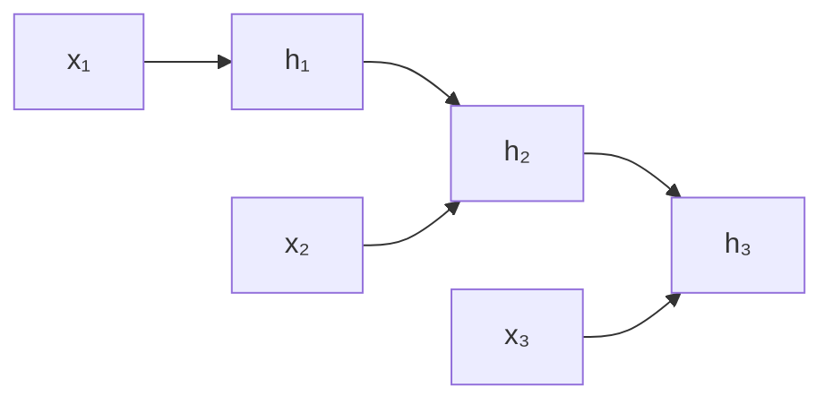

# RNN and LSTM

[中文](recurrent-models.md) · **English**

> Reading time: ~8 min · Level: core · Last reviewed: 2026-08

  
The problem<strong>Let the current position carry the past forward with it</strong>

  
Prerequisites<strong>current input xₜ · previous state hₜ₋₁</strong>

  
Core mechanism<strong>shared update function · LSTM gates · cell state</strong>

  
Common mistakes<strong>long dependencies, vanishing gradients, and no parallelism over time</strong>

## Quick learning: what do RNNs and LSTMs actually solve?

Remember the state recurrence first, then see why gradients vanish

**Quick memory**: an RNN compresses history by recurring over one state. An LSTM uses an additive cell-state path and sigmoid gates to control what is kept, written, and read.

**Interview answer**

> In a vanilla RNN, history has to pass through the same Jacobian again and again, so long-range gradients vanish or explode under the repeated product. An LSTM turns the core memory into an approximately additive update, which lets gradients travel more directly along the cell state, and uses gates to decide how much information passes.

<b>Deep dive</b>: why are the gates themselves not the whole answer?

Sigmoids saturate too. What really matters in an LSTM is

$$
c_t=f_t\odot c_{t-1}+i_t\odot\tilde c_t,
\qquad
\frac{\partial c_t}{\partial c_{t-1}}=f_t.
$$

When the forget gate is close to 1, gradients need not repeatedly cross a fresh tanh and weight matrix. The additive path is more fundamental than “it uses three gates.”

## How the hidden state carries information

Every time an RNN reads a token, it rewrites “what I know so far” onto a small note of fixed size: the hidden state. An LSTM does not replace that note. It adds a few gates beside it so that the model itself decides what to write, what to keep, and what can be forgotten.

## The state update of a vanilla RNN

$$h_t = \tanh(W_x x_t + W_h h_{t-1} + b), \qquad y_t = W_o h_t$$

Each step receives only the current token vector $x_t$ and the previous state $h_{t-1}$. The parameters are shared across all time steps, which is why it can handle sequences of different lengths.

“Recurrent” does not mean the graph really contains an infinite loop; it means the same cell is unrolled $T$ times along time.

## Why early information gradually disappears

During training, the gradient received by an early state has to pass through the same Jacobian many times. If each pass shrinks the gradient a little, the product approaches 0; if each pass enlarges it a little, it explodes.

So this is not just a matter of “a few more parameters would fix it.” The real trouble is that **both information and gradients have to cross the same narrow state path over and over**; the farther apart two positions are, the more easily something is lost on the way.

## LSTM manages information with gates

An LSTM splits the state into a short-term output $h_t$ and a more direct memory path $c_t$:

$$f_t = \sigma(W_f[x_t;h_{t-1}] + b_f), \qquad i_t = \sigma(W_i[x_t;h_{t-1}] + b_i)$$

$$\tilde c_t = \tanh(W_c[x_t;h_{t-1}] + b_c), \qquad c_t = f_t \odot c_{t-1} + i_t \odot \tilde c_t$$

$$o_t = \sigma(W_o[x_t;h_{t-1}] + b_o), \qquad h_t = o_t \odot \tanh(c_t)$$

- forget gate $f_t$: how much of the old memory is kept;
- input gate $i_t$: how much of the new candidate is written;
- output gate $o_t$: how much of the current memory is exposed.

The most important part is the additive path inside $c_t$. As long as $f_t$ stays close to 1, information and gradients can cross time more stably.

## What limits does an LSTM still have?

1. **No parallelism over time**: $h_t$ depends on $h_{t-1}$.
2. **Single-state bottleneck**: the information in a long sequence keeps being squeezed into a fixed-size vector.
3. **Paths are too long**: for the first token to influence the last one takes $T$ updates.

An LSTM mitigates forgetting, but it does not eliminate the sequential computation and the fixed-state bottleneck that come with recurrence.

<b>Deeper</b>: when an RNN / LSTM is still worth using

For streaming sensors, very small edge models, and tasks whose state space is small and which must be updated online one step at a time, a recurrent state can still be cheaper than keeping the full context. The choice of architecture depends on the workload; it is not a simple ranking of new over old.

## Experiment: verify long-range dependencies

[`../code/sequence_numpy.py`](../code/sequence_numpy.py) unrolls the RNN and LSTM forward computation in NumPy; [`../code/sequence_torch.py`](../code/sequence_torch.py) has both learn a delayed-copy task and compares their error under long dependencies.

## Self-check

  <strong>If you really understand this, you should be able to explain:</strong>
  <ol>
    <li>Why does stacking many layers of linear recurrence not automatically solve long-term memory?</li>
    <li>Why does the LSTM cell state pass gradients more easily than a plain hidden state?</li>
    <li>An LSTM mitigates forgetting, so why is it still unsuited to large-scale parallel training?</li>
  </ol>

## Next

An RNN can read a sequence, but how do we turn an input sequence into an output sequence of a different length? Continue to [Seq2Seq](seq2seq.en.md).
