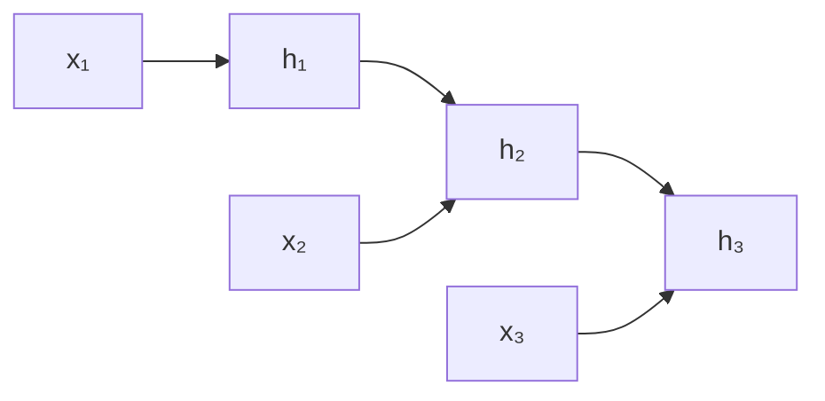

# RNN and LSTM

[中文](recurrent-models.md) · **English**

> Reading time: ~8 min · Level: core · Last reviewed: 2026-10-09

In “It is raining; remember your umbrella,” the final word depends on earlier information. An RNN updates a hidden state as it reads each position. An LSTM adds controls for keeping, writing, and reading its state. First we follow the information forward, then examine why learning long dependencies is difficult.

## How the hidden state carries information {#how-the-hidden-state-carries-information}

Every time an RNN reads a token, it rewrites “what I know so far” onto a small note of fixed size: the hidden state. An LSTM does not replace that note. It adds a few gates beside it so that the model itself decides what to write, what to keep, and what can be forgotten.

## The state update of a vanilla RNN {#the-state-update-of-a-vanilla-rnn}

$$h_t = \tanh(W_x x_t + W_h h_{t-1} + b), \qquad y_t = W_o h_t$$

Each step receives only the current token vector $x_t$ and the previous state $h_{t-1}$. The parameters are shared across all time steps, which is why it can handle sequences of different lengths.

```mermaid
flowchart LR
    X1["x₁"] --> H1["h₁"]
    H1 --> H2["h₂"]
    X2["x₂"] --> H2
    H2 --> H3["h₃"]
    X3["x₃"] --> H3
```

“Recurrent” does not mean the graph really contains an infinite loop; it means the same cell is unrolled $T$ times along time.

## Why early information gradually disappears {#why-early-information-gradually-disappears}

During training, gradients to earlier states pass through a sequence of Jacobians. The weights are shared, but each Jacobian also depends on the current inputs, hidden state, and tanh derivative. Repeated contraction along a direction can shrink the gradient toward zero; repeated expansion can make it explode. Gating changes this propagation path rather than merely adding parameters.

So this is not just a matter of “a few more parameters would fix it.” The real trouble is that **both information and gradients have to cross the same narrow state path over and over**; the farther apart two positions are, the more easily something is lost on the way.

## LSTM manages information with gates {#lstm-manages-information-with-gates}

An LSTM splits the state into a short-term output $h_t$ and a more direct memory path $c_t$:

$$f_t = \sigma(W_f[x_t;h_{t-1}] + b_f), \qquad i_t = \sigma(W_i[x_t;h_{t-1}] + b_i)$$

$$\tilde c_t = \tanh(W_c[x_t;h_{t-1}] + b_c), \qquad c_t = f_t \odot c_{t-1} + i_t \odot \tilde c_t$$

$$o_t = \sigma(W_o[x_t;h_{t-1}] + b_o), \qquad h_t = o_t \odot \tanh(c_t)$$

- forget gate $f_t$: how much of the old memory is kept;
- input gate $i_t$: how much of the new candidate is written;
- output gate $o_t$: how much of the current memory is exposed.

The most important part is the additive path inside $c_t$. As long as $f_t$ stays close to 1, information and gradients can cross time more stably.

## What limits does an LSTM still have? {#what-limits-does-an-lstm-still-have}

1. **No parallelism over time**: $h_t$ depends on $h_{t-1}$.
2. **Single-state bottleneck**: the information in a long sequence keeps being squeezed into a fixed-size vector.
3. **Paths are too long**: for the first token to influence the last one takes $T$ updates.

An LSTM mitigates forgetting, but it does not eliminate the sequential computation and the fixed-state bottleneck that come with recurrence.

<b>Deeper</b>: when an RNN / LSTM is still worth using

For streaming sensors, very small edge models, and tasks whose state space is small and which must be updated online one step at a time, a recurrent state can still be cheaper than keeping the full context. The choice of architecture depends on the workload; it is not a simple ranking of new over old.

## Experiment: verify long-range dependencies {#experiment-verify-long-range-dependencies}

[`../code/sequence_numpy.py`](../code/sequence_numpy.py) unrolls the RNN and LSTM forward computation in NumPy; [`../code/sequence_torch.py`](../code/sequence_torch.py) has both learn a delayed-copy task and compares their error under long dependencies.

## Self-check {#self-check}

  <strong>If you really understand this, you should be able to explain:</strong>
  <ol>
    <li>Why does stacking many layers of linear recurrence not automatically solve long-term memory?</li>
    <li>Why does the LSTM cell state pass gradients more easily than a plain hidden state?</li>
    <li>An LSTM mitigates forgetting, so why is it still unsuited to large-scale parallel training?</li>
  </ol>

## Next {#next}

An RNN can read a sequence, but how do we turn an input sequence into an output sequence of a different length? Continue to [Seq2Seq](seq2seq.en.md).

## Quick learning: what do RNNs and LSTMs actually solve? {#quick-learning-what-do-rnns-and-lstms-actually-solve}

Remember the state recurrence first, then see why gradients vanish

**Quick memory**: an RNN compresses history by recurring over one state. An LSTM uses an additive cell-state path and sigmoid gates to control what is kept, written, and read.

**Interview answer**

> A vanilla RNN propagates gradients through a sequence of state-dependent Jacobians: weights are shared, but activations change. Their product can attenuate or amplify long-range signals. An LSTM adds a gated, additive memory path that makes gradient propagation along the cell state easier.

<b>Deep dive</b>: why are the gates themselves not the whole answer?

Sigmoids saturate too. What really matters in an LSTM is

$$
c_t=f_t\odot c_{t-1}+i_t\odot\tilde c_t,
\qquad
\left.\frac{\partial c_t}{\partial c_{t-1}}\right|_{\text{fixed gates}}=\operatorname{diag}(f_t).
$$

This is the direct cell-state path with gates held fixed, not the total network derivative. A forget gate near one helps preserve gradients along this path; the gates still depend on history, and long-range learning is not guaranteed. For GRU gate conventions and implementation differences, continue to [BPTT and gates](../deep-dives/recurrent-dynamics.en.md).

