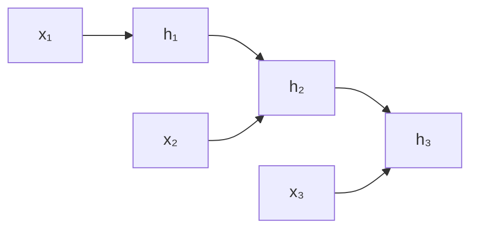

# RNN 与 LSTM

**中文** · [English](recurrent-models.en.md)

> 阅读时间：约 8 分钟 · 难度：必修 · 最近审阅：2026-08

## 先用一句话讲清楚

RNN 用同一个更新函数从左到右读序列，把“到目前为止的信息”压进隐藏状态；LSTM 在这条状态通路上加门，让模型学习该写入、保留和忘掉什么。

## 普通 RNN 在算什么

$$h_t = \tanh(W_x x_t + W_h h_{t-1} + b), \qquad y_t = W_o h_t$$

每一步只接收当前 token 向量 $x_t$ 和上一步状态 $h_{t-1}$。参数在所有时间步共享，所以它能处理不同长度的序列。

“循环”不是图里真的有一条无限环，而是同一个 cell 被沿时间展开了 $T$ 次。

## 它为什么会忘

训练时，早期状态收到的梯度需要穿过很多次同一个 Jacobian。若每次都把梯度缩小一点，连乘后就接近 0；若每次都放大一点，就会爆炸。

这不是“RNN 容量不够”的简单问题，而是**信息和梯度都必须反复穿过一条很窄的状态通路**。

## LSTM 多了什么

LSTM 把状态拆成短期输出 $h_t$ 和更直接的记忆通路 $c_t$：

$$f_t = \sigma(W_f[x_t;h_{t-1}] + b_f), \qquad i_t = \sigma(W_i[x_t;h_{t-1}] + b_i)$$

$$\tilde c_t = \tanh(W_c[x_t;h_{t-1}] + b_c), \qquad c_t = f_t \odot c_{t-1} + i_t \odot \tilde c_t$$

$$o_t = \sigma(W_o[x_t;h_{t-1}] + b_o), \qquad h_t = o_t \odot \tanh(c_t)$$

- forget gate $f_t$：旧记忆保留多少；
- input gate $i_t$：新候选写入多少；
- output gate $o_t$：当前记忆暴露多少。

最关键的是 $c_t$ 里有一条加法路径。只要 $f_t$ 接近 1，信息和梯度就能更稳定地跨越时间。

## 必须知道的局限

1. **无法在时间维并行**：$h_t$ 依赖 $h_{t-1}$。
2. **单状态瓶颈**：长序列的信息持续挤进固定大小的向量。
3. **路径太长**：第一个 token 影响最后一个 token 要走 $T$ 次更新。

LSTM 缓解遗忘，但没有消除递归带来的串行计算和固定状态瓶颈。

<b>进阶</b>：什么时候仍然值得用 RNN / LSTM

流式传感器、非常小的边缘模型、状态空间较低且必须一步步在线更新的任务里，递归状态仍可能比保存完整上下文更便宜。架构选择取决于 workload，不是简单的新旧排名。

## 实验

[`../code/sequence_numpy.py`](../code/sequence_numpy.py) 用 NumPy 展开 RNN 和 LSTM 前向计算；[`../code/sequence_torch.py`](../code/sequence_torch.py) 让两者学习一个延迟复制任务，并比较长依赖下的误差。

## 下一步

RNN 能读一段序列，但怎样把输入序列变成另一段不同长度的输出？继续看 [Seq2Seq](seq2seq.md)。
