# Residual connections

[中文](residual-connections.md) · **English**

> Reading time: ~10 min · Level: core · Last reviewed: 2026-10-09

Suppose the input is `[2, 3]` and a sublayer produces an update `[0.1, -0.2]`. Adding them gives `[2.1, 2.8]`. If the update is zero, the input passes through unchanged. This simple addition changes the function the layer learns and provides a direct path for backpropagation.

## The residual path provides an identity map {#the-residual-path-provides-an-identity-map}

An ordinary layer replaces its input. A residual layer **edits** it:

$$y = x + f(x)$$

If $f$ is zero, the layer is the identity. An added layer can learn what needs changing rather than relearning how to copy the input. But uncertainty does not automatically make the branch output zero; initialization and optimization still determine what it learns.

## Why the gradient gets through {#why-the-gradient-gets-through}

$$\frac{\partial y}{\partial x} = I + \frac{\partial f}{\partial x}$$

That $I$ is the point. Stack $L$ layers and backprop becomes

$$\frac{\partial y_L}{\partial x_0} = \prod_{l=1}^{L}\left(I + \frac{\partial f_l}{\partial x_{l-1}}\right)$$

The product follows the chain rule from the last layer backward; matrices cannot be reordered arbitrarily. Its expansion contains $I\cdots I=I$, but **the total gradient adds every term, not just that path**. [Identity Mappings](https://arxiv.org/abs/1603.05027) studies why identity routes help propagation.

Without the residual, the product is $\prod_l J_{f_l}$. In a scalar example, a derivative of 0.8 per layer gives $0.8^{40}\approx0.000133$ after 40 layers. In higher dimensions, directions, singular values, and activation states matter; a whole matrix is not simply “above 1.”

Residuals have counterexamples too: $f(x)=-x$ gives $y=0$ and derivative $1-1=0$; $f(x)=x$ gives derivative $2^{40}$ through 40 layers. The structure helps optimization but does not guarantee against vanishing or exploding gradients.

## How gradients change without residual paths {#how-gradients-change-without-residual-paths}

A small check uses a 40-layer, width-64 tanh MLP with weight standard deviation $0.8/\sqrt{64}$. Both variants use the same seed, weights, and input; only residual addition changes. The objective is the mean final activation, so both variants receive the same upstream gradient at the last layer:

The graph shows activation-gradient norms, not parameter updates. In this setting the plain stack's gradient decays toward the input, while the residual version retains a larger gradient. Its curve is not flat, and larger is not always better.

There is no optimizer update: only one forward and backward pass. This checks propagation for one input, initialization, and objective—not convergence or generalization—and does not establish a universal tanh “critical gain.” The numbers come from [`make_norm_figures.py`](../code/make_norm_figures.py); changing its parameters changes the graph.

## Three common misreadings {#three-common-misreadings}

**"Its main purpose is preventing overfitting."** That was not the original motivation. [ResNet](https://arxiv.org/abs/1512.03385) addresses ordinary networks whose training error can increase with depth. Residuals primarily help optimization; any generalization benefit still needs validation, and the two are not mutually exclusive.

**"So we can go arbitrarily deep."** No. Gradients can still become unstable, and compute, memory, data, and returns from additional depth remain limited.

**"What if the dimensions don't match?"** Shapes must be compatible at the addition. A projection can match the skip branch; common constant-width Transformer blocks already preserve $d_\text{model}$, but width-changing or hierarchical designs need another check.

<b>Deeper</b>: a residual net behaves like an ensemble of shallow ones

[Residual Networks Behave Like Ensembles](https://arxiv.org/abs/1605.06431) interprets residual networks through paths of different lengths and studies removing layers in its experimental setting. That perspective does not guarantee arbitrary networks tolerate arbitrary layer removal.

At a fixed forward point, the Jacobian product $\prod_l(I+J_l)$ expands into $2^L$ matrix-product terms. The nonlinear forward function cannot generally be decomposed into outputs from $2^L$ independent networks: later branches already depend on earlier outputs.

The actual computation still visits the layers sequentially. This interpretation does not turn depth into parallel width.

## The full sublayer also has a Dropout {#the-full-sublayer-also-has-a-dropout}

The formulas above were simplified to keep the residual in focus. The 2017 sublayer is really:

$$\text{LayerNorm}\big(x + \text{Dropout}(f(x))\big)$$

Standard inverted dropout zeroes activations with probability $p$ during training and divides survivors by $1-p$, preserving the layer output's conditional expectation. It is disabled in eval mode. This is regularization, not a guaranteed improvement on every task. The 2017 Transformer's residual dropout operates on the sublayer output before addition.

**To retain an identity skip, place this dropout on the branch $f(x)$ rather than dropping elements of the skip itself.**

$$\underbrace{x + \text{Dropout}(f(x))}_{\text{identity path intact}} \qquad\text{vs}\qquad \underbrace{\text{Dropout}(x) + f(x)}_{\text{path broken}}$$

Dropout on $x$ changes the direct-path Jacobian from $I$ into a random diagonal matrix. That is a different architecture and no longer satisfies the identity-path argument; it does not, by itself, prove the architecture cannot train.

Whether to use dropout, where to put it, and which rate to use depend on the model configuration and validation results. One model's zero-dropout setting is not a universal answer for pretraining or finetuning.

## How it interacts with normalisation {#how-it-interacts-with-normalisation}

Three different problems, but their **relative placement** matters:

$$\underbrace{\text{Norm}(x + \text{Dropout}(f(x)))}_{\text{post-norm, 2017}} \qquad\text{vs}\qquad \underbrace{x + \text{Dropout}(f(\text{Norm}(x)))}_{\text{pre-norm, now}}$$

Post-norm multiplies the block Jacobian by the normalization Jacobian, so the skip is no longer a pure identity. [On Layer Normalization](https://arxiv.org/abs/2002.04745) analyzes the connection to gradients at initialization and warmup; it does not prove every configuration must—or need not—use warmup.

pre-norm moves the norm into the branch and leaves the identity path intact, at the cost of output scale accumulating with depth — so a final norm is added at the end.

## Common interview questions {#common-interview-questions}

What problem do residual connections solve?

They make updates relative to the input easier to represent and add an identity term to the Jacobian. Total gradients can still cancel or amplify; the existence of one path is not unconditional stability.

Separate optimization from overfitting by inspecting training error as well as validation error. Higher training error is not explained merely by saying the larger model overfits.

Why add instead of concatenate?

Concatenation, as in DenseNet, also preserves information but increases later input widths, requiring parameter and memory management. Addition preserves the current width and makes stacking convenient; it neither permits infinite depth nor requires identical parameter counts in every layer.

Addition also makes "do nothing" a *reachable* solution ($f = 0$). With concatenation, later layers have to actively learn to ignore what was appended.

What happens to the variance of $x + f(x)$?

For one coordinate, write the full expression:

$$\operatorname{Var}(x+f)=\operatorname{Var}(x)+\operatorname{Var}(f)+2\operatorname{Cov}(x,f).$$

Approximately linear growth requires negligible covariance and comparable update variance across layers. If $f=-x$, the output variance is zero instead. Branch scaling controls each increment; final normalization only controls the scale entering the output head, not every intermediate propagation problem.

Inspect activation and gradient distributions before choosing initialization, residual scaling, or normalization.

How should we compare pre-norm and post-norm?

Pre-norm often makes deep networks easier to optimize because normalization stays in the branch rather than the main skip. Suitable learning rates, initialization, and training budgets still matter.

Post-norm normalizes each residual output and has different training and representation behavior. Compare quality at matched budgets rather than claiming one universally wins.

Where does dropout go, and why not on the residual stream?

On the branch output: $x + \text{Dropout}(f(x))$.

Applying dropout to the skip changes its direct Jacobian to a random mask rather than $I$. This explains the standard branch placement; it does not prove every other dropout design is ineffective.

Embedding, attention, and residual dropout occupy different locations; inspect their settings separately.

How does this relate to an LSTM's cell state?

Both provide additive paths. In $c_t = f_t \odot c_{t-1} + i_t \odot \tilde c_t$, holding gates fixed gives the forget gate as the direct derivative along cell state. Values near 1 help propagation across time; the total derivative also includes the gates' dependence on history.

This is a useful analogy between propagation across time and depth, not an equivalence between the architectures.

## Self-check {#self-check}

  <strong>You understand this if you can explain:</strong>
  <ol>
    <li>Why is this an optimisation fix rather than an overfitting fix, and what experiment separates the two?</li>
    <li>What does the $I$ in $\partial y/\partial x = I + \partial f/\partial x$ do during backprop?</li>
    <li>Why does post-norm break that path?</li>
    <li>How does residual-stream variance behave with depth, and what are the two usual remedies?</li>
  </ol>

## Next {#next}

Attention, normalisation and residuals are all covered — time to assemble them: [the vanilla Transformer](vanilla-transformer.en.md).

## Quick learning: why residual connections make depth trainable {#quick-learning-why-residual-connections-make-depth-trainable}

The identity path, gradients, and what it does not guarantee

**Quick memory**: $y=x+f(x)$ asks a block to learn an update relative to its input and preserves an identity route for both forward information and backward gradients.

**Interview answer**

> A residual block has Jacobian $I+J_f$, retaining a direct propagation term. With $f(x)\approx0$ the block approximates the identity; that is an easy function to represent, not a guarantee optimization finds it or that adding depth improves the metric.

<b>Deep dive</b>: does a residual path prove gradients can never vanish?

No. The cross-layer Jacobian remains $\prod_\ell(I+J_{f_\ell})$, whose spectrum can still become unstable; Post-LN also puts $J_{\mathrm{LN}}$ back on the main route. Residual structure helps but is not an unconditional stability theorem, so initialization, normalization, residual scaling, and the optimizer still matter.

