# 残差连接

**中文** · [English](residual-connections.en.md)

> 阅读时间：约 7 分钟 · 难度：必修 · 最近审阅：2026-08

  
这节要做什么<strong>让深度不再是训练的敌人</strong>

  
手里的食材<strong>一个子层 $f$ · 一条恒等通路</strong>

  
核心火候<strong>$y = x + f(x)$，加号是全部</strong>

  
最容易翻车<strong>以为它是「防止过拟合」或者「加深就行」</strong>

## 先尝一口：默认什么都不做

普通一层是「把输入换成新的东西」，残差一层是「在输入上**改一点**」：

$$y = x + f(x)$$

如果 $f$ 学到全 0，这层就是恒等映射，什么也没干。**默认行为从「必须学出有用的变换」变成了「不确定就别动」**——这是它全部威力的来源。

## 第一勺：梯度为什么能穿过去

对残差层求导：

$$\frac{\partial y}{\partial x} = I + \frac{\partial f}{\partial x}$$

那个 $I$ 是关键。堆 $L$ 层之后，反向传播的连乘变成

$$\frac{\partial y_L}{\partial x_0} = \prod_{l=1}^{L}\left(I + \frac{\partial f_l}{\partial x_{l-1}}\right)$$

展开后有一项是 $I \cdot I \cdots I = I$：**存在一条路径，梯度原封不动地从最后一层到达第一层**。

没有残差时是纯连乘 $\prod_l \frac{\partial f_l}{\partial x_{l-1}}$。每层稍微小于 1，$L$ 层之后就是指数级衰减；稍微大于 1 就指数级爆炸。你必须把初始化调到恰好临界，才能两边都不塌。

## 翻车现场：这不是「理论上会衰减」，是真的会

40 层 MLP，tanh，初始化定在临界值下方 20%（也就是「没调到最好」的常见情况），同样的权重同样的输入，唯一区别是有没有那个加号：

普通堆叠从第 40 层走回第 1 层，梯度掉了约 **10³ 倍**，到第 1 层只剩 $2\times10^{-9}$。残差那条基本水平，第 1 层还有 $2.1$。**同一个学习率下，前面那些层等于根本没在训练。**

注意这里没有训练，只是一次前向加一次反向——衰减是架构本身的性质，不是训练不充分。

数字来自 [`../code/make_norm_figures.py`](../code/make_norm_figures.py)，改参数重跑图会跟着变。

## 常见误解

**「残差是为了防止过拟合」** —— 不是。它解决的是**优化**问题，不是泛化问题。ResNet 论文里那个著名观察就是：56 层的普通网络**训练误差**比 20 层还高。不是过拟合，是优化不动。

**「加了残差就可以无限加深」** —— 不能。残差把「梯度消失」从主要瓶颈里移走了，但计算量、显存、数据量、以及深层的边际收益递减都还在。

**「$x + f(x)$ 里维度不一样怎么办」** —— 必须一样，否则加不起来。CNN 里降采样时用 $1\times1$ 卷积做投影；Transformer 里每层输入输出都是 $d_\text{model}$，所以从来不需要投影。

<b>进阶</b>：残差网络更像一个浅网络的集成

[Residual Networks Behave Like Ensembles](https://arxiv.org/abs/1605.06431) 指出：把 $L$ 层残差网络展开，等于 $2^L$ 条长度不等的路径之和（每层要么走 $f$ 要么走恒等）。

而且实测有效路径**很短**——大部分梯度来自长度只有 10–30 的路径，尽管网络有 100+ 层。随机删掉几层，残差网络性能基本不掉；对普通网络这么干会直接崩。

这也解释了为什么残差网络的深度更像「宽度」：它不是在串行地做 $L$ 步推理，而是在并行地叠加许多条较短的变换。

## 和归一化怎么配合

两者解决的是不同问题，但它们的**相对位置**很要命：

$$\underbrace{\text{Norm}(x + f(x))}_{\text{post-norm，2017 原版}} \qquad\text{vs}\qquad \underbrace{x + f(\text{Norm}(x))}_{\text{pre-norm，现在}}$$

post-norm 把 norm 压在残差通路上，上面那条「梯度原样通过」的路径**被打断了**——每层都要穿一次 norm。这正是原版 Transformer 必须配 warmup 的原因。

pre-norm 把 norm 挪进分支里，恒等通路完整保留，代价是输出尺度随深度累积，所以最后要补一个 final norm。

## 面试可能会问

残差连接解决了什么问题？

深层网络的**优化**问题，不是泛化问题。纯连乘的雅可比会指数衰减或爆炸；加上恒等项后 $\partial y/\partial x = I + \partial f/\partial x$，存在一条梯度不衰减的通路。

证据是 ResNet 论文的观察：56 层普通网络的**训练**误差高于 20 层——如果是过拟合，训练误差应该更低。

为什么是相加不是拼接？

拼接（DenseNet 那样）也能保留信息，但维度会随深度增长，参数量和显存跟着涨。相加保持维度不变，可以无限堆叠且每层参数量相同。

另外相加让「什么都不做」成为一个**可达的解**（$f=0$ 即恒等），拼接则需要后续层专门学出「忽略新拼进来的部分」。

$x + f(x)$ 中 $f$ 的输出方差会怎样？

每层加一次，方差近似累加，所以残差流的方差随深度线性增长。两个常见对策：把残差分支的输出投影按 $1/\sqrt{2L}$ 缩放初始化（GPT-2 的做法），或者在最后补一个 final norm。

不管的话，深层的输出尺度会大到让 softmax 饱和。

pre-norm 和 post-norm 哪个好？为什么现在都用 pre-norm？

pre-norm 更容易训——恒等通路上没有 norm，梯度有一条干净的路，可以不用精细的 warmup，深度也更容易堆上去。

post-norm 在训得起来的前提下，最终效果有时略好（每层输出都被归一化，表示更规整），但它对学习率调度非常敏感。工程上稳定性压倒了那一点点效果差异。

残差和 LSTM 的 cell state 有什么关系？

本质相同，都是给梯度开一条加法通路。LSTM 的 $c_t = f_t \odot c_{t-1} + i_t \odot \tilde c_t$ 在 $f_t \to 1$ 时就是沿时间的恒等通路；残差是沿深度的恒等通路。

一个解决「跨时间步太远」，一个解决「跨层太深」，用的是同一招。

## 出锅检查

  <strong>如果真的理解了，你应该能解释：</strong>
  <ol>
    <li>为什么说残差解决的是优化问题而不是过拟合？用什么实验现象能区分？</li>
    <li>$\partial y/\partial x = I + \partial f/\partial x$ 里的 $I$ 在反向传播时具体起了什么作用？</li>
    <li>post-norm 为什么会破坏这条通路？</li>
    <li>残差流的方差随深度怎么变？有哪两种常见处理？</li>
  </ol>

## 下一道菜

注意力、归一化、残差三件都齐了，可以把它们拼成一整块了——[原版 Transformer](vanilla-transformer.md)。
