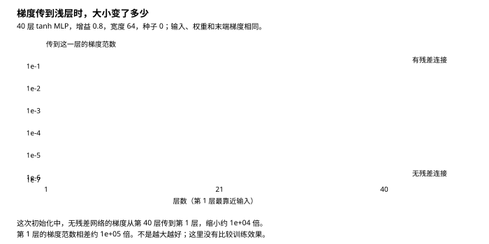

# 残差连接

**中文** · [English](residual-connections.en.md)

> 阅读时间：约 10 分钟 · 难度：必修 · 最近审阅：2026-10-09

输入是 `[2, 3]`，一个子层算出修正量 `[0.1, -0.2]`，残差相加后就是 `[2.1, 2.8]`。如果修正量为零，输入可以原样通过。这个简单的加法既改变了模型学习函数的方式，也给反向传播留了一条直接路径。

## 残差路径提供恒等映射 {#_2}

普通一层是「把输入换成新的东西」，残差一层是「在输入上**改一点**」：

$$y = x + f(x)$$

如果 $f$ 为 0，这层就是恒等映射。多加一层时，不必重新学一遍怎样复制输入，只需学习需要修改的部分。但网络不会因为“不确定”就自动输出 0；初始化和训练仍会影响它实际学到什么。

## 梯度为什么能穿过去 {#_3}

对残差层求导：

$$\frac{\partial y}{\partial x} = I + \frac{\partial f}{\partial x}$$

那个 $I$ 是关键。堆 $L$ 层之后，反向传播的连乘变成

$$\frac{\partial y_L}{\partial x_0} = \prod_{l=1}^{L}\left(I + \frac{\partial f_l}{\partial x_{l-1}}\right)$$

这里的乘积按链式法则从最后一层往前排列，矩阵不能任意换序。展开后有一项是 $I\cdots I=I$，但**总梯度是所有项相加，不是只取这条通路**。[Identity Mappings](https://arxiv.org/abs/1603.05027)讨论了恒等路径为什么有利于传播。

没有残差时是纯连乘 $\prod_l J_{f_l}$。在一维例子里，每层导数为 0.8，40 层后就是 $0.8^{40}\approx0.000133$；高维还要看方向、奇异值和激活状态，不能给整个矩阵简单说“大于 1”。

残差也有反例：若 $f(x)=-x$，则 $y=0$，导数是 $1-1=0$；若 $f(x)=x$，40 层的导数会是 $2^{40}$。因此残差让优化有更好的结构，却没有保证梯度永不消失或爆炸。

## 没有残差时梯度如何变化 {#_4}

用 40 层、宽度 64 的 tanh MLP 做一个小检查。权重标准差设为 $0.8/\sqrt{64}$，两组使用同一随机种子、权重和输入，只改变残差相加。目标取末层激活的平均值，因此两组末层收到相同的上游梯度：

图里画的是每层激活的梯度范数，不是参数更新量。在这个设置下，普通堆叠往前传播时明显衰减，残差版本保留了较大的梯度。曲线不是一条水平线，也不表示梯度越大越好。

这里没有优化器更新，只做一次前向和反向。它检验的是这个输入、初始化和目标下的传播，不是训练收敛或泛化实验，也不能据此认定某个 gain 是所有 tanh 网络的“临界值”。

数字来自 [`../code/make_norm_figures.py`](../code/make_norm_figures.py)，改参数重跑图会跟着变。

## 常见误解 {#_5}

**「残差主要是为了防止过拟合」** —— 这不是最初的出发点。[ResNet](https://arxiv.org/abs/1512.03385)关注的现象是普通网络变深后，连训练误差都可能更高。它首先改善优化；是否改善泛化仍要看验证数据，二者并不互斥。

**「加了残差就可以无限加深」** —— 不能。梯度仍可能不稳定，计算量、显存、数据和深度收益也都有限制。

**「$x + f(x)$ 里维度不一样怎么办」** —— 相加位置的 shape 必须兼容。可以用投影匹配 skip 分支；常见等宽 Transformer block 已保持 $d_\text{model}$，但换宽度或层级结构时仍要重新核对。

<b>进阶</b>：残差网络更像一个浅网络的集成

[Residual Networks Behave Like Ensembles](https://arxiv.org/abs/1605.06431)用长短不同的路径解释残差网络，并在论文设置里研究移除部分层的影响。这是理解传播的一种视角，不是说任意残差网络都能随意删层。

对于固定前向点的 Jacobian，$\prod_l(I+J_l)$ 可以展开成 $2^L$ 个矩阵乘积项。非线性前向函数本身却不能一般地拆成 $2^L$ 个彼此独立的网络输出，因为后层的输入已经依赖前层结果。

因此实际计算仍要依次经过各层，不能把这个解释当作“深度已经变成并行宽度”。

## 完整的子层还有一个 Dropout {#dropout}

前面为了把残差讲透，式子是简化过的。2017 原版的子层实际长这样：

$$\text{LayerNorm}\big(x + \text{Dropout}(f(x))\big)$$

标准 inverted dropout 在训练时按概率 $p$ 置零，留下的激活除以 $1-p$，保持这一层输出的条件期望；eval 时关闭。它是一种正则化手段，不保证每个任务都获益。2017 Transformer 的 residual dropout 放在子层输出上，再与输入相加。

**若想保留恒等 skip，就把这里的 dropout 放在分支 $f(x)$ 上，而不是直接丢弃 skip 的元素。**

$$\underbrace{x + \text{Dropout}(f(x))}_{\text{恒等通路完好}} \qquad\text{vs}\qquad \underbrace{\text{Dropout}(x) + f(x)}_{\text{通路被打断}}$$

Dropout 放到 $x$ 上时，直接通路的 Jacobian 从 $I$ 变成随机对角矩阵。这是另一种结构，不再满足前面的恒等路径推导；但不能仅凭这一点宣称它完全无法训练。

是否使用 dropout、放在哪一层、概率多大，都要以具体模型配置和验证结果为准。不要把某个大模型的零 dropout 配置当作所有预训练或微调任务的通用答案。

## 和归一化怎么配合 {#_6}

三样东西解决的是不同问题，但它们的**相对位置**很要命：

$$\underbrace{\text{Norm}(x + \text{Dropout}(f(x)))}_{\text{post-norm，2017 原版}} \qquad\text{vs}\qquad \underbrace{x + \text{Dropout}(f(\text{Norm}(x)))}_{\text{pre-norm，现在}}$$

Post-norm 的 Jacobian 要再乘上 Norm 的 Jacobian，不再是纯恒等 skip。[On Layer Normalization](https://arxiv.org/abs/2002.04745)分析了这类结构与初始化时梯度、warmup 的关系；它不是所有配置都“必须 / 不必 warmup”的定理。

pre-norm 把 norm 挪进分支里，恒等通路完整保留，代价是输出尺度随深度累积，所以最后要补一个 final norm。

## 面试常见问题 {#_7}

残差连接解决了什么问题？

它让深层网络更容易学习相对输入的修正，并给 Jacobian 加上恒等项。总梯度仍可能发生抵消或放大，不能把一条通路的存在说成无条件稳定。

区分优化和过拟合时，先看训练误差，再看验证误差。训练误差变高，不能仅用“模型更大所以过拟合”解释。

为什么是相加不是拼接？

拼接（如 DenseNet）也能保留信息，但会增加后续层的输入宽度，需要管理参数和显存。相加保持当前宽度，便于堆叠；它不意味着能无限加深，也不要求各层参数量完全相同。

另外相加让「什么都不做」成为一个**可达的解**（$f=0$ 即恒等），拼接则需要后续层专门学出「忽略新拼进来的部分」。

$x + f(x)$ 中 $f$ 的输出方差会怎样？

先对一个坐标写完整：

$$\operatorname{Var}(x+f)=\operatorname{Var}(x)+\operatorname{Var}(f)+2\operatorname{Cov}(x,f).$$

只有协方差可忽略、各层更新方差相近时，才近似随深度线性增长。若 $f=-x$，输出方差反而为 0。分支缩放可以控制每层增量；final norm 只控制末端送入输出头的尺度，不能把中间传播问题都修好。

检查实际激活和梯度分布，再决定初始化、残差缩放或归一化方案。

Pre-Norm 和 Post-Norm 怎么取舍？

Pre-norm 通常更容易优化深层网络，因为 Norm 位于分支而非主 skip 上；它仍需要合适的学习率、初始化和训练预算。

Post-norm 逐层归一化残差输出，训练条件和表示行为不同。质量结论要在可比预算下测，不能直接排出所有模型通用的优劣顺序。

Dropout 加在哪一步？为什么不能加在残差流上？

加在分支输出上：$x + \text{Dropout}(f(x))$。

若对 skip 的 $x$ 做 dropout，直接路径就变成随机掩码，不再是 $I$。这里解释的是为何标准残差分支这样放，不是证明任何其他 dropout 设计都无效。

另外，embedding dropout、attention dropout 和 residual dropout 不是同一个位置，核对配置时要分开。

残差和 LSTM 的 cell state 有什么关系？

两者都提供加法通路。LSTM 的 $c_t = f_t \odot c_{t-1} + i_t \odot \tilde c_t$ 在固定门值时，沿 cell state 的直接导数是 forget gate；它接近 1 时有利于跨时间传播。总导数仍包含门对历史的依赖。

所以可以类比时间与深度上的传播，但不能说两种结构完全等价。

## 自检 {#_8}

  <strong>如果真的理解了，你应该能解释：</strong>
  <ol>
    <li>为什么说残差解决的是优化问题而不是过拟合？用什么实验现象能区分？</li>
    <li>$\partial y/\partial x = I + \partial f/\partial x$ 里的 $I$ 在反向传播时具体起了什么作用？</li>
    <li>post-norm 为什么会破坏这条通路？</li>
    <li>残差流的方差随深度怎么变？有哪两种常见处理？</li>
  </ol>

## 继续阅读 {#_9}

注意力、归一化、残差都齐了，可以拼成一整块——[原版 Transformer](vanilla-transformer.md)。

## 快速学习：Residual Connection 为什么让深度可训练 {#residual-connection}

Identity path、梯度与它没有解决的事

**快速记忆**：$y=x+f(x)$ 让 block 只需学习相对输入的增量，并给前向信息与反向梯度都保留一条恒等通路。

**面试回答**

> Residual connection 的 Jacobian 是 $I+J_f$，保留了直接传播的项。$f(x)\approx0$ 时 block 接近恒等映射；这是容易表示的解，不保证训练一定找到，也不保证加深后指标一定更好。

<b>深挖</b>：有 residual 就绝不会梯度消失吗？

不会。跨层 Jacobian 仍是 $\prod_\ell(I+J_{f_\ell})$，其谱仍可能失控；Post-LN 还会把 $J_{\mathrm{LN}}$ 放回主路径。Residual 提供有利结构，不是无条件稳定性证明，因此初始化、normalization、residual scaling 与 optimizer 仍然重要。

