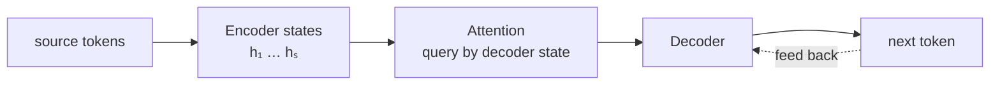

# Seq2Seq: encode and generate

[中文](seq2seq.md) · **English**

> Reading time: ~8 min · Level: core · Last reviewed: 2026-08

  
The problem<strong>Turn one input sequence into an output sequence of a different length</strong>

  
Prerequisites<strong>source sequence · target sequence · BOS / EOS</strong>

  
Core mechanism<strong>encoder · decoder · teacher forcing · attention</strong>

  
Common mistakes<strong>the fixed-vector bottleneck and the training / generation mismatch</strong>

## Quick learning: how the Seq2Seq bottleneck led to attention

The encoder–decoder spine, teacher forcing, and exposure bias

**Quick memory**: the encoder turns the source into states and the decoder generates the target autoregressively. Squeezing the whole sentence into a single vector creates a bottleneck; attention instead lets every step read all encoder states on demand.

**Interview answer**

> Classic Seq2Seq conditions the decoder on the encoder's final state, so the information in a long sequence is forced into a fixed-length vector. Attention lets every decode step address all encoder states with its current query. During training, teacher forcing supplies the true prefix; at inference the model can only consume its own outputs, which produces exposure bias.

<b>Deep dive</b>: what did attention solve, and what did it not solve?

It relieves the information bottleneck and improves alignment, but it does not remove the decoder's recurrence over time: target token $t$ still depends on what was generated before it, and the prefix distributions in training and inference still differ. What the Transformer later parallelized is the sequence computation at training time, not autoregressive generation itself.

## Start with the overall structure

The input and the output need not have the same length. Translation, summarization, and question answering are all “read one passage to the end, then write another.” The first thing Seq2Seq does is split these two jobs cleanly: the encoder reads, the decoder writes.

## A fixed-length vector creates an information bottleneck

$$h_1,\ldots,h_S = \text{Encoder}(x_1,\ldots,x_S), \qquad c = h_S$$

$$s_t = \text{Decoder}(y_{t-1}, s_{t-1}, c), \qquad p(y_t)=\text{softmax}(W s_t)$$

The input length is $S$ and the output length is $T$; the two need not be equal. The problem is that the whole input must end up squeezed into one fixed vector $c$. A short sentence gets by; a long one is like writing a whole book on a sticky note.

## Attention reads the encoder states on demand

If one sticky note cannot hold everything, stop giving the decoder only one. Every time it writes a token, let it go back over the encoder states again and pick the positions that actually matter at this moment:

$$e_{tj}=\text{score}(s_{t-1},h_j), \qquad \alpha_{tj}=\text{softmax}_j(e_{tj})$$

$$c_t = \sum_j \alpha_{tj}h_j$$

$c_t$ is no longer a fixed bottleneck. It answers “when generating token $t$, which input positions should information come from?” This is the ancestor of cross-attention.

## Training technique: teacher forcing

At training step $t$, the decoder is fed the true $y_{t-1}$. During generation, it can only be fed the $\hat y_{t-1}$ it has just predicted.

The training loss is

$$\mathcal{L} = -\sum_{t=1}^{T}\log p_\theta(y_t \mid y_{<t}, x)$$

Training has access to the complete correct prefix; at inference, an error enters the later context and keeps propagating. This train–inference mismatch is commonly called exposure bias.

## Training and generation see different input distributions

| Concept | Training | Inference |
| --- | --- | --- |
| decoder input | the true prefix shifted right by one | the prefix it generated itself |
| time-step computation | an RNN is still sequential | sequential |
| termination | the target ends with EOS | EOS is generated or the length limit is reached |

Beam search only changes how candidate sequences are kept at inference time; it does not change the training objective.

## What remains unsolved: recurrent computation cannot be parallelized

- the RNNs inside the encoder and decoder cannot be parallelized over time;
- the information path between two arbitrary positions can still be very long;
- attention has already solved dynamic reading, but recurrent state still limits throughput.

The Transformer's key move was not “inventing attention.” It was removing recurrence entirely and keeping only attention and position-wise computation.

## Experiment: learn sequence reversal

Run [`../code/sequence_torch.py`](../code/sequence_torch.py) with `--task reverse` and watch the encoder–decoder learn the alignment on a sequence-reversal task. Then compare with the existing [`../code/vanilla_demo.py`](../code/vanilla_demo.py) to see how the same task is handled by Transformer cross-attention.

## Self-check

  <strong>Try explaining these three things to someone who has never studied them:</strong>
  <ol>
    <li>Why does it not matter that the source and the target have different lengths?</li>
    <li>Compared with a fixed context vector, exactly which assumption does attention relax?</li>
    <li>Why does teacher forcing make training easy yet leave an exposure gap for generation?</li>
  </ol>

## Next

Continue to [Vanilla Transformer](vanilla-transformer.en.md) to see how self-attention lets both the encoder and the decoder be trained in parallel internally.
