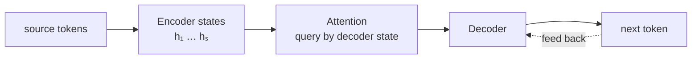

# Seq2Seq：编码与生成

**中文** · [English](seq2seq.en.md)

> 阅读时间：约 8 分钟 · 难度：必修 · 最近审阅：2026-08

  
解决什么问题<strong>把一段输入，变成另一段不同长度的输出</strong>

  
前置知识<strong>source sequence · target sequence · BOS / EOS</strong>

  
核心机制<strong>encoder · decoder · teacher forcing · attention</strong>

  
常见错误<strong>固定向量瓶颈与训练 / 生成不一致</strong>

## 先读完，再开始写

输入和输出不一定一样长。翻译、摘要、问答都是“先读完一段，再写出另一段”。Seq2Seq 做的第一件事，就是很干脆地把这两件事拆开：encoder 负责读，decoder 负责写。

## 整段输入压成一张便利贴

$$h_1,\ldots,h_S = \text{Encoder}(x_1,\ldots,x_S), \qquad c = h_S$$

$$s_t = \text{Decoder}(y_{t-1}, s_{t-1}, c), \qquad p(y_t)=\text{softmax}(W s_t)$$

输入长度是 $S$，输出长度是 $T$，二者无需相等。问题在于：它要求整段输入最后都挤进一个固定向量 $c$。短句还能凑合，长句就像把整本书写进一张便利贴。

## 需要什么，就回头找什么

既然一张便利贴装不下，那就别只给 decoder 一张。让它每写一个 token，都回头重新翻一遍 encoder states，挑出这一刻真正相关的位置：

$$e_{tj}=\text{score}(s_{t-1},h_j), \qquad \alpha_{tj}=\text{softmax}_j(e_{tj})$$

$$c_t = \sum_j \alpha_{tj}h_j$$

$c_t$ 不再是固定瓶颈，而是“生成第 $t$ 个 token 时，从输入的哪些位置取信息”。这就是 cross-attention 的祖先。

## 训练技巧：Teacher forcing

训练第 $t$ 步时，decoder 输入真实的 $y_{t-1}$；生成时，它只能输入自己刚预测的 $\hat y_{t-1}$。

训练损失是：

$$\mathcal{L} = -\sum_{t=1}^{T}\log p_\theta(y_t \mid y_{<t}, x)$$

训练时可以知道完整正确前缀，推理时错误会进入后续上下文并继续传播。这种 train–inference mismatch 常被称为 exposure bias。

## 训练时有人递答案，生成时没有

| 概念 | 训练 | 推理 |
| --- | --- | --- |
| decoder 输入 | 真实前缀右移一位 | 自己生成的前缀 |
| 时间步计算 | RNN 仍需串行 | 串行 |
| 终止 | 目标末尾有 EOS | 生成 EOS 或达到长度上限 |

Beam search 只改变推理时怎样保留候选序列，不改变模型训练目标。

## 还没解决的问题：Attention 有了，递归还在

- encoder / decoder 里的 RNN 无法按时间并行；
- 任意两位置之间的信息路径仍可能很长；
- attention 已经解决动态读取，但 recurrent state 仍限制吞吐。

Transformer 的关键动作不是“发明 attention”，而是把 recurrence 全部拿掉，只保留 attention 与逐位置计算。

## 动手：看它自己学出“倒着读”

运行 [`../code/sequence_torch.py`](../code/sequence_torch.py) 的 `--task reverse`，观察 encoder–decoder 在反转序列任务上学习对齐。然后对照现有 [`../code/vanilla_demo.py`](../code/vanilla_demo.py)，看同一任务如何由 Transformer cross-attention 完成。

## 自检

  <strong>试着把这三件事讲给没学过的人：</strong>
  <ol>
    <li>为什么 source 和 target 长度不一样也没关系？</li>
    <li>attention 相比固定 context vector，究竟放松了哪个假设？</li>
    <li>teacher forcing 为什么让训练容易，却给生成留下 exposure gap？</li>
  </ol>

## 继续读

进入 [Vanilla Transformer](vanilla-transformer.md)，看 self-attention 怎样让 encoder 和 decoder 内部都可以并行训练。
