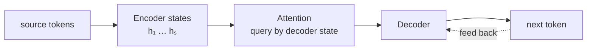

# Seq2Seq：编码与生成

**中文** · [English](seq2seq.en.md)

> 阅读时间：约 8 分钟 · 难度：必修 · 最近审阅：2026-08

## 先用一句话讲清楚

Seq2Seq 把“读输入”和“写输出”拆成 encoder 与 decoder：encoder 形成输入表示，decoder 在该表示条件下逐 token 生成目标序列。

## 最早的固定向量版本

$$h_1,\ldots,h_S = \text{Encoder}(x_1,\ldots,x_S), \qquad c = h_S$$

$$s_t = \text{Decoder}(y_{t-1}, s_{t-1}, c), \qquad p(y_t)=\text{softmax}(W s_t)$$

输入长度是 $S$，输出长度是 $T$，二者无需相等。但所有输入信息都要穿过一个固定向量 $c$，长句很容易被压坏。

## Attention 为什么出现

与其要求 decoder 永远只看最后一个状态，不如让它在每一步重新查询所有 encoder states：

$$e_{tj}=\text{score}(s_{t-1},h_j), \qquad \alpha_{tj}=\text{softmax}_j(e_{tj})$$

$$c_t = \sum_j \alpha_{tj}h_j$$

$c_t$ 不再是固定瓶颈，而是“生成第 $t$ 个 token 时，从输入的哪些位置取信息”。这就是 cross-attention 的祖先。

## Teacher forcing

训练第 $t$ 步时，decoder 输入真实的 $y_{t-1}$；生成时，它只能输入自己刚预测的 $\hat y_{t-1}$。

训练损失是：

$$\mathcal{L} = -\sum_{t=1}^{T}\log p_\theta(y_t \mid y_{<t}, x)$$

训练时可以知道完整正确前缀，推理时错误会进入后续上下文并继续传播。这种 train–inference mismatch 常被称为 exposure bias。

## 三件必须分清的事

| 概念 | 训练 | 推理 |
| --- | --- | --- |
| decoder 输入 | 真实前缀右移一位 | 自己生成的前缀 |
| 时间步计算 | RNN 仍需串行 | 串行 |
| 终止 | 目标末尾有 EOS | 生成 EOS 或达到长度上限 |

Beam search 只改变推理时怎样保留候选序列，不改变模型训练目标。

## Seq2Seq 留给 Transformer 的问题

- encoder / decoder 里的 RNN 无法按时间并行；
- 任意两位置之间的信息路径仍可能很长；
- attention 已经解决动态读取，但 recurrent state 仍限制吞吐。

Transformer 的关键动作不是“发明 attention”，而是把 recurrence 全部拿掉，只保留 attention 与逐位置计算。

## 实验

运行 [`../code/sequence_torch.py`](../code/sequence_torch.py) 的 `--task reverse`，观察 encoder–decoder 在反转序列任务上学习对齐。然后对照现有 [`../code/vanilla_demo.py`](../code/vanilla_demo.py)，看同一任务如何由 Transformer cross-attention 完成。

## 下一步

进入 [Vanilla Transformer](vanilla-transformer.md)，看 self-attention 怎样让 encoder 和 decoder 内部都可以并行训练。
