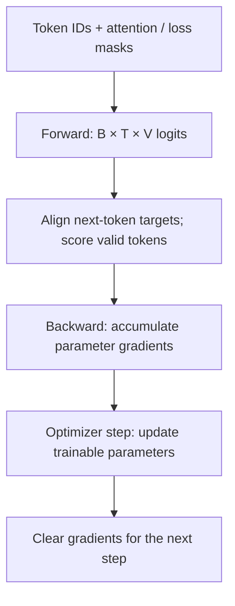

# What happens in one language-model training step

[中文](training-step.md) · **English**

> Reading time: about 6 minutes · Level: introductory to intermediate · Last reviewed: 2026-09

An architecture diagram does not explain every `labels`, `mask`, and `backward` in training code. Follow one batch: **which tokens provide context, which get scored, and which parameters change?**

Start with [Decoder-only](../core/decoder-only.en.md). The theory of training versus generation is covered in [language-model objectives](language-model-objective.en.md).

## Align each prediction with its target

Use the invented sequence `[BOS, question, SEP, answer, EOS, PAD]`, with each word treated as one teaching token. The output at position 2, `SEP`, predicts the answer at position 3—not itself.

| Input position | Current token | Next-token target | Scored in answer-only loss |
| --- | --- | --- | --- |
| 0 | BOS | question | No |
| 1 | question | SEP | No |
| 2 | SEP | answer | Yes |
| 3 | answer | EOS | Yes |
| 4 | EOS | PAD | No |

A manual loss aligns `logits[:, :-1]` with `input_ids[:, 1:]`, using `[:, 1:]` of a target-position loss mask. If the model implementation already shifts internally, do not shift twice. The [Hugging Face causal LM tutorial](https://huggingface.co/docs/transformers/tasks/language_modeling) illustrates an interface where the model handles alignment.

## Three masks, three different jobs

- **Causal mask:** prevent looking at future answers.
- **Padding mask:** prevent treating padding as valid context.
- **Loss mask:** choose which target positions contribute to the objective.

Excluding the question from loss **does not hide it from the model**. Answer predictions still depend on it, and shared parameters can receive gradients through that computation.

When packing independent examples into one sequence, decide whether attention may cross sample boundaries. EOS is a token, not an isolation barrier; enforce boundaries explicitly if independence is required.

## Five operations on a batch



Cross-entropy takes logits, not probabilities from a manually applied softmax. A common token-average objective with $M$ valid targets is:

$$L=\frac{1}{M}\sum_{b,t}m_{b,t}\left[-\log p_\theta(x_{b,t}\mid x_{b,<t})\right],\qquad M=\sum_{b,t}m_{b,t}.$$

Here $m_{b,t}$ marks **target positions**. A batch with no valid targets needs an explicit skip or error, not division by zero. See [PyTorch CrossEntropyLoss](https://docs.pytorch.org/docs/main/generated/torch.nn.CrossEntropyLoss.html) for `ignore_index` and reduction semantics.

## What a larger batch changes

Suppose two microbatches contain 2 and 8 valid tokens, with mean losses of 1 and 3. Averaging the means gives 2; averaging all tokens gives $(2\times1+8\times3)/10=2.6$. These are different objectives.

Gradient accumulation therefore involves more than calling backward repeatedly. To match a large-batch token average, normalize by the total valid-token count and account for any additional framework or distributed averaging. `backward()` accumulates gradients; `optimizer.step()` updates parameters. Their call counts need not match.

## One computation chain, different training settings

| Setting | Data and scored targets | What does not follow automatically |
| --- | --- | --- |
| Causal pretraining | Predict subsequent valid tokens in text sequences | Instruction-following behavior |
| Answer-only SFT | Questions provide context; assistant answers usually receive loss | Identical masking across all SFT tools |
| Visual instruction SFT | Add visual conditioning and score target answers | Actual use of the image |

These are training settings, not three mutually exclusive architectures. SFT can also use full-sequence loss; specify what the implementation does.

## Small checks before a big run

The [lab file](../code/multimodal_math.py) implements a pure-Python masked next-token loss. Tests check padding invariance, correct shifting, and optional agreement with PyTorch.

```bash
python -m unittest discover -s site/tests -p 'test_multimodal_math.py'
```

For a real small model, first overfit a tiny batch, check finite gradients and expected parameter updates, then evaluate loss and task behavior on non-overlapping validation data. Memorizing the tiny batch checks the training path, not generalization.

Continue with [visual language models](../../03-multimodal-learning/vision-to-language.en.md) to distinguish adding a new input from changing the learning objective.
