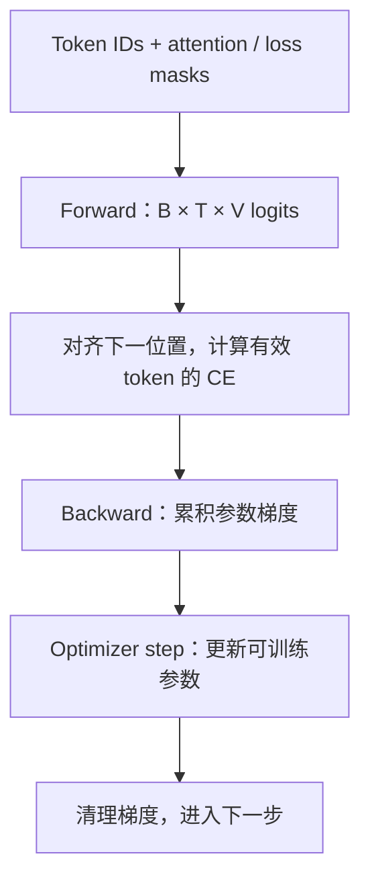

# 语言模型的一次训练究竟做了什么

**中文** · [English](training-step.en.md)

> 阅读时间：约 6 分钟 · 难度：基础到进阶 · 最近审阅：2026-09

架构图看懂了，代码里却还是一堆 `labels`、`mask`、`backward`。这一篇只追踪一个 batch：**哪些 token 提供上下文，哪些 token 被计分，最后什么参数变了。**

前置是 [Decoder-only](../core/decoder-only.md)。理论上的训练与生成差别，在[语言模型目标](language-model-objective.md)里展开。

## 先把预测位置对齐

用虚构序列 `[BOS, 问题, SEP, 答案, EOS, PAD]`，这里只把每个词当成一个教学 token。位置 2 的 `SEP` 处输出预测位置 3 的 `答案`，不是预测它自己。

| 输入位置 | 当前 token | 应预测的下一个 token | answer-only 计分 |
| --- | --- | --- | --- |
| 0 | BOS | 问题 | 否 |
| 1 | 问题 | SEP | 否 |
| 2 | SEP | 答案 | 是 |
| 3 | 答案 | EOS | 是 |
| 4 | EOS | PAD | 否 |

所以手写 loss 时，`logits[:, :-1]` 对齐 `input_ids[:, 1:]`，目标位置的 loss mask 也取 `[:, 1:]`。如果框架的模型已经在内部 shift，就不要再 shift 一次；先查实际实现。[Hugging Face 的 causal LM 教程](https://huggingface.co/docs/transformers/tasks/language_modeling)展示了一种由模型负责对齐的用法。

## 三种 mask 不做同一件事

- **Causal mask**：不能看未来答案。
- **Padding mask**：无效的补齐位置不应作为有效上下文。
- **Loss mask**：哪些目标位置计入训练目标。

问题不计 loss，**不代表模型看不到问题**。答案的预测仍然依赖它；共享参数也仍可能通过这条计算路径得到梯度。

将独立样本 pack 在同一序列里时，还要决定是否隔离样本间的 attention。EOS 是一个 token，本身不等于隔离墙；如果要求样本互不影响，必须显式设置边界。

## 一个 batch 经过的 5 步



Cross-entropy 接收 logits，而不是先手动 softmax 的概率。有效目标数是 $M$ 时，常见的 token 平均 loss 是：

$$L=\frac{1}{M}\sum_{b,t}m_{b,t}\left[-\log p_\theta(x_{b,t}\mid x_{b,<t})\right],\qquad M=\sum_{b,t}m_{b,t}.$$

这里 $m_{b,t}$ 标的是**目标位置**。全是无效目标的 batch 不能除以 0；应明确跳过或报错。框架的 `ignore_index` 和 reduction 语义见 [PyTorch CrossEntropyLoss](https://docs.pytorch.org/docs/main/generated/torch.nn.CrossEntropyLoss.html)。

## Batch 变大，究竟哪里变了

假设两个 microbatch 分别有 2 和 8 个有效 token，平均 loss 分别是 1 和 3。直接平均两个数得 2；按全部 token 平均是 $(2\times1+8\times3)/10=2.6$。它们不是同一个训练目标。

因此 gradient accumulation 不只是在循环里多调几次 backward。如果想等价于大 batch 的 token 平均，要按有效 token 总数归一化；框架或分布式实现还可能做额外的平均，需要一起核对。`backward()` 累加梯度，`optimizer.step()` 才更新参数，不要把前者次数当成更新次数。

## 同一条计算链，怎样区分 pretraining 和 SFT

| 设置 | 数据与计分方式 | 不能直接推出 |
| --- | --- | --- |
| Causal pretraining | 从文本序列预测后续有效 token | 模型自然就会遵循指令 |
| Answer-only SFT | 问题作为上下文，通常只对助手答案计分 | 所有 SFT 工具都用相同 mask |
| 视觉指令 SFT | 再加入视觉条件，对目标答案计分 | 加了图片就保证模型使用它 |

比较的是训练设置，不是三种互斥的网络结构。SFT 也可以选择 full-sequence loss，关键是把实际目标写清楚。

## 先做这些小检查

配套[实验文件](../code/multimodal_math.py)实现了纯 Python 的 masked next-token loss；测试会检查 padding 不改变结果、shift 是否正确，以及可选的 PyTorch 结果一致性。

```bash
python -m unittest discover -s site/tests -p 'test_multimodal_math.py'
```

此外，可以让一个真实的小模型先过拟合极小 batch，检查梯度是否有限、预期模块是否更新；再在不重叠的验证数据上看 loss 和任务表现。小 batch 能记住只能证明训练链基本通了，不能证明泛化。

下一篇把这条训练链用到[视觉语言模型](../../03-multimodal-learning/vision-to-language.md)，你就能区分“加了哪个输入”和“改变了哪个目标”。
