# From linear models to neural networks

[中文](from-linear-to-neural.md) · **English**

Place four points at the corners of a square and give opposite corners the same label. No single line separates the classes. Stacking linear layers alone does not help: they still compose into one linear transform. We use this XOR example to see how nonlinear hidden layers change the representation.

## A linear model's decision boundary is always a hyperplane {#a-linear-models-decision-boundary-is-always-a-hyperplane}

Start with a common classification network: **hidden layers learn features, and a linear classification head reads them out**. With a sigmoid for binary classification, this resembles logistic regression on learned features. It is a useful view for this chapter, not a required output structure for every neural network.

This page goes from least squares to backpropagation. Every step comes with its formula and a framework-free Python implementation.

## Linear regression: the decision boundary can only be a hyperplane {#linear-regression-the-decision-boundary-can-only-be-a-hyperplane}

$$\hat{y} = \mathbf{w}^\top \mathbf{x} + b = \sum_{i=1}^{n} w_i x_i + b, \qquad \mathbf{x}, \mathbf{w} \in \mathbb{R}^n$$

With squared loss $\mathcal{L} = \frac{1}{2}\sum_k (y_k - \hat y_k)^2$, absorb the bias into $\mathbf{w}$ (append a constant 1 to $\mathbf{x}$). When $X$ has full column rank, setting the gradient to zero gives:

$$\nabla_{\mathbf{w}}\mathcal{L} = X^\top(X\mathbf{w} - \mathbf{y}) = 0 \;\Longrightarrow\; \hat{\mathbf{w}} = (X^\top X)^{-1} X^\top \mathbf{y}$$

With linearly dependent features, $X^\top X$ can be singular; a pseudoinverse gives the minimum-norm solution. In code, use a QR / SVD least-squares solver rather than explicitly computing the inverse.

Used as a classifier, its decision surface is

$$\{\mathbf{x} : \mathbf{w}^\top \mathbf{x} + b = 0\}$$

a hyperplane: a line in two dimensions, a plane in three. This is **the only shape a linear model can draw**.

## Is it still linear once you add interaction terms? {#is-it-still-linear-once-you-add-interaction-terms}

This is easy to get tangled in, because “linear” has two meanings.

$$\hat{y} = w_1 x_1 + w_2 x_2 + w_3 \underbrace{x_1 x_2}_{\text{interaction term}} + b$$

- **Linear in the parameters**: $\hat y$ is a linear function of $\mathbf{w}$, so a statistics course still calls it linear regression, and the closed form above still applies.
- **Linear in the inputs**: no longer. Setting $\hat y = 0$ gives a hyperbola, not a line.

What happened? You have hand-built a feature map

$$\phi(x_1, x_2) = (x_1,\; x_2,\; x_1 x_2)$$

that sends two-dimensional points into three dimensions, separates them there with a **hyperplane**, and becomes a curve when projected back onto the original plane. An $x^2$ term gives you a parabola; $x_1^2 + x_2^2$ gives you a circle. Polynomial regression and kernel SVMs follow the same idea: **fix a $\phi$ first, then use a linear boundary.**

The catch is that you have to guess $\phi$ yourself.

## Sigmoid changes the form of the output, not the expressive power {#sigmoid-changes-the-form-of-the-output-not-the-expressive-power}

Compute the same linear score first, then squash it into a probability:

$$z = \mathbf{w}^\top \mathbf{x} + b, \qquad \sigma(z) = \frac{1}{1 + e^{-z}}$$

**The decision boundary is still a hyperplane**: $\sigma(z) = 0.5 \iff z = 0 \iff \mathbf{w}^\top\mathbf{x} + b = 0$. The sigmoid is monotone, so it cannot change the shape of that surface; it only translates *distance from the surface* into a probability.

### So what does the sigmoid actually fix? {#so-what-does-the-sigmoid-actually-fix}

An **optimization** problem. Suppose we skip the sigmoid and fit 0/1 labels with MSE on the raw score. A point with $\mathbf{w}^\top\mathbf{x} = 100$ and label 1 is already classified as correctly as it can be — yet its residual is 99 and its gradient is huge, so it drags the decision surface toward itself as hard as it can. **Points that are already correct dominate training.**

Switch to sigmoid + cross-entropy:

$$\mathcal{L} = -\big[\, y \log \sigma(z) + (1-y)\log(1 - \sigma(z)) \,\big]$$

Derive the gradient once. First recall a neat property of the sigmoid:

$$\sigma'(z) = \sigma(z)\big(1 - \sigma(z)\big)$$

Apply the chain rule with $s = \sigma(z)$:

$$\frac{\partial \mathcal{L}}{\partial s} = -\frac{y}{s} + \frac{1-y}{1-s} = \frac{s - y}{s(1-s)}$$

$$\frac{\partial \mathcal{L}}{\partial z} = \frac{\partial \mathcal{L}}{\partial s}\cdot \sigma'(z) = \frac{s-y}{s(1-s)} \cdot s(1-s) = \boxed{\;s - y\;}$$

The denominator is cancelled exactly by $\sigma'$, leaving only **prediction minus target**:

$$\nabla_{\mathbf{w}} \mathcal{L} = (\sigma(z) - y)\,\mathbf{x}, \qquad \frac{\partial \mathcal{L}}{\partial b} = \sigma(z) - y$$

This is one reason sigmoid and cross-entropy are a common binary-classification pair:

- A far-away, correctly classified point has $\sigma(100) \approx 1$, so $s - y \approx 0$ — it **falls silent on its own**.
- A misclassified point has $\sigma(-10) \approx 0$ while $y=1$, so $s - y \approx -1$ — the gradient cannot saturate, and the optimizer concentrates on it.

With MSE instead, the gradient carries an extra $\sigma'(z)$ factor that approaches 0 in saturated regions, making misclassified points harder to update. For the linear logistic regression used here, cross-entropy is **convex** in the parameters. That does not automatically guarantee a unique or finite optimum: collinear features can produce multiple solutions, and unregularized parameters can grow without bound on completely separable data. The convexity claim does not extend to a multilayer network.



$\sigma'$ is largest at $z=0$ ($0.25$) and goes to $0$ at both ends — this is the origin of **vanishing gradients**, and the reason ReLU later replaced sigmoid as the hidden-layer activation.

### Python: write it from scratch {#python-write-it-from-scratch}

NumPy only; the gradient is the one line derived above.

```python
import numpy as np

def sigmoid(values):
    values = np.asarray(values, dtype=float)
    return np.exp(-np.logaddexp(0.0, -values))

def fit_logistic(X, y, lr=0.1, steps=2000):
    """X: (N, d)   y: (N,) in {0, 1}"""
    w = np.zeros(X.shape[1])
    b = 0.0
    for _ in range(steps):
        s = sigmoid(X @ w + b)          # (N,)
        err = s - y                     # this is dL/dz: the entire derivation in one line
        w -= lr * (X.T @ err) / len(y)
        b -= lr * err.mean()
    return w, b
```

## Four common functions: all of them “transform numbers”, but their roles are entirely different {#four-common-functions-all-of-them-transform-numbers-but-their-roles-are-entirely-different}

$$
\boxed{
\begin{aligned}
\text{Sigmoid}&:\text{independent soft gate or binary probability}\\
\text{Softmax}&:\text{allocate a total probability of 1 across several options}\\
\text{ReLU}&:\text{introduce piecewise-linear nonlinearity in hidden layers}\\
\text{Tanh}&:\text{produce bounded state with positive and negative direction}
\end{aligned}}
$$

| Function | How it treats input | Output range | Sums to 1? | Derivative / Jacobian | Typical role |
| --- | --- | --- | --- | --- | --- |
| Sigmoid | elementwise | $(0,1)$ | no | $\sigma(x)(1-\sigma(x))$ | binary classification, multi-label, gates |
| Softmax | jointly normalizes one vector | each entry $(0,1)$ | **yes** | $p_i(\delta_{ij}-p_j)$ | multiclass, attention, vocabulary distribution |
| ReLU | elementwise | $[0,\infty)$ | no | $\mathbf 1[x>0]$ (a conventional subgradient at $x=0$) | hidden-layer nonlinearity |
| Tanh | elementwise | $(-1,1)$ | no | $1-\tanh^2(x)$ | RNN state, LSTM candidate |

The most important distinction is not what the output looks like but **whether entries compete**. Sigmoid, ReLU, and Tanh compute each entry independently. Every Softmax output depends on the whole input vector, so increasing one logit changes the relative probabilities of the other classes.

<details class="interview" markdown="1">
<summary>Sigmoid: when should one logit be read as a probability or a gate?</summary>

$$
\sigma(x)=\frac{1}{1+e^{-x}},\qquad \sigma'(x)=\sigma(x)(1-\sigma(x)).
$$

At $x=0$ the output is $0.5$; large negative inputs approach 0 and large positive inputs approach 1. A binary classifier can interpret $\sigma(z)$ as the positive-class probability. A multi-label classifier applies an independent sigmoid to each label, so “person, car, road” can all be true at once. The LSTM forget / input / output gates use it too, keeping each channel between 0 and 1.

The cost is saturation: the derivative peaks at only $0.25$ and approaches 0 for large $|x|$. Sigmoid therefore fits **output and gating semantics**, not the ordinary hidden layers of a modern deep network.

</details>

<details class="interview" markdown="1">
<summary>Tanh: why does RNN state need bounded values of both signs?</summary>

$$
\tanh(x)=\frac{e^x-e^{-x}}{e^x+e^{-x}},\qquad
\tanh'(x)=1-\tanh^2(x),\qquad
\tanh(x)=2\sigma(2x)-1.
$$

Tanh is zero-centered and squashes values into $(-1,1)$. A plain RNN uses

$$h_t=\tanh(W_xx_t+W_hh_{t-1}+b),$$

while an LSTM uses it to produce signed candidate memory. A sigmoid gate answers “how much passes?”; a tanh candidate answers “what signed content gets written?” Tanh also saturates at large magnitudes, so it does not solve long-range vanishing gradients. What really matters in the LSTM is the additive path through the cell state.

</details>

<details class="interview" markdown="1">
<summary>ReLU: how can a simple max stop a deep network from being equivalent to a linear layer?</summary>

$$
\operatorname{ReLU}(x)=\max(0,x),\qquad
\operatorname{ReLU}'(x)=\begin{cases}0,&x<0\\1,&x>0.\end{cases}
$$

Without an activation, $W_2(W_1x)=(W_2W_1)x$, so many layers are still one linear map. ReLU opens different linear paths in different input regions, turning the network into a piecewise-linear function. Its derivative on the positive side is 1, which avoids the positive-side saturation of sigmoid / tanh, and it is cheap to compute.

If a unit stays in the negative region for a long time, both its output and its gradient are 0, and it may become a dying ReLU. Leaky ReLU keeps a small slope on the negative side; modern Transformer FFNs more often use GELU, SiLU, and SwiGLU.

</details>

<details class="interview" markdown="1">
<summary>Softmax: why is it not an elementwise activation?</summary>

$$
p_i=\operatorname{softmax}(z)_i=\frac{e^{z_i}}{\sum_j e^{z_j}},
\qquad \sum_i p_i=1.
$$

Softmax turns a whole group of logits into one categorical distribution. $[2,1,0]$ becomes approximately $[0.665,0.245,0.090]$. It is used for mutually exclusive multiclass classification, for each row of attention weights, and for a language model's next-token distribution.

It is invariant to a common shift, so a stable implementation subtracts the maximum first:

$$
\operatorname{softmax}(z)=\operatorname{softmax}(z-\max_j z_j).
$$

This step prevents $e^{z_i}$ from overflowing without changing the result. Softmax itself is not “pick the maximum”: it keeps several nonzero weights, and only approaches one-hot, and saturates, when the logit gaps are large.

</details>

### Sigmoid versus Softmax: independent labels or a mutually exclusive choice {#sigmoid-versus-softmax-independent-labels-or-a-mutually-exclusive-choice}

| Question | Output layer | Why |
| --- | --- | --- |
| “Which objects are in the image?” | an independent Sigmoid per class + BCE | person, car, and road can appear together; the probabilities need not sum to 1 |
| “What is the image's single main class?” | Softmax + categorical CE | classes compete and the probabilities sum to 1 |
| “Is it the positive class?” | a one-logit Sigmoid, or a Softmax over two logits | in binary classification, a two-class Softmax is equivalent to a Sigmoid of the logit difference |

### Putting the four back into the model {#putting-the-four-back-into-the-model}

```text
LSTM gates                 → Sigmoid: how much passes in each channel
LSTM candidate / RNN state → Tanh: write a signed value
Transformer attention      → row-wise Softmax: allocate attention across keys
LM head                    → vocabulary Softmax: distribution over the next token
Vanilla Transformer FFN    → ReLU; modern models mostly use GELU / SiLU / SwiGLU
```

One-line memory aid: **Sigmoid is like an independent valve, Softmax is like splitting votes among candidates, ReLU is like cutting off the negative half-axis, and Tanh is like squashing a signed state into $(-1,1)$.**

## What a neural network really adds: learning $\phi$ {#what-a-neural-network-really-adds-learning-phi}

$$\mathbf{h} = \phi(W_1 \mathbf{x} + \mathbf{b}_1), \qquad \hat{y} = \sigma(\mathbf{w}_2^\top \mathbf{h} + b_2)$$

Here $W_1 \in \mathbb{R}^{m \times n}$, $\mathbf{h} \in \mathbb{R}^m$, and $\phi$ is an elementwise activation function. The second expression is just logistic regression, with $\mathbf{h}$ in place of $\mathbf{x}$ as its input.

**$\phi$ cannot be left out.** Remove it and:

$$W_2(W_1\mathbf{x}) = (W_2 W_1)\mathbf{x} = W'\mathbf{x}$$

A composition of linear maps is still a linear map. It makes no difference how many layers you stack: the whole network collapses back to logistic regression.

### Backpropagation is the chain rule {#backpropagation-is-the-chain-rule}

Reuse the result above, $\delta_2 \equiv \partial\mathcal{L}/\partial z_2 = \hat y - y$, and push it back one layer:

$$\frac{\partial \mathcal{L}}{\partial \mathbf{w}_2} = \delta_2\, \mathbf{h}, \qquad \frac{\partial \mathcal{L}}{\partial b_2} = \delta_2$$

$$\boldsymbol{\delta}_1 = \underbrace{(\delta_2\, \mathbf{w}_2)}_{\text{error sent back}} \odot \underbrace{\phi'(\mathbf{z}_1)}_{\text{gate of the activation}}, \qquad \frac{\partial \mathcal{L}}{\partial W_1} = \boldsymbol{\delta}_1 \mathbf{x}^\top$$

$\odot$ is the elementwise product. For ReLU, $\phi'(z) = \mathbb{1}[z > 0]$ — the gradient either passes through unchanged or is cut off completely. That is all there is to it.

```python
def init(n_in, n_hidden, seed=0):
    rng = np.random.default_rng(seed)
    return {"W1": rng.normal(0, np.sqrt(2 / n_in), (n_hidden, n_in)),  # He initialization
            "b1": np.zeros(n_hidden),
            "w2": rng.normal(0, np.sqrt(2 / n_hidden), n_hidden),
            "b2": 0.0}

def step(p, X, y, lr=0.05):
    N = len(y)
    z1 = X @ p["W1"].T + p["b1"]        # (N, m)   forward
    h = np.maximum(z1, 0)              # ReLU
    z2 = h @ p["w2"] + p["b2"]         # (N,)
    yhat = sigmoid(z2)

    d2 = (yhat - y) / N                            # (N,)     backward: still that one line
    gw2, gb2 = h.T @ d2, d2.sum()
    d1 = np.outer(d2, p["w2"]) * (z1 > 0)          # (N, m)   through the ReLU gate
    gW1, gb1 = d1.T @ X, d1.sum(0)

    for k, g in (("W1", gW1), ("b1", gb1), ("w2", gw2), ("b2", gb2)):
        p[k] = p[k] - lr * g
    loss = -np.mean(y * np.log(yhat + 1e-9) + (1 - y) * np.log(1 - yhat + 1e-9))
    return loss, ((z2 > 0) == y).mean()
```

The full runnable versions are in [`code/why_nonlinear.py`](code/why_nonlinear.py) (PyTorch) and [`code/make_figures.py`](code/make_figures.py) (generates every figure on this page).

## Testing expressive power with XOR {#testing-expressive-power-with-xor}

Four Gaussian blobs, with diagonally opposite blobs sharing a class. No straight line can separate them — this is the example Minsky & Papert used in 1969 to show what a perceptron cannot do.

Three models, same data and same training configuration:

| Model | Params | Accuracy |
| --- | --- | --- |
| A `Linear(2,1)` | 3 | 50.0% |
| B `Linear(2,8) → Linear(8,1)`, **no activation** | 33 | 50.0% |
| C `Linear(2,8) → ReLU → Linear(8,1)` | 33 | 100% |



**B and C are the same architecture with the same 33 parameters, one ReLU apart.** B's two weight matrices multiply out to $(1,8)\times(8,2) = (1,2)$, just a single row, identical in form to A — so it is exactly as weak as the 3-parameter logistic regression.

50% is not undertraining: on symmetric XOR the best accuracy any straight line can reach is 50%, with the loss pinned at $\ln 2 \approx 0.693$.

### What the hidden layer does geometrically {#what-the-hidden-layer-does-geometrically}

Push a square grid on the input space through the hidden layer and see what it gets kneaded into:



(The figure uses the version with 2 hidden units, because only two dimensions can be drawn.) ReLU folds the plane along a crease, and the two classes land on opposite sides of one straight line — **the output layer is still just logistic regression**, only now it lives in this new coordinate system.

<!-- widget:xor -->

## From linear models all the way to the Transformer {#from-linear-models-all-the-way-to-the-transformer}

| | Feature map $\phi$ | Final step | Boundary shape |
| --- | --- | --- | --- |
| Linear regression | none | $\mathbf{w}^\top\mathbf{x}$ | hyperplane |
| Logistic regression | none | $\sigma(\mathbf{w}^\top\mathbf{x})$ | hyperplane |
| polynomial / kernel | you choose it | linear classifier | a curved surface in input space |
| MLP | learned | linear classifier | same as above, but $\phi$ is learned |
| CNN | learned, constrained to be translation-equivariant | linear classifier | same as above |
| Transformer | learned, $N$ layers of attention + FFN | linear classifier | same as above |

## Connecting to the Transformer {#connecting-to-the-transformer}

$$\mathbf{h} = \text{TransformerBlocks}\big(\text{Embed}(\mathbf{x})\big), \qquad \text{logits} = W_{\text{head}}\, \mathbf{h}$$

$$p(\text{token}_i) = \text{softmax}(\text{logits})_i = \frac{e^{z_i}}{\sum_j e^{z_j}}$$

Softmax is the generalization of the sigmoid to many classes (with two classes the two are equivalent). And that neat property carries over intact: with cross-entropy,

$$\frac{\partial \mathcal{L}}{\partial z_i} = p_i - y_i$$

still **prediction minus target**. `lm_head` is that linear classifier, with the number of classes replaced by vocab_size; the dozens of attention layers beneath it exist for one purpose only: to bend the space until “what is the next token” becomes linearly readable.

## Are they all function approximators in the end? {#are-they-all-function-approximators-in-the-end}

In the broad sense, yes. Every supervised model searches a parameterized function family for a function $f_\theta$ that approximates the unknown true mapping $f^*$, or the true conditional distribution $p^*$:

$$
\theta^*=\arg\min_\theta \frac{1}{N}\sum_{i=1}^{N}\ell\big(f_\theta(x_i),y_i\big).
$$

What is most easily confused here: **“the whole model is an approximator” does not mean “the whole model is a linear approximator.”**

| Name | Form | Where exactly is it linear? |
| --- | --- | --- |
| Linear approximator | $\hat f(x)=\mathbf{w}^\top\mathbf{x}+b$ | linear in both the input and the parameters |
| Linear approximator over a fixed basis | $\hat f(x)=\sum_j w_j\phi_j(x)$ | linear in $w_j$; may be nonlinear in the raw input |
| Neural function approximator | $f_\theta(x)=W_L\phi(\cdots\phi(W_1x))$ | the last layer is often a linear readout, but the whole map is usually nonlinear |
| Language model | $p_\theta(x_t\mid x_{<t})$ | approximates a next-token conditional distribution, not a function with one fixed answer |

So polynomial regression is an instructive case: after adding $x^2$, it is no longer linear in $x$, but it is still **linear in parameters**. A neural network goes one step further and learns the basis / feature map $\phi$ from data as well.

<details class="interview" markdown="1">
<summary>What does the universal approximation theorem actually guarantee?</summary>

With a suitable nonlinear activation and a wide enough network, on a compact set $K$, for any continuous target function $f^*$ and any $\varepsilon>0$, there **exists** a set of parameters such that

$$
\sup_{x\in K}\left|f_\theta(x)-f^*(x)\right|<\varepsilon.
$$

This shows that the network's function family has enough **expressivity**, but it does not guarantee that:

- gradient descent will find those parameters;
- finite training data is enough to pin down the right function;
- the required network is small enough and cheap enough to train;
- the model still extrapolates correctly out of distribution;
- a low training loss implies good generalization.

“Universal approximator” is therefore an **existence result**, not a quality certificate saying “this model will learn well.”

</details>

The same holds for a Transformer: the final <code>lm_head</code> is linear, but

$$
x_{<t}\longmapsto \mathbf{h}_t\longmapsto
\operatorname{softmax}(W_{\text{head}}\mathbf{h}_t)
$$

this complete map contains attention, Softmax, MLP activations, and many composed layers, so the whole is a highly nonlinear conditional-distribution approximator. What really decides whether it is useful is not only “can it approximate”, but also **inductive bias, data, objective, optimization, and evaluation**.

## Representing, learning, and generalizing are different

Approximate $f(x)=x^2$ with line segments. The endpoint interpolant on $[a,b]$ is $s(x)=(a+b)x-ab$, giving

$$s(x)-x^2=(x-a)(b-x)\leq (b-a)^2/4.$$

With $M$ equal segments on $[0,1]$, the maximum error is $1/(4M^2)$: 0.015625 for four segments and 0.0025 for ten. A piecewise-linear function can also be written as an initial line plus slope changes:

$$s(x)=b_0+a_0x+\sum_j c_j\operatorname{ReLU}(x-t_j).$$

Here $t_j$ are breakpoints and $c_j$ slope increments. This constructs a ReLU representation, **not a proof that training will find it**.

```python
def square_interpolant(value, segments):
    if type(segments) is not int or segments < 1 or not 0 <= value <= 1:
        raise ValueError("Expected x in [0, 1] and a positive segment count")
    index = min(int(value * segments), segments - 1)
    left, right = index / segments, (index + 1) / segments
    return (left + right) * value - left * right

for segments in (4, 10):
    errors = [
        square_interpolant((index + 0.5) / segments, segments)
        - ((index + 0.5) / segments) ** 2
        for index in range(segments)
    ]
    assert abs(max(errors) - 1 / (4 * segments ** 2)) < 1e-12
```

Now consider data sufficiency: with observations only at $x=0,1$, both $x^2$ and $x^2+10x(1-x)$ fit perfectly but disagree in between. Zero training error cannot distinguish them. More data, prior knowledge, or constraints are needed, not just a larger network.

Empirical risk minimization selects parameters using samples; it does not establish the true relationship. With noisy labels, the population squared-loss optimum is $\mathbb E[Y\mid X=x]$ under suitable conditions, not perfect prediction of every random fluctuation.

## When should a simpler method come first?

| Setting | Baseline worth comparing | Main checks |
| --- | --- | --- |
| Few features, near-linear relationships, limited data | Regularized linear / logistic regression | Scaling, calibration, interpretation |
| Structured tables with nonlinear interactions | Trees and boosting | Categories, missing values, temporal transfer |
| Useful similarity and manageable sample count | Kernel methods | Regularization, kernel, computation |
| Text, images, transferable representations | Neural networks / pretrained representations | Data, transfer, compute |

These are comparisons to try, not fixed rules by data type. Use the same splits, comparable tuning budgets, and preprocessing fitted only on training data. Shuffling a time series does not establish future generalization; repeated observations of one person may require grouped splits. The conclusion should be “better under these data and constraints,” not “a more expressive family must win.”

## Self-check {#self-check}

<div class="taste-check">
  <strong>Without looking at the tables above, try to answer:</strong>
  <ol>
    <li>Why do many linear layers with no activation in between still amount to a single linear layer?</li>
    <li>Does sigmoid + cross-entropy really improve expressive power, or optimization behavior?</li>
    <li>How would you use the XOR figures to demonstrate the statement “the hidden layer learns a new coordinate system”?</li>
    <li>Why does multi-label classification use Sigmoid, while mutually exclusive multiclass classification uses Softmax?</li>
    <li>Why do LSTM gates use Sigmoid, while the candidate memory uses Tanh?</li>
    <li>Why is <code>lm_head</code> a linear readout, while the whole Transformer is not a linear approximator?</li>
    <li>What does the universal approximation theorem guarantee, and what does it not guarantee?</li>
  </ol>
</div>

## Where to read next {#where-to-read-next}

- [The Transformer architecture](transformer.en.md) — what that $\phi$ concretely looks like
- [Post-Training](../05-post-training/README.en.md) — how you keep changing it after training is done
- [Representation and memory](../02-memory/README.en.md) — what should be kept in $\mathbf{h}$

## Reference papers {#reference-papers}

- [Learning representations by back-propagating errors](https://www.nature.com/articles/323533a0) — Rumelhart, Hinton & Williams, 1986
- [Multilayer feedforward networks are universal approximators](https://www.sciencedirect.com/science/article/abs/pii/0893608089900208) — Hornik et al., 1989
- [Delving Deep into Rectifiers](https://arxiv.org/abs/1502.01852) — He initialization and ReLU

## Quick learning: from linear readout to learned feature map {#quick-learning-from-linear-readout-to-learned-feature-map}

<details class="interview" markdown="1">
<summary>The one-line spine, the standard answer, and a function-approximator deep dive</summary>

**Quick memory**: a linear model draws a hyperplane in a given feature space. A neural network uses nonlinear layers to learn new coordinates $\phi_\theta(x)$, and a linear head reads the result out.

**Interview answer**

> Stacked linear layers without activations can still be merged into one matrix. With nonlinearities such as ReLU, the network can learn a piecewise nonlinear feature map that makes a complex boundary in the original space linearly separable in hidden space. A linear final layer does not make the whole model linear.

<details markdown="1">
<summary><b>Deep dive</b>: why does universal approximation not mean “it will certainly learn well”?</summary>

It only says that, in a sufficiently large function family, parameters **exist** that approximate a continuous function on a compact domain. It does not guarantee that gradient descent finds them, that finite data identifies them, that the parameter count is affordable, that the model extrapolates out of distribution, or that it generalizes in the end. Expressivity, optimization, and generalization are three different things.

</details>
</details>
