# 从线性模型到神经网络

**中文** · [English](from-linear-to-neural.en.md)

<div class="lesson-recipe">
  <div><span>解决什么问题</span><strong>看懂神经网络如何把“切直线”变成复杂边界</strong></div>
  <div><span>前置知识</span><strong>线性模型 · sigmoid · cross-entropy · ReLU</strong></div>
  <div><span>核心机制</span><strong>特征映射 · 链式法则 · backpropagation</strong></div>
  <div><span>常见错误</span><strong>误以为层数或 sigmoid 本身带来了非线性边界</strong></div>
</div>

## 线性模型的决策边界始终是超平面

神经网络 = **学出来的坐标变换** + **一个线性分类器**。最后那一层永远是逻辑回归，只是它长在了新坐标系上。

这一页从最小二乘推到反向传播，每一步都给出公式和一份不依赖框架的 Python 实现。

## 线性回归：决策边界只能是超平面

$$\hat{y} = \mathbf{w}^\top \mathbf{x} + b = \sum_{i=1}^{n} w_i x_i + b, \qquad \mathbf{x}, \mathbf{w} \in \mathbb{R}^n$$

配平方损失 $\mathcal{L} = \frac{1}{2}\sum_k (y_k - \hat y_k)^2$，把偏置吸收进 $\mathbf{w}$（给 $\mathbf{x}$ 补一维常数 1），令梯度为零可以直接解出闭式解：

$$\nabla_{\mathbf{w}}\mathcal{L} = X^\top(X\mathbf{w} - \mathbf{y}) = 0 \;\Longrightarrow\; \hat{\mathbf{w}} = (X^\top X)^{-1} X^\top \mathbf{y}$$

拿它做分类的话，判定面是

$$\{\mathbf{x} : \mathbf{w}^\top \mathbf{x} + b = 0\}$$

一个超平面。二维是直线，三维是平面。这是**线性模型能画出的唯一形状**。

## 加入交互项后还算线性吗？

这里容易绕晕，因为「线性」有两个意思。

$$\hat{y} = w_1 x_1 + w_2 x_2 + w_3 \underbrace{x_1 x_2}_{\text{交互项}} + b$$

- **对参数线性**：$\hat y$ 是 $\mathbf{w}$ 的线性函数，所以统计课仍叫它 linear regression，上面那个闭式解照用。
- **对输入线性**：不是了。令 $\hat y = 0$ 解出来的不是直线，是双曲线。

发生了什么？你其实手动构造了一个特征映射

$$\phi(x_1, x_2) = (x_1,\; x_2,\; x_1 x_2)$$

把二维的点映射到三维，在三维里用一个**超平面**分割，投影回原平面就成了曲线。$x^2$ 项给你抛物线，$x_1^2 + x_2^2$ 给你圆。polynomial regression、kernel SVM 都遵循这个思路：**先确定一个 $\phi$，再使用线性边界。**

问题是 $\phi$ 得你自己猜。

## Sigmoid 改变输出形式，不增加表达能力

先算同一个线性分数，再压成概率：

$$z = \mathbf{w}^\top \mathbf{x} + b, \qquad \sigma(z) = \frac{1}{1 + e^{-z}}$$

**决策边界还是超平面**：$\sigma(z) = 0.5 \iff z = 0 \iff \mathbf{w}^\top\mathbf{x} + b = 0$。sigmoid 单调，动不了那个面的形状，只是把「离面多远」翻译成概率。

### 那 sigmoid 到底解决什么

一个**优化**问题。假设不加 sigmoid，直接拿分数配 MSE 拟合 0/1 标签。有个点 $\mathbf{w}^\top\mathbf{x} = 100$，标签是 1，已经分对得不能再对——但残差是 99，梯度巨大，它会拼命把决策面往自己这边拉。**已经分对的点在主导训练。**

换成 sigmoid + 交叉熵：

$$\mathcal{L} = -\big[\, y \log \sigma(z) + (1-y)\log(1 - \sigma(z)) \,\big]$$

推一遍梯度。先记住 sigmoid 的一个漂亮性质：

$$\sigma'(z) = \sigma(z)\big(1 - \sigma(z)\big)$$

代入链式法则，令 $s = \sigma(z)$：

$$\frac{\partial \mathcal{L}}{\partial s} = -\frac{y}{s} + \frac{1-y}{1-s} = \frac{s - y}{s(1-s)}$$

$$\frac{\partial \mathcal{L}}{\partial z} = \frac{\partial \mathcal{L}}{\partial s}\cdot \sigma'(z) = \frac{s-y}{s(1-s)} \cdot s(1-s) = \boxed{\;s - y\;}$$

分母被 $\sigma'$ 完全约掉，只剩**预测减真值**：

$$\nabla_{\mathbf{w}} \mathcal{L} = (\sigma(z) - y)\,\mathbf{x}, \qquad \frac{\partial \mathcal{L}}{\partial b} = \sigma(z) - y$$

这就是为什么 sigmoid 必须和交叉熵配对：

- 分对的远点 $\sigma(100) \approx 1$，$s - y \approx 0$ —— **自动闭嘴**。
- 分错的点 $\sigma(-10) \approx 0$ 而 $y=1$，$s - y \approx -1$ —— 梯度饱和不了，优化器专心处理它。

如果改用 MSE，梯度会多出一个 $\sigma'(z)$ 因子，在饱和区趋近 0，分错的点反而学不动。顺带一提，$\sigma$ 配交叉熵的损失曲面是**凸的**（唯一全局最优），配 MSE 则不是。



$\sigma'$ 在 $z=0$ 处最大（$0.25$），两端趋近 $0$——这正是**梯度消失**的来源，也是后来 ReLU 取代 sigmoid 做隐藏层激活的原因。

### Python：从零写一遍

只用 numpy，梯度是上面推出来的那一行。

```python
import numpy as np

def sigmoid(z):
    return np.where(z >= 0, 1 / (1 + np.exp(-z)),           # 分支写法避免 exp 溢出
                    np.exp(z) / (1 + np.exp(z)))

def fit_logistic(X, y, lr=0.1, steps=2000):
    """X: (N, d)   y: (N,) in {0, 1}"""
    w = np.zeros(X.shape[1])
    b = 0.0
    for _ in range(steps):
        s = sigmoid(X @ w + b)          # (N,)
        err = s - y                     # 就是 dL/dz —— 全部推导浓缩成这一行
        w -= lr * (X.T @ err) / len(y)
        b -= lr * err.mean()
    return w, b
```

## 神经网络真正多做的事：把 $\phi$ 学出来

$$\mathbf{h} = \phi(W_1 \mathbf{x} + \mathbf{b}_1), \qquad \hat{y} = \sigma(\mathbf{w}_2^\top \mathbf{h} + b_2)$$

其中 $W_1 \in \mathbb{R}^{m \times n}$，$\mathbf{h} \in \mathbb{R}^m$，$\phi$ 是逐元素的激活函数。第二行就是逻辑回归，只不过输入从 $\mathbf{x}$ 换成了 $\mathbf{h}$。

**$\phi$ 不能省。** 去掉它：

$$W_2(W_1\mathbf{x}) = (W_2 W_1)\mathbf{x} = W'\mathbf{x}$$

线性映射的复合还是线性映射。堆多少层都一样，整个网络塌回逻辑回归。

### 反向传播就是链式法则

沿用上面的结论 $\delta_2 \equiv \partial\mathcal{L}/\partial z_2 = \hat y - y$，往回推一层：

$$\frac{\partial \mathcal{L}}{\partial \mathbf{w}_2} = \delta_2\, \mathbf{h}, \qquad \frac{\partial \mathcal{L}}{\partial b_2} = \delta_2$$

$$\boldsymbol{\delta}_1 = \underbrace{(\delta_2\, \mathbf{w}_2)}_{\text{误差传回来}} \odot \underbrace{\phi'(\mathbf{z}_1)}_{\text{过激活的门}}, \qquad \frac{\partial \mathcal{L}}{\partial W_1} = \boldsymbol{\delta}_1 \mathbf{x}^\top$$

$\odot$ 是逐元素乘。对 ReLU，$\phi'(z) = \mathbb{1}[z > 0]$——梯度要么原样通过，要么被完全掐断。这就是全部。

```python
def init(n_in, n_hidden, seed=0):
    rng = np.random.default_rng(seed)
    return {"W1": rng.normal(0, np.sqrt(2 / n_in), (n_hidden, n_in)),  # He 初始化
            "b1": np.zeros(n_hidden),
            "w2": rng.normal(0, np.sqrt(2 / n_hidden), n_hidden),
            "b2": 0.0}

def step(p, X, y, lr=0.05):
    N = len(y)
    z1 = X @ p["W1"].T + p["b1"]        # (N, m)   前向
    h = np.maximum(z1, 0)              # ReLU
    z2 = h @ p["w2"] + p["b2"]         # (N,)
    yhat = sigmoid(z2)

    d2 = (yhat - y) / N                            # (N,)     反向：还是那一行
    gw2, gb2 = h.T @ d2, d2.sum()
    d1 = np.outer(d2, p["w2"]) * (z1 > 0)          # (N, m)   过 ReLU 的门
    gW1, gb1 = d1.T @ X, d1.sum(0)

    for k, g in (("W1", gW1), ("b1", gb1), ("w2", gw2), ("b2", gb2)):
        p[k] = p[k] - lr * g
    loss = -np.mean(y * np.log(yhat + 1e-9) + (1 - y) * np.log(1 - yhat + 1e-9))
    return loss, ((z2 > 0) == y).mean()
```

完整可运行版本在 [`code/why_nonlinear.py`](code/why_nonlinear.py)（PyTorch）和 [`code/make_figures.py`](code/make_figures.py)（生成本页所有图）。

## 用 XOR 验证表达能力

四团高斯点，对角同类。没有任何直线能分开——这就是 1969 年 Minsky & Papert 用来说明感知机做不到什么的例子。

三个模型，同样的数据和训练配置：

| 模型 | 参数量 | 准确率 |
| --- | --- | --- |
| A `Linear(2,1)` | 3 | 50.0% |
| B `Linear(2,8) → Linear(8,1)`，**无激活** | 33 | 50.0% |
| C `Linear(2,8) → ReLU → Linear(8,1)` | 33 | 100% |



**B 和 C 是同一个架构、同样 33 个参数，只差一个 ReLU。** B 的两个权重矩阵乘起来是 $(1,8)\times(8,2) = (1,2)$，一行而已，和 A 的形式完全相同——所以它和 3 参数的逻辑回归一样弱。

50% 不是没训好：对称 XOR 上，任何直线的最优准确率就是 50%，损失卡在 $\ln 2 \approx 0.693$。

### 隐藏层在几何上做了什么

把输入空间的方格网推过隐藏层，看它被揉成什么样：



（画图用的是 2 个隐藏单元的版本，因为二维才画得出来。）ReLU 沿一条折痕把平面对折，两类点落到了同一条直线的两侧——**输出层依然只是逻辑回归**，只是长在了这个新坐标系上。

<!-- widget:xor -->

## 从线性模型一路接到 Transformer

| | 特征映射 $\phi$ | 最后一步 | 边界形状 |
| --- | --- | --- | --- |
| 线性回归 | 无 | $\mathbf{w}^\top\mathbf{x}$ | 超平面 |
| 逻辑回归 | 无 | $\sigma(\mathbf{w}^\top\mathbf{x})$ | 超平面 |
| polynomial / kernel | 你自己选 | 线性分类器 | 输入空间里的曲面 |
| MLP | 学出来 | 线性分类器 | 同上，但 $\phi$ 是学的 |
| CNN | 学出来，受平移不变性约束 | 线性分类器 | 同上 |
| Transformer | 学出来，$N$ 层注意力 + FFN | 线性分类器 | 同上 |

## 接到 Transformer

$$\mathbf{h} = \text{TransformerBlocks}\big(\text{Embed}(\mathbf{x})\big), \qquad \text{logits} = W_{\text{head}}\, \mathbf{h}$$

$$p(\text{token}_i) = \text{softmax}(\text{logits})_i = \frac{e^{z_i}}{\sum_j e^{z_j}}$$

softmax 是 sigmoid 在多类上的推广（两类时二者等价）。而且那个漂亮的性质原样保留：配交叉熵时

$$\frac{\partial \mathcal{L}}{\partial z_i} = p_i - y_i$$

还是**预测减真值**。`lm_head` 就是那个线性分类器，类别数换成 vocab_size；底下几十层注意力存在的唯一目的，是把空间弯折到「下一个 token 是什么」变得线性可读为止。

## 自检

<div class="taste-check">
  <strong>不看上面的表，试着回答：</strong>
  <ol>
    <li>为什么很多层 linear layer 中间没有 activation，最后仍然只是一层 linear？</li>
    <li>sigmoid + cross-entropy 真正改善的是表达能力，还是优化行为？</li>
    <li>“隐藏层学习一个新坐标系”这句话，怎样用 XOR 的图来证明？</li>
  </ol>
</div>

## 继续阅读

- [Transformer 架构](transformer.md) —— 那个 $\phi$ 具体长什么样
- [Post-Training](../05-post-training/) —— 训练完之后还怎么改它
- [表征与记忆](../02-memory/) —— $\mathbf{h}$ 里该留下什么

## 参考论文

- [Learning representations by back-propagating errors](https://www.nature.com/articles/323533a0) — Rumelhart, Hinton & Williams, 1986
- [Multilayer feedforward networks are universal approximators](https://www.sciencedirect.com/science/article/abs/pii/0893608089900208) — Hornik et al., 1989
- [Delving Deep into Rectifiers](https://arxiv.org/abs/1502.01852) — He 初始化与 ReLU
