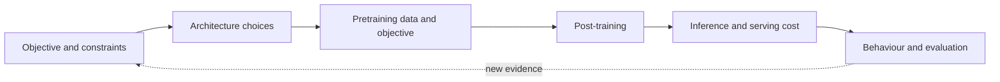

# Model family deep dives: beyond the parameter table

[中文](README.md) · **English**

> Reading time: ~8 min · Type: reading map · Last reviewed: 2026-09

Model launches put parameter counts, context length, and benchmark scores in the largest type. The more useful thread is different: **where does this family place the capability bottleneck, and which architecture, training, and systems choices attack it?**

These notes do not compress a technical report into another parameter table. Every deep dive uses the same questions, then checks the story against papers, public configs, and reproducible evidence. The goal is not “I have seen this name.” It is a method that still works when the next model appears.

  
Start with<strong>the objective and constraints, not parameter count</strong>

  
Then dissect<strong>architecture · data and training · post-training · inference · evaluation</strong>

  
Finally compare<strong>where capability came from and where cost moved</strong>

  
Evidence bar<strong>papers, public configs, ablations, and reproducible experiments</strong>

## See the map before entering a family

Open the [interactive Transformer guide](../transformer-lab.en.md#tx-arch) and switch between families first. That diagram answers “what changed inside the block”; these deep dives continue with “why, how was it trained, and what does deployment pay?”

## Ask every family the same six questions

| Lens | Question | Common trap |
| --- | --- | --- |
| Objective | Does it prioritise capability, cost, length, multimodality, or deployment? | Explaining every change as “stronger” |
| Architecture | What changed in attention, the FFN, norms, position encoding, or modality interface? | Memorising components without tracing tensors and data flow |
| Training | How do data, objective, scale, and curriculum work together? | Mixing architecture gains with data gains |
| Post-training | Which behaviours come from SFT, preference optimisation, RL, or distillation? | Explaining chat-model behaviour from the base architecture |
| Systems | What is the bill for KV cache, active parameters, communication, and latency? | Looking at total parameters instead of per-token cost |
| Evidence | Which claims have ablations, outside evaluation, or reproducible results? | Replacing mechanism evidence with one leaderboard |

## Four entrances

  <a class="curriculum-card" href="llama.en.md">Dense baseline<h3>Llama</h3>
A restrained dense decoder that helps separate architecture gains, scale gains, and post-training gains.
<b>Start →</b></a>
  <a class="curriculum-card" href="qwen.en.md">Family design<h3>Qwen</h3>
Dense and MoE models, many sizes, and thinking and non-thinking modes make it useful for studying how a model family itself is designed.
<b>Start →</b></a>
  <a class="curriculum-card" href="deepseek.en.md">Co-design<h3>DeepSeek</h3>
MLA, fine-grained MoE, the training system, and reasoning post-training are not four isolated tricks but one co-designed stack.
<b>Start →</b></a>
  <a class="curriculum-card" href="gemma.en.md">Compact & multimodal<h3>Gemma</h3>
Start from smaller models, long context, and visual input to see deployment constraints shape attention and distillation.
<b>Start →</b></a>

## Choose a route by question

- **For the architecture line**: Llama → DeepSeek. Establish the dense baseline, then see how MLA and MoE change the cost structure.
- **For post-training**: Llama → Qwen → DeepSeek. Compare general alignment, mode switching, and reasoning RL by the problems they solve.
- **For deployment and multimodality**: Gemma → Qwen. Focus on how model size, context, modality interfaces, and inference budgets determine the product shape.

## Self-check

  <strong>Do not memorise “who uses what.” Try to answer:</strong>
  <ol>
    <li>If the model name were hidden, could you infer what it optimises from attention, the FFN, and post-training?</li>
    <li>Did a capability gain come from structure, data, training scale, or post-training? Is the evidence strong enough to separate them?</li>
    <li>Did saved FLOPs, memory, or latency reappear as communication, routing, or data cost?</li>
    <li>Under which workload does the design make sense, and what is most likely to break under another one?</li>
  </ol>

These pages only use public information. Model families move quickly, so treat the original reports and public configs linked at the end of each note as the source of truth.
