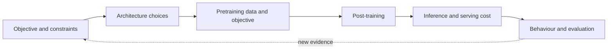

# Model family deep dives: beyond the parameter table

[中文](README.md) · **English**

> Reading time: ~8 min · Type: reading map · Last reviewed: 2026-10

Model launches tend to highlight parameter counts, context length, and scores. I want to understand **the problem the model addresses, why it uses this architecture, and how it was trained**.

These notes use the same questions across reports, checking explanations against public configurations and experiments. If you're new to technical reports, start with the [model-reading exercise](how-to-read.en.md): trace a token, calculate KV-cache size, and separate observations from explanations.

  
Start with<strong>the objective and constraints, not parameter count</strong>

  
Then dissect<strong>architecture · data and training · post-training · inference · evaluation</strong>

  
Finally compare<strong>where capability came from and where cost moved</strong>

  
Evidence bar<strong>papers, public configs, ablations, and reproducible experiments</strong>

## See the map before entering a family

Open the [interactive Transformer guide](../transformer-lab.en.md#tx-arch) and switch between families first. That diagram answers “what changed inside the block”; these deep dives continue with “why, how was it trained, and what does deployment pay?”

```mermaid
flowchart LR
    A["Objective and constraints"] --> B["Architecture choices"]
    B --> C["Pretraining data and objective"]
    C --> D["Post-training"]
    D --> E["Inference and serving cost"]
    E --> F["Behaviour and evaluation"]
    F -. new evidence .-> A
```

## Ask every family the same six questions

| Lens | Question | Common trap |
| --- | --- | --- |
| Objective | Does it prioritise capability, cost, length, multimodality, or deployment? | Explaining every change as “stronger” |
| Architecture | What changed in attention, the FFN, norms, position encoding, or modality interface? | Memorising components without tracing tensors and data flow |
| Training | How do data, objective, scale, and curriculum work together? | Mixing architecture gains with data gains |
| Post-training | Which behaviours come from SFT, preference optimisation, RL, or distillation? | Explaining chat-model behaviour from the base architecture |
| Systems | What is the bill for KV cache, active parameters, communication, and latency? | Looking at total parameters instead of per-token cost |
| Evidence | Which claims have ablations, outside evaluation, or reproducible results? | Replacing mechanism evidence with one leaderboard |

## Five entrances

  <a class="curriculum-card" href="gpt.en.md">Ways of learning<h3>GPT</h3>
Separate task fine-tuning, contextual demonstrations, and preference optimization, then calculate a gpt-oss attention sink.
<b>Start →</b></a>
  <a class="curriculum-card" href="llama.en.md">Dense baseline<h3>Llama</h3>
Scope: Llama 1–3.1 text models. Trace the block, GQA cache, and post-training without applying one generation's configuration to the entire family.
<b>Start →</b></a>
  <a class="curriculum-card" href="qwen.en.md">Family design<h3>Qwen</h3>
Dense and MoE models, many sizes, and thinking and non-thinking modes make it useful for studying how a model family itself is designed.
<b>Start →</b></a>
  <a class="curriculum-card" href="deepseek.en.md">Co-design<h3>DeepSeek</h3>
MLA, fine-grained MoE, the training system, and reasoning post-training are not four isolated tricks but one co-designed stack.
<b>Start →</b></a>
  <a class="curriculum-card" href="gemma.en.md">Compact & multimodal<h3>Gemma</h3>
Start from smaller models, long context, and visual input to see deployment constraints shape attention and distillation.
<b>Start →</b></a>

## Choose a route by question

- **For different meanings of “learning”**: GPT → Llama. Separate context, parameter updates, and training signals, then inspect a block and its cache.
- **For the architecture line**: Llama → DeepSeek. Establish the dense baseline, then see how MLA and MoE change the cost structure.
- **For post-training**: Llama → Qwen → DeepSeek. Compare general alignment, mode switching, and reasoning RL by the problems they solve.
- **For deployment and multimodality**: Gemma → Qwen. Focus on how model size, context, modality interfaces, and inference budgets determine the product shape.

## When a report introduces an unfamiliar component

You do not need to restart an entire model family. Locate the change in the computation, then return to the report's experiments.

| What the report describes | Mechanism note | Distinction to retain |
| --- | --- | --- |
| Gating an attention output | [Gated Attention](../deep-dives/gated-attention.en.md) | Scaling the output does not skip attention computation |
| Replacing some historical reads with recurrent state | [Gated DeltaNet](../deep-dives/gated-deltanet.en.md) | State updates are not gates appended to ordinary attention |
| Looking up local token patterns | [Engram](../deep-dives/engram.en.md) | Learned model memory is not stored user conversations |
| Selecting earlier-layer information | [Attention Residuals](../deep-dives/attention-residuals.en.md) | Mixing over network depth, not sequence positions |
| Activating selected experts | [MoE](../moe/README.en.md) | Account separately for total parameters, active parameters, and communication |
| Repeating computation with shared weights | [Looped Transformers](../looped/README.en.md) | Sharing parameters does not reduce the number of executions |

Suppose a version changes attention, data, and training budget together. A better score on the same task supports the new version, not attention as the cause. Look for a structure-only ablation; without one, keep the uncertainty rather than supplying a causal explanation the report did not establish.

These pages only use public information. Model families move quickly, so treat the original reports and public configs linked at the end of each note as the source of truth.
