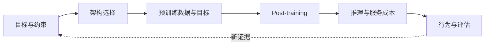

# 模型家族精读：别只看参数表

**中文** · [English](README.en.md)

> 阅读时间：约 8 分钟 · 类型：阅读地图 · 最近审阅：2026-09

新模型发布时，大家通常先看参数量、上下文长度和 benchmark 分数。我更想弄明白：**它要解决什么问题，为什么选择这套架构，又是怎么训练出来的？**

这里不只整理参数。每篇都会带着同一组问题读技术报告，对照公开 config 和实验看具体实现。读完后，再遇到新模型，可以试着判断它改了什么、为什么改。

  
先看什么<strong>目标与约束，而不是参数量</strong>

  
再拆什么<strong>架构 · 数据与训练 · post-training · 推理系统 · 评估</strong>

  
最后比较什么<strong>效果为什么提高，计算开销又有什么变化</strong>

  
证据标准<strong>论文、公开 config、消融和可复现实验</strong>

## 先看架构图，再读具体模型

先打开 [Transformer 交互图解](../transformer-lab.md#tx-arch)，在不同家族之间切换。那张图回答“block 里哪里变了”；这一组精读继续回答“为什么变、怎么训、部署时需要多少资源”。

## 每个家族都问这六个问题

| 视角 | 要问的问题 | 容易掉进的坑 |
| --- | --- | --- |
| 目标 | 它优先解决能力、成本、长度、多模态，还是部署？ | 把所有改动都解释成“更强” |
| 架构 | attention、FFN、norm、位置编码和模态接口改了什么？ | 只记组件名，不看张量和数据流 |
| 训练 | 数据、目标、规模和 curriculum 怎样配合？ | 把架构收益和数据收益混在一起 |
| Post-training | SFT、偏好优化、RL、蒸馏分别改变什么行为？ | 用 base model 的结构解释 chat model 的行为 |
| 系统 | KV cache、激活参数、通信和延迟的账怎么算？ | 只看总参数，不看每 token 实际成本 |
| 证据 | 哪些结论有消融、外部评估或可复现结果？ | 用一张 leaderboard 代替机制证据 |

## 四个入口

  <a class="curriculum-card" href="llama.md">Dense baseline<h3>Llama</h3>
从较常见的 dense decoder 出发，分清架构、训练规模和 post-training 各自带来的提升。
<b>开始精读 →</b></a>
  <a class="curriculum-card" href="qwen.md">Family design<h3>Qwen</h3>
同一家族有 dense 和 MoE、大小不同的模型，也有 thinking 和 non-thinking 模式。可以对比不同预算下该怎么选。
<b>开始精读 →</b></a>
  <a class="curriculum-card" href="deepseek.md">Co-design<h3>DeepSeek</h3>
MLA、细粒度 MoE、训练系统和 reasoning post-training 需要放在一起看，才能理解它们如何配合。
<b>开始精读 →</b></a>
  <a class="curriculum-card" href="gemma.md">Compact & multimodal<h3>Gemma</h3>
看模型在支持长上下文和图像输入时，怎样通过 attention 和蒸馏控制部署开销。
<b>开始精读 →</b></a>

## 按你的问题选择读法

- **想补架构主线**：Llama → DeepSeek。先建立 dense baseline，再看 MLA 与 MoE 怎样改成本结构。
- **想补 post-training**：Llama → Qwen → DeepSeek。比较通用对齐、模式切换与 reasoning RL 各自解决什么。
- **想补部署与多模态**：Gemma → Qwen。重点看模型大小、上下文长度和图像输入对显存、延迟及部署方式有什么影响。

## 读完后的自检

  <strong>不要背“谁用了什么”，试着回答：</strong>
  <ol>
    <li>如果把模型名遮住，你能从 attention、FFN 和 post-training 看出它在优化什么吗？</li>
    <li>某个能力提升来自结构、数据、训练规模，还是 post-training？证据够不够把它们分开？</li>
    <li>省下计算、显存或延迟之后，通信、路由或数据处理的开销有没有增加？</li>
    <li>这套设计在什么 workload 下成立，换一个 workload 最可能先坏哪里？</li>
  </ol>

这组页面只覆盖公开信息；模型家族更新很快，具体配置以每篇末尾链接的原始报告和公开 config 为准。
