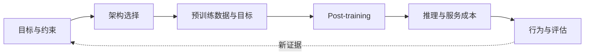

# 模型家族精读：别只看参数表

**中文** · [English](README.en.md)

> 阅读时间：约 8 分钟 · 类型：阅读地图 · 最近审阅：2026-10

新模型发布时，大家通常先看参数量、上下文长度和 benchmark 分数。我更想弄明白：**它要解决什么问题，为什么选择这套架构，又是怎么训练出来的？**

这里用同一组问题读不同模型的技术报告，再对照公开配置和实验。下次遇到一个新模型，希望你能更快看出它改了哪里，哪些结论有依据，哪些还需要验证。

  
先看什么<strong>目标与约束，而不是参数量</strong>

  
再拆什么<strong>架构 · 数据与训练 · post-training · 推理系统 · 评估</strong>

  
最后比较什么<strong>效果为什么提高，计算开销又有什么变化</strong>

  
证据标准<strong>论文、公开 config、消融和可复现实验</strong>

## 先看架构图，再读具体模型

第一次读技术报告，可以先做[模型阅读练习](how-to-read.md)：跟着一个 token 看张量形状怎么变，算一次 KV cache 占多少空间，再分清哪些是实验结果、哪些是对结果的解释。以后读其他模型，也能沿用这个方法。

先打开 [Transformer 交互图解](../transformer-lab.md#tx-arch)，在不同家族之间切换。那张图回答“block 里哪里变了”；这一组精读继续回答“为什么变、怎么训、部署时需要多少资源”。

```mermaid
flowchart LR
    A["目标与约束"] --> B["架构选择"]
    B --> C["预训练数据与目标"]
    C --> D["Post-training"]
    D --> E["推理与服务成本"]
    E --> F["行为与评估"]
    F -. 新证据 .-> A
```

## 每个家族都问这六个问题

| 视角 | 要问的问题 | 容易掉进的坑 |
| --- | --- | --- |
| 目标 | 它优先解决能力、成本、长度、多模态，还是部署？ | 把所有改动都解释成“更强” |
| 架构 | attention、FFN、norm、位置编码和模态接口改了什么？ | 只记组件名，不看张量和数据流 |
| 训练 | 数据、目标、规模和 curriculum 怎样配合？ | 把架构收益和数据收益混在一起 |
| Post-training | SFT、偏好优化、RL、蒸馏分别改变什么行为？ | 用 base model 的结构解释 chat model 的行为 |
| 系统 | KV cache、激活参数、通信和延迟的账怎么算？ | 只看总参数，不看每 token 实际成本 |
| 证据 | 哪些结论有消融、外部评估或可复现结果？ | 用一张 leaderboard 代替机制证据 |

## 五个入口

  <a class="curriculum-card" href="gpt.md">学习方式<h3>GPT</h3>
从任务微调、上下文示范到偏好优化：分清参数在什么时候更新，再动手算一次 gpt-oss attention sink。
<b>开始精读 →</b></a>
  <a class="curriculum-card" href="llama.md">稠密模型基线<h3>Llama</h3>
以 Llama 1–3.1 的文本模型为范围，拆 block、GQA 缓存和后训练；不把这一代配置套到整个家族。
<b>开始精读 →</b></a>
  <a class="curriculum-card" href="qwen.md">Family design<h3>Qwen</h3>
同一家族有 dense 和 MoE、大小不同的模型，也有 thinking 和 non-thinking 模式。可以对比不同预算下该怎么选。
<b>开始精读 →</b></a>
  <a class="curriculum-card" href="deepseek.md">Co-design<h3>DeepSeek</h3>
MLA、细粒度 MoE、训练系统和 reasoning post-training 需要放在一起看，才能理解它们如何配合。
<b>开始精读 →</b></a>
  <a class="curriculum-card" href="gemma.md">Compact & multimodal<h3>Gemma</h3>
看模型在支持长上下文和图像输入时，怎样通过 attention 和蒸馏控制部署开销。
<b>开始精读 →</b></a>

## 按你的问题选择读法

- **想分清几种“学习”**：GPT → Llama。先看上下文、参数更新和训练信号的区别，再拆具体的 block 与缓存。
- **想看架构**：Llama → DeepSeek。先熟悉稠密模型，再看 MLA 与 MoE 分别省下什么、增加什么开销。
- **想看后训练**：Llama → Qwen → DeepSeek。比较通用对齐、推理模式切换，以及用强化学习训练推理能力，各自在解决什么问题。
- **想补部署与多模态**：Gemma → Qwen。重点看模型大小、上下文长度和图像输入对显存、延迟及部署方式有什么影响。

## 报告提到新组件时，去哪里补

不用从头重学一个模型家族。先找到这项改动在计算里发生的位置，再回原报告看实验。

| 报告在讲什么 | 对应的机制笔记 | 要分清的区别 |
| --- | --- | --- |
| Attention 输出加门 | [Gated Attention](../deep-dives/gated-attention.md) | 门控输出，不是跳过 attention 计算 |
| 用循环状态代替一部分历史读取 | [Gated DeltaNet](../deep-dives/gated-deltanet.md) | 状态更新，不是把 gate 加在普通 attention 后面 |
| 按局部 token 模式查表 | [Engram](../deep-dives/engram.md) | 模型内可学习记忆，不是用户聊天记录 |
| 重选前层信息 | [Attention Residuals](../deep-dives/attention-residuals.md) | 网络深度上的混合，不是序列维度的 attention |
| 只激活一部分专家 | [MoE](../moe/README.md) | 总参数、激活参数和通信量分开算 |
| 用相同参数反复计算 | [Looped Transformer](../looped/README.md) | 参数共享不等于减少执行次数 |

例如，同一任务上一个版本换了 attention，也换了数据和训练预算。总分涨了只能说明这个版本更好，不能直接证明是 attention 的功劳。先找有没有只改结构的消融；没有就保留这个不确定性，而不是替报告补原因。

这里只讨论公开信息。模型更新很快，具体配置请对照每篇末尾的原始报告和公开配置文件。
