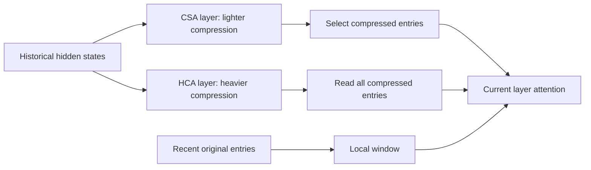

# DeepSeek-V4: What Remains After Compressing History?

[中文](deepseek-v4.md) · **English**

A longer context limit lets a model accept more input. The harder questions are what history to retain, which parts to read next, and whether the savings discard information the task needs.

Continue here after [V2 / V3 / R1](deepseek.en.md). Attention, residual paths, and training change different things. This note checks public sources as of 2026-10-08; it does not reproduce the reported performance.

## 1. What do the two attention types save?

The [V4 model card](https://huggingface.co/deepseek-ai/DeepSeek-V4-Pro) describes interleaved CSA and HCA layers: CSA compresses then selects sparse entries; HCA compresses more heavily and reads the compressed history. Both retain a local sliding window. These are different layer configurations, not two consecutive attention operations inside every layer.

This diagram omits projections, normalization, and position handling:



The branches represent alternative layers, not a head running both. CSA uses overlapping projected blocks while emitting one entry per m positions, not one per 2m. See [report §2.3](https://arxiv.org/html/2606.19348v1#S2.SS3).

## 2. Storage and reads are different budgets

Consider an invented configuration: 1,024 historical positions, compression ratios 4 and 128, 32 selected entries, and a 128-position local window.

| Quantity | Lighter compression + selection | Heavier compression + full read |
| --- | --- | --- |
| Completed compressed entries | 256 | 8 |
| Compressed entries read by a query | At most 32 | 8 |
| Main-attention entries including the window | At most 160 | At most 136 |
| Omitted work | Compressor, indexer, projections, temporary state | Compressor, projections, temporary state |

These are not V4 settings or latency predictions. Compressed entries do not contain the same information as individual tokens. Reading 32 entries also does not mean storing only 32: a later query may need different ones.

```python
def attention_ledger(history, light_ratio, heavy_ratio, selected, window):
    values = (history, light_ratio, heavy_ratio, selected, window)
    if any(type(value) is not int or value <= 0 for value in values):
        raise ValueError("Expected positive integer counts")
    if heavy_ratio <= light_ratio:
        raise ValueError("Heavy compression must use a larger ratio")
    light_entries = history // light_ratio
    heavy_entries = history // heavy_ratio
    local_entries = min(history, window)
    return {
        "light_stored": light_entries,
        "heavy_stored": heavy_entries,
        "light_main_reads": min(selected, light_entries) + local_entries,
        "heavy_main_reads": heavy_entries + local_entries,
        "light_tail": history % light_ratio,
        "heavy_tail": history % heavy_ratio,
    }

assert attention_ledger(1024, 4, 128, 32, 128)["light_main_reads"] == 160
assert attention_ledger(1024, 4, 128, 32, 128)["heavy_main_reads"] == 136
assert attention_ledger(9, 4, 128, 32, 128)["light_tail"] == 1
```

The ledger counts completed blocks and separately reports uncompleted tails, without estimating their bytes. Compressed history usually still grows with context length. A fixed local window does not make the whole model constant-space.

## 3. Two errors that are easy to miss

**Future leakage.** With zero-based positions, a query at 8 and block width 4 may read completed blocks 0–3 and 4–7. It must not read the full 8–11 block, which contains future tokens. A causal local window handles current and recent visible positions. Alter future tokens in a test: the output at position 8 should not change.

**Irreversible information loss.** Suppose a simplified compressor stores only a mean. Both `[1, 9]` and `[5, 5]` become 5, so their maxima can no longer be distinguished. V4 is not mean pooling; this counterexample simply explains why compression must be evaluated on tasks rather than judged by its ratio.

Test single evidence, multiple evidence, exact numbers, similar distractors, and unanswerable cases. See [benchmarks and long-context tests](../../07-evaluation/benchmark-protocols.en.md).

## 4. mHC constrains residual mixing; Muon changes updates

mHC uses multiple residual streams:

$$
X_{\ell+1}=B_\ell X_\ell+C_\ell F_\ell(A_\ell X_\ell).
$$

Rows of $X$ are streams; $A$ combines inputs, $F$ is the layer, and $C$ redistributes its output. Nonnegativity and row/column-sum constraints apply to $B$, approximated with finite Sinkhorn iterations. [Report §2.2](https://arxiv.org/html/2606.19348v1#S2.SS2)

Take a **fixed** example:

$$
B=\begin{bmatrix}0.8&0.2\\0.2&0.8\end{bmatrix},
\quad X=\begin{bmatrix}2\\10\end{bmatrix},
\quad BX=\begin{bmatrix}3.6\\8.4\end{bmatrix}.
$$

The sum remains 12; the sum of squares falls from 104 to 83.52. More generally, convexity gives, for fixed nonnegative $B$ with unit row and column sums:

$$
\sum_i\left(\sum_j B_{ij}x_j\right)^2
\leq \sum_{i,j}B_{ij}x_j^2
=\sum_jx_j^2.
$$

This is **not a contraction proof for the entire model**. The transformed branch remains, and actual mappings depend on the input. Finite normalization iterations also have numerical error; the theoretical target is not an exact floating-point identity.

Muon acts on parameter-update matrices. It is an optimizer, not attention or the same constraint on residual mixing. Both can affect stability while operating at entirely different locations.

## 5. Post-training: specialists, then consolidation

The [official V4 description](https://huggingface.co/deepseek-ai/DeepSeek-V4-Flash) separates specialist SFT / GRPO from subsequent on-policy distillation. Here specialists are teacher models, not individual MoE FFN experts. OPD is not weight averaging.

For an invented two-token distribution, let the student assign `[0.8, 0.2]` and the teacher `[0.5, 0.5]`:

$$
D_{\mathrm{KL}}(p_s\Vert p_t)
=0.8\log(1.6)+0.2\log(0.4)\approx0.193.
$$

This is KL at **one prefix**. Training must also specify prefix collection, teacher selection, masks, normalization, and updates. Student-generated and teacher-generated prefixes visit different states: changing their source changes the experiment. Continue with [knowledge distillation](../../05-post-training/distillation.en.md).

## 6. What should a reproduction check first?

| Check | Small test | Likely issue if it fails |
| --- | --- | --- |
| Causality | Change future tokens; compare earlier outputs | Compressed-block boundaries or masks |
| Prefill / decode equivalence | Compare whole-sequence and incremental execution | Tail caches, positions, or restored state |
| mHC constraints | Row/column sums, minimum entry, mixing error | Normalization or precision |
| Compression quality | Vary evidence type, position, and distractors at fixed length | Aggregate scores conceal specific losses |
| Serving cost | Matched requests and concurrency; TTFT, latency, memory | FLOPs do not capture total latency |
| Post-training | Fix tasks, teachers, and generation budgets | Model, data, and inference compute are confounded |

Only the accounting and mathematical examples are tested here, not the model. Before deployment, check the [official inference instructions](https://huggingface.co/deepseek-ai/DeepSeek-V4-Pro/blob/main/inference/README.md), weight precision, message encoder, and runtime version rather than trusting an automatically generated one-line launch command.
