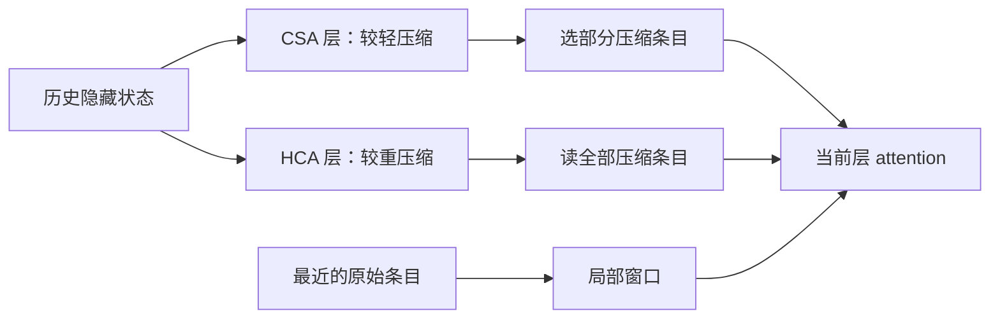

# DeepSeek-V4：压缩历史以后，还能读到什么？

**中文** · [English](deepseek-v4.en.md)

把上下文加长，只是允许模型接收更多输入。真正难的是：历史越来越长，哪些信息还要保留，下一步应该读哪些，以及这些取舍会不会损失任务需要的细节。

这篇接着 [V2 / V3 / R1](deepseek.md) 往下读。先看注意力，再看残差和训练；不要把三个层面的变化混成一个“模型更强”。按 2026-10-08 的公开资料核对，不声称复现官方性能。

## 1. 两种注意力，各省哪一笔？

[V4 模型卡](https://huggingface.co/deepseek-ai/DeepSeek-V4-Pro)介绍 CSA / HCA 混合架构：前者压缩后再稀疏选择，后者更重地压缩、读取压缩后的历史。它们交错安排在不同层，不是每层都先 CSA、再 HCA。两者都保留近处的滑动窗口。

下面这张图只画历史的读法，省略投影、归一化和位置处理：



图里两条路代表**不同层的配置**，不是一个 head 把两套都跑一遍。CSA 的实际压缩有重叠：相邻块的两个投影参与合成，仍然每 m 个位置产出一个条目；不能把它误写成每 2m 个位置产出一个。细节见[报告 §2.3](https://arxiv.org/html/2606.19348v1#S2.SS3)。

## 2. 算存储和算读取，要分开

用自拟的小配置想一遍：历史 1,024 个位置，轻压缩比例 4，重压缩比例 128，稀疏读取 32 个条目，局部窗口 128。

| 项目 | 轻压缩 + 选择 | 重压缩 + 全读 |
| --- | --- | --- |
| 完成的压缩条目 | 256 | 8 |
| 当前 query 读的压缩条目 | 最多 32 | 8 |
| 加上局部窗口的主 attention 条目数 | 最多 160 | 最多 136 |
| 没算进去的部分 | 压缩器、indexer、投影、临时状态 | 压缩器、投影、临时状态 |

这不是 V4 的实际配置，也不是延迟预测。原始 token 和压缩条目不是等量的信息，不能因为后者少就说它同样准确。并且**只读 32 个，不代表只存 32 个**：后续 query 可能选择别的条目。

```python
def attention_ledger(history, light_ratio, heavy_ratio, selected, window):
    values = (history, light_ratio, heavy_ratio, selected, window)
    if any(type(value) is not int or value <= 0 for value in values):
        raise ValueError("Expected positive integer counts")
    if heavy_ratio <= light_ratio:
        raise ValueError("Heavy compression must use a larger ratio")
    light_entries = history // light_ratio
    heavy_entries = history // heavy_ratio
    local_entries = min(history, window)
    return {
        "light_stored": light_entries,
        "heavy_stored": heavy_entries,
        "light_main_reads": min(selected, light_entries) + local_entries,
        "heavy_main_reads": heavy_entries + local_entries,
        "light_tail": history % light_ratio,
        "heavy_tail": history % heavy_ratio,
    }

assert attention_ledger(1024, 4, 128, 32, 128)["light_main_reads"] == 160
assert attention_ledger(1024, 4, 128, 32, 128)["heavy_main_reads"] == 136
assert attention_ledger(9, 4, 128, 32, 128)["light_tail"] == 1
```

这里按已完成块记账，尾部状态单列，未计其字节数。历史翻倍，压缩缓存通常仍会增长；固定大小的局部窗口并没有让整个系统变成常量空间。

## 3. 两个容易藏住的错误

**未来泄漏。** 用从 0 开始的位置，query 在 8，块宽 4。它可以用已经完成的 0–3、4–7 块，不能读取包含 8–11 的完整压缩块；后者含有未来。当前位置及附近可见内容由因果局部窗口处理。测试时，把未来 token 全部改掉，位置 8 的输出不应改变。

**不可逆的信息损失。** 假设一种简化压缩只保留均值，`[1, 9]` 和 `[5, 5]` 都变成 5。问“最大值是什么”，压缩之后就无法区分。V4 不是简单求均值，这个反例只是说明：压缩必须结合训练和任务验证，不能凭压缩比例推断质量。

实测可以同时放单条证据、多条证据、精确数字、相似干扰和无答案样本。测试设计见 [Benchmark 与长上下文测试](../../07-evaluation/benchmark-protocols.md)。

## 4. mHC 约束残差；Muon 改参数更新

mHC 把残差状态写成多条流，形式为：

$$
X_{\ell+1}=B_\ell X_\ell+C_\ell F_\ell(A_\ell X_\ell).
$$

这里 $X$ 有多行残差流；$A$ 聚合输入，$F$ 是实际层，$C$ 把结果送回各流。$B$ 的非负元素、行和、列和受到约束；报告用有限次 Sinkhorn 归一化近似实现。[报告 §2.2](https://arxiv.org/html/2606.19348v1#S2.SS2)

用一个**固定**矩阵算：

$$
B=\begin{bmatrix}0.8&0.2\\0.2&0.8\end{bmatrix},
\quad X=\begin{bmatrix}2\\10\end{bmatrix},
\quad BX=\begin{bmatrix}3.6\\8.4\end{bmatrix}.
$$

两条流混合后，和仍是 12，平方和从 104 变成 83.52。一般地，对非负、行列和都为 1 的固定 $B$，由凸性：

$$
\sum_i\left(\sum_j B_{ij}x_j\right)^2
\leq \sum_{i,j}B_{ij}x_j^2
=\sum_jx_j^2.
$$

但这**不是整个模型的收缩证明**：还有 $CF(AX)$，而实际映射也依赖输入。有限次归一化还要检查误差，不能把“理论目标”当浮点实现的恒等式。

Muon 则处理参数更新矩阵，属于 optimizer，不是 attention，也不是给残差矩阵做同一个约束。两者都可能关系到稳定性，但修改的位置完全不同。

## 5. 后训练：先训练专家，再合并能力

[V4 官方说明](https://huggingface.co/deepseek-ai/DeepSeek-V4-Flash)区分领域专家的 SFT / GRPO 与之后的 on-policy distillation。此处“专家”是老师模型，不是 MoE 的某个 FFN expert；OPD 也不是直接平均老师权重。

可以用一个自拟的两词词表理解分布比较。学生给 `[0.8, 0.2]`，老师给 `[0.5, 0.5]`：

$$
D_{\mathrm{KL}}(p_s\Vert p_t)
=0.8\log(1.6)+0.2\log(0.4)\approx0.193.
$$

这只算**某个前缀下**的 KL。完整训练还要决定前缀从哪里来、哪个老师负责、mask、分母和更新方式。学生生成的前缀与老师生成的前缀，会让训练遇到不同状态；不能换掉数据来源，却还把它叫同一个实验。更详细的训练取舍见[知识蒸馏](../../05-post-training/distillation.md)。

## 6. 如果要复现，先检查什么？

| 检查 | 一个小测试 | 失败通常意味着什么 |
| --- | --- | --- |
| 因果性 | 改未来 token，比较此前输出 | 压缩块边界或 mask 错 |
| Prefill / decode 一致性 | 整段与逐步运行比较 | 尾部缓存、位置或状态恢复错 |
| mHC 约束 | 行列和、最小元素、残差映射误差 | 归一化或精度问题 |
| 压缩质量 | 同长度下换证据类型、位置与干扰 | 总分掩盖了具体损失 |
| 部署成本 | 同请求和并发下记录 TTFT、延迟、显存 | FLOPs 不能解释全部延迟 |
| 后训练 | 固定任务、老师版本与生成预算 | 模型、数据和推理预算混在一起 |

本文执行的是记账与数学小测试，不是模型复现。部署前还要核对[官方 inference 说明](https://huggingface.co/deepseek-ai/DeepSeek-V4-Pro/blob/main/inference/README.md)、权重精度、message encoder 和运行时版本；不要只复制模型托管页自动生成的一行启动命令。
