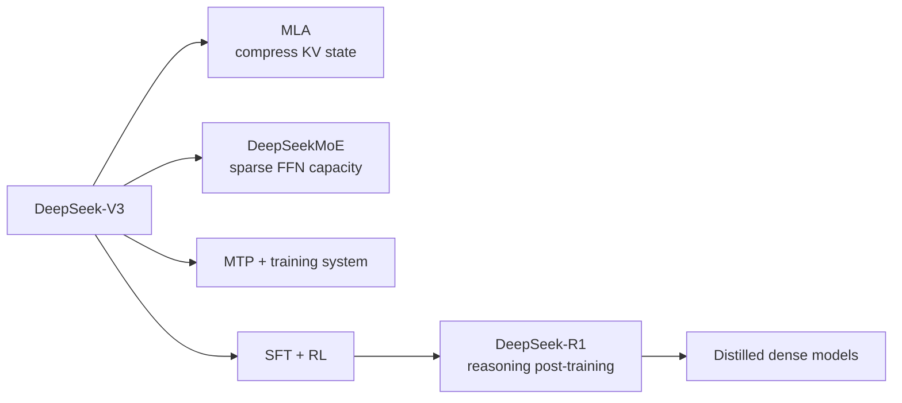

# DeepSeek deep dive: architecture, systems, and reasoning training together

[中文](deepseek.md) · **English**

> Reading time: ~10 min · Type: model family deep dive · Last reviewed: 2026-09

  
Core question<strong>How do you control attention, FFN, and reasoning cost in a high-capacity model?</strong>

  
Main components<strong>MLA · fine-grained MoE · shared expert · MTP</strong>

  
Training line<strong>V3 pretraining / SFT / RL → R1 cold start / reasoning RL / distillation</strong>

  
After reading<strong>do not collapse V3 architecture and R1 post-training into one story</strong>

## One-sentence position

The most useful lesson in DeepSeek is **co-design**. MLA compresses attention state, MoE expands FFN capacity, the training and communication system makes the sparse model practical, and R1 shifts post-training toward verifiable reasoning. Each layer manages a different cost; “it uses MoE” is not enough.

## Separate the two lines first

V3 is first a foundation-model and training-system design. R1 mainly studies how reasoning emerges through cold-start data, RL, and distillation on top of that base. Keeping the two apart tells you whether a change lives in the forward pass or in the learning signal.

## Three ideas worth keeping

1. **MLA changes decoding state.** It compresses K/V representations into a lower-dimensional latent and reconstructs what attention needs. The central gain is a smaller KV cache, not that “attention reasons better.”
2. **MoE changes the capacity–compute relationship.** Many routed experts provide total capacity while each token activates only a few; a shared expert handles more general patterns. Cost moves into routing, load balance, and communication.
3. **Reasoning is mainly a post-training question.** R1-Zero shows that pure RL can elicit reasoning behaviour, while also exposing readability and language-mixing problems. R1 adds cold-start data and multi-stage training, then distils capability into smaller dense models.

## Trade-offs

| Choice | What it buys | What it costs |
| --- | --- | --- |
| MLA | Smaller KV cache and cheaper long-context decode | More complex implementation and a new compression bottleneck |
| Fine-grained MoE | Large total capacity with fewer active parameters | All-to-all communication, routing, and load balance |
| Multi-token prediction | Denser training signal and possible decoding gains | More complex objective and implementation |
| Reasoning RL | Longer reasoning on verifiable tasks | Rollout cost, reward boundaries, and behaviour regressions |

## How I would use the family

DeepSeek is good practice for not mixing levels. For every result I would ask: is this a cache or compute systems gain, an expert-capacity architecture gain, a pretraining-data gain, or a reasoning post-training gain? If the report does not isolate them, the uncertainty should remain explicit.

## Self-check

- Why does MLA primarily improve the KV cache rather than directly prove stronger reasoning?
- Which compute does MoE save, and where does the cost move?
- What does the difference between R1-Zero and R1 teach us?
- Why is a distilled dense model not simply “the R1 architecture, but smaller”?

## Primary sources

- [DeepSeek-V3 Technical Report](https://arxiv.org/abs/2412.19437)
- [DeepSeek-R1: Incentivizing Reasoning Capability in LLMs via Reinforcement Learning](https://arxiv.org/abs/2501.12948)
- [DeepSeek-V2: A Strong, Economical, and Efficient Mixture-of-Experts Language Model](https://arxiv.org/abs/2405.04434)
