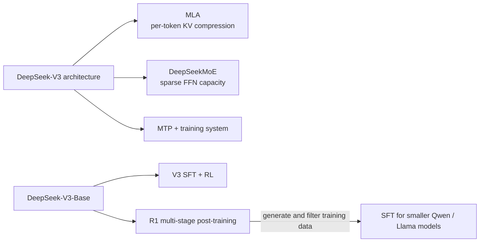

# DeepSeek deep dive: architecture, systems, and reasoning training together

[中文](deepseek.md) · **English**

> Reading time: ~10 min · Type: model family deep dive · Last reviewed: 2026-10

<div class="lesson-recipe advanced">
  <div><span>Core question</span><strong>How do you control attention, FFN, and reasoning cost in a high-capacity model?</strong></div>
  <div><span>Main components</span><strong>MLA · fine-grained MoE · shared expert · MTP</strong></div>
  <div><span>Training line</span><strong>V3-Base → R1 multi-stage training; small-model distillation is a separate branch</strong></div>
  <div><span>After reading</span><strong>do not collapse V3 architecture and R1 post-training into one story</strong></div>
</div>

## One-sentence position

The most useful lesson in DeepSeek is **co-design**. MLA compresses attention state, MoE expands FFN capacity, the training and communication system makes the sparse model practical, and R1 shifts post-training toward verifiable reasoning. Each layer manages a different cost; “it uses MoE” is not enough.

## Separate the two lines first


```mermaid
flowchart LR
    A["DeepSeek-V3 architecture"] --> B["MLA<br/>per-token KV compression"]
    A --> C["DeepSeekMoE<br/>sparse FFN capacity"]
    A --> D["MTP + training system"]
    H["DeepSeek-V3-Base"] --> E["V3 SFT + RL"]
    H --> F["R1 multi-stage post-training"]
    F -->|generate and filter training data| G["SFT for smaller Qwen / Llama models"]
```

V3 chat post-training and R1 follow different routes from V3-Base. R1 is not a module attached to the V3 chat model. This diagram covers V2 / V3 / R1; V4 introduces a different attention design.

## Three ideas worth keeping

1. **MLA stores less per token, not one vector for the entire history.** Each token adds a latent and a decoupled positional key. Going from 1,000 to 2,000 tokens still increases cache entries. Projection absorption can avoid expanding full K/V during inference. [V2 §2.1](https://arxiv.org/html/2405.04434v5#S2.SS1)
2. **MoE separates total capacity from per-token computation.** Routed experts provide capacity; each token uses a subset. Shared experts aim to capture reusable patterns, without guaranteeing neatly separated domains. Routing, communication, and storage remain costs.
3. **R1 investigates what post-training can change.** R1-Zero applies RL to a pretrained V3-Base, not random weights. It does not establish that pretraining is unimportant or that RL explains every capability beyond the reward.

## V3 load balance: selection scores are not mixture weights

V3 selects routed experts using affinity plus a load bias, but normalizes the selected original affinities for output mixing. Overload decreases an expert's bias; underload increases it. A small sequence-wise balance loss remains, so “auxiliary-loss-free” does not mean every balancing auxiliary term is absent. [V3 §2.1.2](https://arxiv.org/html/2412.19437v2#S2.SS1.SSS2)

Take three invented affinities `[0.6, 0.3, 0.1]` and select two experts. Biases `[0, 0, 0.4]` give the third expert more opportunities:

| Step | Values | Result |
| --- | --- | --- |
| Selection scores | `[0.6, 0.3, 0.5]` | Select experts 1 and 3 |
| Mixture weights | Normalize the original `0.6` and `0.1` | `6/7` and `1/7` |
| Incorrect shortcut | Normalize the biased selection scores | `6/11` and `5/11` |

With selected outputs 2 and 10, the correct mixture is `22/7`; the shortcut produces `62/11`. Reusing the wrong scores changes the forward computation.

```python
def route_with_bias(affinities, biases, selected_count):
    if len(affinities) != len(biases) or not affinities:
        raise ValueError("affinities and biases must have matching nonzero lengths")
    if type(selected_count) is not int or not 1 <= selected_count <= len(affinities):
        raise ValueError("invalid selected_count")
    if not all(math.isfinite(value) for value in [*affinities, *biases]):
        raise ValueError("scores must be finite")
    if any(value <= 0 for value in affinities):
        raise ValueError("this example expects positive affinities")
    selected = sorted(
        range(len(affinities)), key=lambda index: (-(affinities[index] + biases[index]), index)
    )[:selected_count]
    denominator = sum(affinities[index] for index in selected)
    return [(index, affinities[index] / denominator) for index in selected]

import math

routed = route_with_bias([0.6, 0.3, 0.1], [0.0, 0.0, 0.4], 2)
assert [index for index, _ in routed] == [0, 2]
assert math.isclose(sum(weight * [2, 0, 10][index] for index, weight in routed), 22 / 7)
```

This illustrates only the routed branch, without shared experts, node constraints, full scaling, or communication. A bias updated from prior load statistics is not new evidence of relevance for the current token. Measure tokens received per device too: balanced mean expert loads do not guarantee balanced inter-node traffic.

## R1 has four stages; distillation is separate

The [original R1 report, §2.3–2.4](https://arxiv.org/html/2501.12948v1#S2.SS3), distinguishes:

| Stage | Purpose |
| --- | --- |
| Cold-start SFT | Give V3-Base a small set of readable reasoning demonstrations |
| Reasoning-oriented RL | Train reasoning with verifiable task rewards |
| Rejection sampling + SFT | Filter RL-generated samples, add general-task data, then fine-tune V3-Base again |
| All-scenarios RL | Further balance reasoning, helpfulness, and safety |

At stage three, **the data-generating checkpoint and the SFT starting point play different roles**. A diagram must distinguish data transfer from weight updates.

Small-model distillation is another branch: use the curated data for Qwen / Llama SFT. The report's distilled models neither compress V3's MoE architecture nor each repeat R1's RL pipeline.

### Checking the outcome does not necessarily check the reasoning

R1-Zero uses rule-based accuracy and format rewards. Later R1 stages also involve language consistency and general preferences. Do not extrapolate one phase's rule-based reward to the entire training pipeline. [R1 §2.2–2.3](https://arxiv.org/html/2501.12948v1#S2.SS2)

For an original small example, suppose an addition problem has answer 12. A response ends with 12 but explains it as “5 + 8.” A final-number checker rewards it; a step check catches the inconsistency. Conversely, a brittle parser might reject a valid algorithm's answer expressed in different units. Test **verifier reliability, reward coverage, and whether training actually uses the intended signal** separately.

Local fixtures should include a correct response, a correct response in a different format, a correct result with faulty reasoning, and a fluent but wrong response. The training checker should not be the only independent evaluation.

Rejection sampling creates another choice. Suppose four samples per question produce four correct responses for one question and only one for another. Keeping all five as independent SFT examples weights the first question four times as much; retaining one per question weights them equally. These are invented counts, not paper statistics. “Keep correct answers” still leaves sampling and weighting decisions: curation is part of the objective.

## Continue to V4: the object being compressed changes

The [V4 walkthrough](deepseek-v4.en.md) examines CSA / HCA hybrid attention, mHC, and post-training. Sequence compression is not MLA's channel compression; constraints on mHC residual mappings are not Muon's update orthogonalization; a fixed local window does not make the whole history cache constant-size.

Keep mechanisms separate from measurements. Compression is not a losslessness guarantee, orthogonalization does not guarantee convergence, and a FLOPs ratio at one context length is not a universal latency ratio.

## Trade-offs

| Choice | What it buys | What it costs |
| --- | --- | --- |
| MLA | Smaller KV cache and cheaper long-context decode | More complex implementation and a new compression bottleneck |
| Fine-grained MoE | Large total capacity with fewer active parameters | All-to-all communication, routing, and load balance |
| Multi-token prediction | Denser training signal and possible decoding gains | More complex objective and implementation |
| Reasoning RL | Longer reasoning on verifiable tasks | Rollout cost, reward boundaries, and behaviour regressions |

## How I would use the family

DeepSeek is good practice for not mixing levels. For every result I would ask: is this a cache or compute systems gain, an expert-capacity architecture gain, a pretraining-data gain, or a reasoning post-training gain? If the report does not isolate them, the uncertainty should remain explicit.

## Self-check

To work through the components, continue with [MLA and sparse attention](../deep-dives/latent-and-sparse-attention.en.md), [MTP targets and causality](../deep-dives/multi-token-prediction.en.md), and [FFN and SwiGLU](../core/ffn-and-gates.en.md). These explain mechanisms; they do not replace checking a specific model version.

- Why does MLA primarily improve the KV cache rather than directly prove stronger reasoning?
- Which compute does MoE save, and where does the cost move?
- What does the difference between R1-Zero and R1 teach us?
- Why is a distilled dense model not simply “the R1 architecture, but smaller”?

## Primary sources

- [DeepSeek-V3 Technical Report](https://arxiv.org/abs/2412.19437)
- [DeepSeek-R1: Incentivizing Reasoning Capability in LLMs via Reinforcement Learning](https://arxiv.org/abs/2501.12948)
- [DeepSeek-V2: A Strong, Economical, and Efficient Mixture-of-Experts Language Model](https://arxiv.org/abs/2405.04434)
