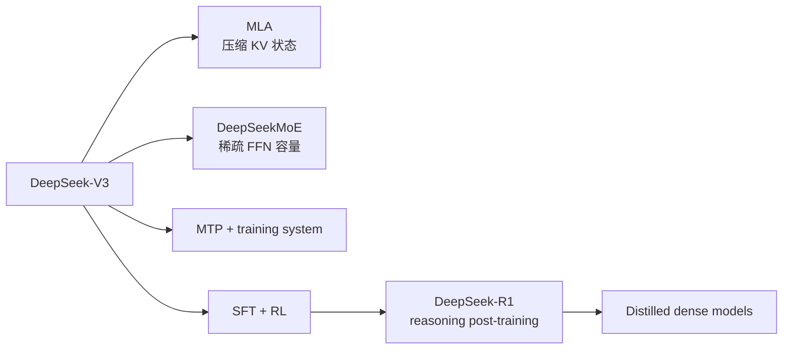

# DeepSeek 精读：把架构、系统与推理训练放在一起

**中文** · [English](deepseek.en.md)

> 阅读时间：约 10 分钟 · 类型：模型家族精读 · 最近审阅：2026-09

  
核心问题<strong>怎样在大容量模型里控制 attention、FFN 与 reasoning 的成本？</strong>

  
重点组件<strong>MLA · fine-grained MoE · shared expert · MTP</strong>

  
训练主线<strong>V3 预训练 / SFT / RL → R1 cold start / reasoning RL / distillation</strong>

  
读完要会<strong>不要把 V3 的架构创新和 R1 的 post-training 混成一个故事</strong>

## 一句话定位

DeepSeek 最值得学的是 **co-design**：MLA 压 attention cache，MoE 扩大 FFN 容量，训练与通信系统让稀疏模型跑得起来，R1 再把 post-training 的重点转向可验证 reasoning。每一层都在处理不同的成本，不能只记“用了 MoE”。

## 先把两条线分开

V3 首先是一套基础模型与训练系统设计；R1 主要是在这个基础上研究 reasoning 如何通过 cold-start 数据、RL 和蒸馏形成。把两者分开，才能判断一个变化发生在 forward pass，还是发生在学习信号。

## 真正值得抓住的三件事

1. **MLA 改的是解码状态。** 它把 K/V 表示压进低维 latent，再在需要时恢复 attention 所需的表示；核心收益来自更小的 KV cache，而不是“attention 更会推理”。
2. **MoE 改的是容量—计算关系。** 大量 routed experts 提供总容量，每个 token 只激活少数专家；shared expert 承担更通用的模式。代价转移到 routing、负载均衡和通信。
3. **Reasoning 主要是 post-training 问题。** R1-Zero 展示了纯 RL 能诱发推理行为，也暴露可读性与语言混合问题；R1 用 cold start 与多阶段训练修正这些行为，再把能力蒸馏到较小 dense 模型。

## 取舍表

| 选择 | 得到什么 | 付出什么 |
| --- | --- | --- |
| MLA | 更小的 KV cache，长上下文 decode 更省 | 实现更复杂，压缩维度成为新瓶颈 |
| Fine-grained MoE | 总容量大、每 token 激活较少 | all-to-all、路由和负载均衡困难 |
| Multi-token prediction | 更密的训练信号与潜在 decode 收益 | 训练目标和实现更复杂 |
| Reasoning RL | 可验证任务上的长链推理 | rollout 成本、reward 边界与行为退化风险 |

## 我会怎样使用这个家族

DeepSeek 很适合训练“不要把层次混在一起”的能力。分析任何结果时，我会先问：这是 cache / compute 的系统收益，expert capacity 的架构收益，预训练数据收益，还是 reasoning post-training 的行为收益？如果论文没有足够消融，就明确保留不确定性。

## 自检

- MLA 为什么主要改善 KV cache，而不是直接证明 reasoning 更强？
- MoE 省了哪些计算，又把成本转移到了哪里？
- R1-Zero 与 R1 的训练差别说明了什么？
- 为什么蒸馏后的 dense model 不能被简单称为“小号 R1 架构”？

## 原始资料

- [DeepSeek-V3 Technical Report](https://arxiv.org/abs/2412.19437)
- [DeepSeek-R1: Incentivizing Reasoning Capability in LLMs via Reinforcement Learning](https://arxiv.org/abs/2501.12948)
- [DeepSeek-V2: A Strong, Economical, and Efficient Mixture-of-Experts Language Model](https://arxiv.org/abs/2405.04434)
