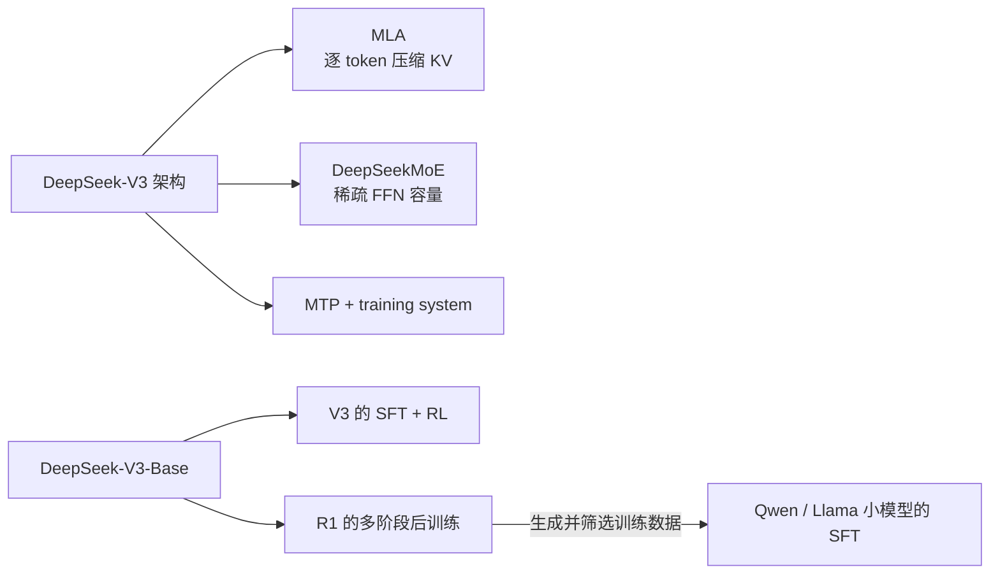

# DeepSeek 精读：把架构、系统与推理训练放在一起

**中文** · [English](deepseek.en.md)

> 阅读时间：约 10 分钟 · 类型：模型家族精读 · 最近审阅：2026-10

<div class="lesson-recipe advanced">
  <div><span>核心问题</span><strong>怎样在大容量模型里控制 attention、FFN 与 reasoning 的成本？</strong></div>
  <div><span>重点组件</span><strong>MLA · fine-grained MoE · shared expert · MTP</strong></div>
  <div><span>训练主线</span><strong>V3-Base → R1 多阶段训练；小模型蒸馏是另一条分支</strong></div>
  <div><span>读完要会</span><strong>不要把 V3 的架构创新和 R1 的 post-training 混成一个故事</strong></div>
</div>

## 一句话定位

读 DeepSeek，值得留意的是架构、训练方法和系统实现怎样配合，也就是 **co-design**：MLA 减少 KV cache，MoE 增大 FFN 的总容量，训练与通信的优化让这套架构能高效运行；R1 则进一步研究推理能力的后训练。只记住“用了 MoE”，会漏掉很多关键设计。

## 先把两条线分开


```mermaid
flowchart LR
    A["DeepSeek-V3 架构"] --> B["MLA<br/>逐 token 压缩 KV"]
    A --> C["DeepSeekMoE<br/>稀疏 FFN 容量"]
    A --> D["MTP + training system"]
    H["DeepSeek-V3-Base"] --> E["V3 的 SFT + RL"]
    H --> F["R1 的多阶段后训练"]
    F -->|生成并筛选训练数据| G["Qwen / Llama 小模型的 SFT"]
```

V3 的对话后训练与 R1 是从 V3-Base 出发的不同路线，不是“先训出 V3 对话模型，再接一个 R1 模块”。下面先讲 V2 / V3 / R1；V4 的新注意力结构不能直接套进这张图。

## 真正值得抓住的三件事

1. **MLA 少存的是每个 token 的 KV，不是把整段历史合成一个向量。** 每来一个 token，仍要追加低维 latent 和解耦的位置 key。历史从 1,000 个 token 变成 2,000 个，缓存条目也随之增长。部分投影可在推理时吸收，不一定先展开完整 K/V。[V2 §2.1](https://arxiv.org/html/2405.04434v5#S2.SS1)
2. **MoE 分开了总容量与每 token 的计算。** 多个 routed experts 提供容量，token 只调用少数；shared expert 的设计目的是承接可复用的模式，不保证自然学出清晰的领域分工。还要付路由、通信和存储成本。
3. **R1 研究的是后训练能改变什么。** R1-Zero 从已经预训练的 V3-Base 开始做 RL，不是从随机权重出发。它不能证明预训练不重要，也不能把奖励之外的所有能力一并归功于 RL。

## V3 的负载均衡：选谁和给多少权重，不是同一个分数

V3 用原始 affinity 加负载 bias 来选 routed expert，但混合输出仍使用选中 expert 的原始 affinity，再归一化。过载会降低 bias，欠载会提高它。论文还保留很小的 sequence-wise balance loss，所以“auxiliary-loss-free”不能读成全模型没有任何均衡辅助项。[V3 §2.1.2](https://arxiv.org/html/2412.19437v2#S2.SS1.SSS2)

用一个自拟的 3-expert 例子算一遍。affinity 为 `[0.6, 0.3, 0.1]`，选择 top-2；为了给第三个 expert 更多机会，bias 为 `[0, 0, 0.4]`。

| 步骤 | 数值 | 结果 |
| --- | --- | --- |
| 选择分数 | `[0.6, 0.3, 0.5]` | 选第 1、3 个 expert |
| 混合权重 | 原始的 `0.6` 和 `0.1` 归一化 | `6/7` 和 `1/7` |
| 错误做法 | 把选择分数直接当混合权重 | 变成 `6/11` 和 `5/11` |

如果两个选中 expert 的输出分别是 2 和 10，正确混合为 `22/7`，错误混合为 `62/11`。一次看似无关紧要的“复用分数”，改变了模型的前向结果。

```python
def route_with_bias(affinities, biases, selected_count):
    if len(affinities) != len(biases) or not affinities:
        raise ValueError("affinities and biases must have matching nonzero lengths")
    if type(selected_count) is not int or not 1 <= selected_count <= len(affinities):
        raise ValueError("invalid selected_count")
    if not all(math.isfinite(value) for value in [*affinities, *biases]):
        raise ValueError("scores must be finite")
    if any(value <= 0 for value in affinities):
        raise ValueError("this example expects positive affinities")
    selected = sorted(
        range(len(affinities)), key=lambda index: (-(affinities[index] + biases[index]), index)
    )[:selected_count]
    denominator = sum(affinities[index] for index in selected)
    return [(index, affinities[index] / denominator) for index in selected]

import math

routed = route_with_bias([0.6, 0.3, 0.1], [0.0, 0.0, 0.4], 2)
assert [index for index, _ in routed] == [0, 2]
assert math.isclose(sum(weight * [2, 0, 10][index] for index, weight in routed), 22 / 7)
```

代码只演示 routed 分支，不含 shared expert、节点限制、完整缩放和通信。选择偏置在上一步负载统计之后调整，不是给当前 token 添加一个“更相关”的证据。看性能时还要检查每卡接收多少 token：平均 expert 负载接近，并不保证跨节点通信均匀。

## R1 的四个阶段，不要把蒸馏算进去

按 [R1 原始报告 §2.3–2.4](https://arxiv.org/html/2501.12948v1#S2.SS3)读，会清楚很多：

| 阶段 | 主要作用 |
| --- | --- |
| Cold-start SFT | 先给 V3-Base 少量可读的长推理示范 |
| Reasoning-oriented RL | 用可检验的任务奖励继续训练推理行为 |
| Rejection sampling + SFT | 从 RL checkpoint 采样、筛选，再混入通用任务数据；用这些数据重新微调 V3-Base |
| All-scenarios RL | 进一步兼顾推理、帮助性与安全等目标 |

第三步尤其容易画错：**生成数据的 checkpoint 和接收 SFT 的起点不是同一个角色**。这是一条既传模型权重、也传训练数据的流程，不能全部画成一条连续更新的箭头。

小模型蒸馏则另起一条线：拿筛选后的数据训练 Qwen / Llama。原报告里的这些 distilled models 使用 SFT，不是把 V3 的 MoE 压缩成小 MoE，也不是每个小模型都再跑一遍 R1 的 RL。

### 奖励能检查结果，不一定能检查理由

R1-Zero 的规则奖励检查答案准确性和格式；R1 后续不同阶段还涉及语言一致性与通用偏好目标。不能把最初阶段的“规则奖励”概括为整个 R1 从头到尾只看数学答案。[R1 §2.2–2.3](https://arxiv.org/html/2501.12948v1#S2.SS2)

自己造个更小的例子：题目问两个整数相加，输出恰好是正确的 12，但解释写成“5 + 8”。只核对最后数字的 checker 会给分，逐步检查却能发现错误。相反，一个正确算法如果输出了不合约定的单位，脆弱的 parser 也可能判错。于是要分别检查 **verifier 是否可靠、奖励是否覆盖需求、训练是否真的利用了这些信号**。

做本地验证时，至少留四类夹具：正确答案、格式变化但语义正确、结果正确但理由错误、结果错误但语气流畅。不要把训练用的同一个 checker 当成唯一独立评估。

再看 rejection sampling：假设每题采样 4 次，其中一道题 4 次全对，另一道只有 1 次对。如果把 5 条全部作为独立 SFT 样本，第一题的监督权重就高 4 倍；如果每题只留 1 条，两题权重才相同。这个例子不是报告的数据统计，它说明“只留正确答案”仍然留下采样与权重选择。数据筛选也属于训练目标的一部分。

## 接着读 V4：压缩的对象变了

[V4 专篇](deepseek-v4.md)继续拆 CSA / HCA 混合注意力、mHC 与后训练。几个词不能混用：序列压缩不同于 MLA 的通道压缩；mHC 的残差映射约束不同于 Muon 的更新矩阵正交化；局部窗口大小固定，也不代表整个模型的历史缓存恒定。

报告中的实现与性能还需要分开看。压缩比不是无损保证，正交化不是收敛保证，某个长度下的 FLOPs 比例也不是所有请求的延迟比例。

## 取舍表

| 选择 | 得到什么 | 付出什么 |
| --- | --- | --- |
| MLA | 更小的 KV cache，长上下文 decode 更省 | 实现更复杂，压缩维度成为新瓶颈 |
| Fine-grained MoE | 总容量大、每 token 激活较少 | all-to-all、路由和负载均衡困难 |
| Multi-token prediction | 更密的训练信号与潜在 decode 收益 | 训练目标和实现更复杂 |
| Reasoning RL | 可验证任务上的长链推理 | rollout 成本、reward 边界与行为退化风险 |

## 我会怎样使用这个家族

读 DeepSeek 时，我会特别注意不要把不同来源的提升混为一谈。分析任何结果时，我会先问：这是 cache / compute 的系统收益，expert capacity 的架构收益，预训练数据收益，还是 reasoning post-training 的行为收益？如果消融实验还不足以区分，就先不急着下结论。

## 自检

想把上面的组件算一遍，可以接着读 [MLA 与稀疏注意力](../deep-dives/latent-and-sparse-attention.md)、[MTP 的标签与因果关系](../deep-dives/multi-token-prediction.md)，以及 [FFN 与 SwiGLU](../core/ffn-and-gates.md)。这些讲机制，不能代替对具体模型版本的核对。

- MLA 为什么主要改善 KV cache，而不是直接证明 reasoning 更强？
- MoE 省了哪些计算，又把成本转移到了哪里？
- R1-Zero 与 R1 的训练差别说明了什么？
- 为什么蒸馏后的 dense model 不能被简单称为“小号 R1 架构”？

## 原始资料

- [DeepSeek-V3 Technical Report](https://arxiv.org/abs/2412.19437)
- [DeepSeek-R1: Incentivizing Reasoning Capability in LLMs via Reinforcement Learning](https://arxiv.org/abs/2501.12948)
- [DeepSeek-V2: A Strong, Economical, and Efficient Mixture-of-Experts Language Model](https://arxiv.org/abs/2405.04434)
