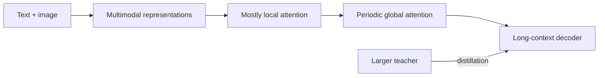

# Gemma deep dive: model design from deployment constraints

[中文](gemma.md) · **English**

> Reading time: ~9 min · Type: model family deep dive · Last reviewed: 2026-09

  
Core question<strong>How can smaller open models combine long context, vision, and local deployment?</strong>

  
Main components<strong>Local / global attention · GQA · multimodal input</strong>

  
Training line<strong>pretraining → larger-model distillation → instruction post-training</strong>

  
After reading<strong>explain architecture through cache, latency, and device limits—not benchmarks alone</strong>

## One-sentence position

Gemma 3 begins with a practical problem: if a family must cover smaller sizes, long context, and image input, how does it stop inference cost from exploding with context? The design does not chase the most exotic block. It tries to make capability and deployment constraints hold at the same time.

## Start with the long-context bill

If every layer attends over the full context, attention work and KV cache become expensive quickly. Gemma 3 lets most layers see a shorter local window and inserts global attention periodically so distant information still has a path. This is not free long context; it is a structured trade-off between information range and cost.

## Three ideas worth keeping

1. **Alternating local and global attention allocates budget.** Local layers control most of the work; global layers move information across windows. The real question is whether their spacing supports the target workload.
2. **Multimodality is not finished when an image encoder is attached.** Visual tokens consume context and compute. Evaluation must test whether the model uses the image rather than guessing from text priors.
3. **Distillation is a major source of small-model capability.** Gemma 3 uses supervision from stronger models to train smaller ones. That improves data efficiency while making teacher coverage and bias part of the student's ceiling.

## Trade-offs

| Choice | What it buys | What it costs |
| --- | --- | --- |
| More local attention | Lower long-context cache and attention cost | More indirect cross-window information flow |
| Periodic global attention | Preserved long-range interaction | Global layers remain expensive |
| Visual input | Image-text tasks and grounded understanding | More tokens, latency, and modality conflict |
| Distillation | Stronger supervision for small models | Capability and bias depend on the teacher |

## How I would use the family

Gemma suits **capability experiments under deployment constraints**. For one task, record quality, peak memory, prefill and decode latency, and context length together. For multimodal tasks, add image ablations and text-image conflict tests. That shows whether the added capability truly comes from vision instead of hiding cost inside an average score.

## Self-check

- Why does local attention reduce cost without immediately cutting off global information?
- How do visual tokens affect context and latency?
- How would you test whether the model looked at the image rather than guessed from text priors?
- Why does a distilled model still need independent evaluation?

## Primary sources

- [Gemma 3 Technical Report](https://arxiv.org/abs/2503.19786)
- [Gemma: Open Models Based on Gemini Research and Technology](https://arxiv.org/abs/2403.08295)
