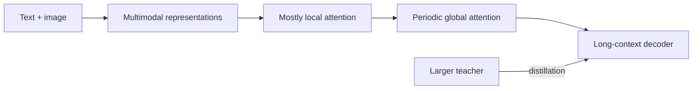

# Gemma 精读：从部署约束反推模型设计

**中文** · [English](gemma.en.md)

> 阅读时间：约 9 分钟 · 类型：模型家族精读 · 最近审阅：2026-09

  
核心问题<strong>较小的开放模型怎样兼顾长上下文、视觉输入与本地部署？</strong>

  
重点组件<strong>Local / global attention · GQA · multimodal input</strong>

  
训练主线<strong>预训练 → 大模型蒸馏 → instruction post-training</strong>

  
读完要会<strong>从 cache、延迟和设备限制解释架构，而不是只看 benchmark</strong>

## 一句话定位

Gemma 3 把一个很实际的问题放在前面：如果模型要覆盖较小尺寸、长上下文和图像输入，怎样避免推理成本跟着上下文一起失控？重点不在于把 block 设计得多复杂，而是在有限的部署资源下保留需要的能力。

## 先看长上下文的账

如果每一层都对完整上下文做 global attention，序列越长，计算量和 KV cache 的显存占用就越大。Gemma 3 让多数层只看较短的 local window，间隔插入 global attention，让远距离信息仍有通路。长上下文的成本并没有消失。这里的取舍是：多数层只处理局部信息，再用少量全局层补上跨窗口的联系。

## 真正值得抓住的三件事

1. **把计算重点分配给不同的层。** local 层控制多数计算，global 层负责跨窗口传播；关键问题是全局层间隔是否足够支持真实任务。
2. **多模态不是“再接一个图片 encoder”就结束。** 视觉 token 会占用上下文和计算预算，评价必须检查模型是否真的使用图像，而不是靠文本先验猜答案。
3. **蒸馏是小模型能力的重要来源。** Gemma 3 使用来自更强模型的监督来训练较小模型；这提高数据效率，也让 teacher 的覆盖范围和偏差成为 student 的上限之一。

## 取舍表

| 选择 | 得到什么 | 付出什么 |
| --- | --- | --- |
| 较多 local attention | 更低的长上下文 cache 与 attention 成本 | 跨窗口信息传播更间接 |
| 周期性 global attention | 保留长距离交互 | 全局层仍然昂贵 |
| 视觉输入 | 图文任务与 grounded understanding | 更多 token、延迟和模态冲突 |
| 蒸馏 | 小模型获得更强监督 | 能力与偏差受 teacher 约束 |

## 我会怎样使用这个家族

Gemma 适合做**部署约束下的能力实验**：同一任务同时记录质量、峰值显存、prefill / decode 延迟和上下文长度；多模态任务再加入 image ablation 与图文冲突测试。这样既能检查模型是否真的用到了图像，也能看清新增的显存和延迟开销。

## 自检

- local attention 为什么能降低成本，又为什么不会立刻切断全局信息？
- 视觉 token 对上下文和延迟有什么影响？
- 怎样验证模型真的看了图，而不是猜文本先验？
- 蒸馏提升小模型时，为什么仍需要独立评估？

## 原始资料

- [Gemma 3 Technical Report](https://arxiv.org/abs/2503.19786)
- [Gemma: Open Models Based on Gemini Research and Technology](https://arxiv.org/abs/2403.08295)
