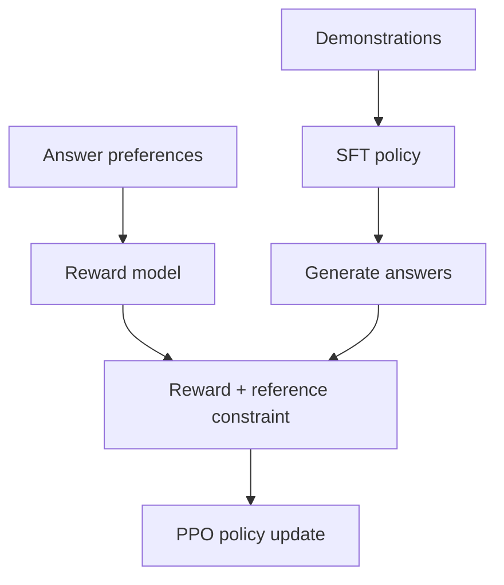

# Reading GPT: how does a model learn a new task?

[中文](gpt.md) · **English**

> Reading time: ~15 min · Type: model-report deep dive · Last reviewed: 2026-10

To make a model classify a message, you could put examples in its prompt, fine-tune on labeled examples, or collect preferences between its answers. All three can help. They change different things.

The useful thread through GPT is not a list of model sizes. It is this distinction: **was knowledge or behavior learned through parameter updates, or specified temporarily through the inference context?** We follow that question here. gpt-oss provides a separate, inspectable architecture example—not a blueprint for closed GPT models.

## Put four kinds of “learning” side by side

| Approach | What the data looks like | Parameter updates? | Common confusion |
| --- | --- | --- | --- |
| Pretraining | Text prefixes predicting subsequent tokens | Yes | Continuing text is not the same as following instructions |
| Task fine-tuning / SFT | Inputs paired with desired outputs | Yes | Not the same as pasting examples into a conversation |
| In-context learning | Instructions and demonstrations in the current prompt | Usually no | A correct answer does not imply permanent memory |
| Preference optimization | Comparisons of answers to the same question | Yes | Preferred does not automatically mean factually correct |

A useful check: **does this step include a backward pass and an optimizer step?** If not, do not describe it as another update to model weights. Activations and KV-cache contents change with context, but they are not parameters.

## GPT-1: read text first, then adapt to a task

GPT-1's main approach was generative pretraining followed by supervised task fine-tuning. It retains causal self-attention. What is absent is the original encoder–decoder Transformer's cross-attention to encoder outputs—not multi-head attention altogether. [Original paper, §3](https://cdn.openai.com/research-covers/language-unsupervised/language_understanding_paper.pdf)

Suppose feedback must be classified as a bug report or a feature suggestion. General text provides the initial language-learning signal; task-specific examples then update the parameters. The paper also allows an auxiliary language-model objective during fine-tuning. Written as a loss to minimize:

$$
\mathcal L=\mathcal L_{\text{task}}+\lambda\mathcal L_{\text{LM}}.
$$

Here $\lambda$ weights the auxiliary objective; it is not a “fraction of retained memory.” A large value may hinder task adaptation, while a small value does not guarantee forgetting. Evaluate both the target task and capabilities you want to preserve.

The transferable idea is to identify what must change for a task before deciding what to update. A small dataset does not make fine-tuning the same operation as few-shot prompting.

## GPT-2: a task can also be expressed in text

GPT-2 trains a language model on WebText and examines task performance without task-specific fine-tuning. It does not attach a classifier for every task or alternate between an explicit set of supervised task losses. [GPT-2 report, §2](https://cdn.openai.com/better-language-models/language-models.pdf)

Consider this message:

> “The meeting has moved to Wednesday afternoon. Please resend the invitation.”

Following it with “French translation:” should produce a different continuation than “One-sentence summary:”. The context carries both **content** and **the task**, so one next-token interface can express several tasks.

That does not make pretraining text a clean instruction dataset. Webpages contain mistakes, quotations, and contradictory views. Learning their distribution and knowing which response is appropriate are different problems.

## GPT-3: examples in context, weights unchanged

GPT-3's few-shot evaluations put instructions and demonstrations into context without gradient updates on the evaluation task. Few-shot means a small set of demonstrations, not one mandatory example count. [GPT-3 paper](https://arxiv.org/abs/2005.14165)

Here is an illustrative task with two temporary labels:

| Demonstration in the prompt | Label |
| --- | --- |
| “The button keeps spinning after payment.” | A |
| “Please add a dark mode.” | B |
| “My uploaded file stays stuck on processing.” | ? |

A model might infer that A means a malfunction and B a suggestion, then answer A. Three controls help test whether it actually used the demonstrations:

1. Remove the examples but retain A/B. Is the label meaning still specified?
2. Swap A and B while keeping everything else fixed. Does the answer follow the new rule?
3. Preserve the rule but paraphrase the messages. Is it using meaning or surface words?

This is a proposed test, not a reproduced GPT-3 experiment or a promise that any model will pass. Context use can be investigated separately; a higher score with more examples alone does not establish a stable new capability.

## InstructGPT: fluent continuation is not enough

InstructGPT uses demonstrations for SFT, comparison data for a reward model, and PPO to update the policy. It is based on GPT-3. Do not draw one supposedly known training recipe for InstructGPT, the original ChatGPT, and every subsequent GPT. [InstructGPT paper](https://arxiv.org/abs/2203.02155)



For the bug report above, two answers may both be fluent. One repeats the complaint; the other acknowledges it, identifies uncertainty, and suggests a next step. Preference data can express that difference.

But a scorer may also favor length or unwarranted confidence. **Optimizing reward amplifies what the scorer rewards; it does not automatically fix what the scorer misses.** Keep independent human assessment or verifiable tasks, check input subgroups, and do not rely on training reward alone.

A reference policy anchors a distribution comparison; it is not a reference answer. A reward model is also different from a critic estimating future return. See the [RLHF model roles](../../05-post-training/rlhf/README.en.md) for the computations.

## gpt-oss: which public details are worth calculating?

Released in 2025, gpt-oss is an open-weight, text-only MoE family. Its model card describes GQA, alternating local/global attention, and a learned softmax sink per head. These are its own disclosed choices, not evidence of GPT-4 or GPT-5 internals. [Model card, §2](https://deploymentsafety.openai.com/gpt-oss)

### How can a sink make attention read less?

Ordinary attention distributes all its weight among visible tokens. With token scores $s_1,s_2$ and sink score $b$:

$$
\alpha_j=\frac{\exp(s_j)}{\exp(b)+\sum_k\exp(s_k)},
\qquad
o=\sum_j\alpha_jv_j.
$$

The denominator gains an entry, but the output has no corresponding value term. Think of it as an additional zero value: real-token weights can sum to less than one.

For an original toy calculation, let $\exp(s_1)=3$, $\exp(s_2)=1$, and $\exp(b)=4$, with values 10 and 2:

| Case | Weights on the two tokens | Output |
| --- | --- | --- |
| No sink | $3/4,\;1/4$ | $8$ |
| With sink | $3/8,\;1/8$ | $4$ |
| Incorrectly renormalize after dropping the sink | Back to $3/4,\;1/4$ | Back to $8$ |

The last row cancels the effect. Nor is this a sparse-compute shortcut: reducing an output does not mean the earlier QK calculation was skipped.

This code checks only the probability arithmetic, not a full attention kernel:

```python
import math

def weights_with_sink(logits, sink_logit):
    offset = max([*logits, sink_logit])
    masses = [math.exp(logit - offset) for logit in logits]
    sink_mass = math.exp(sink_logit - offset)
    total = sum(masses) + sink_mass
    return [mass / total for mass in masses], sink_mass / total

weights, sink_weight = weights_with_sink([math.log(3), 0.0], math.log(4))
output = sum(weight * value for weight, value in zip(weights, [10, 2]))
assert all(math.isclose(actual, expected) for actual, expected in zip(weights, [0.375, 0.125]))
assert math.isclose(sink_weight, 0.5)
assert math.isclose(output, 4.0)
```

### Keep three budgets separate

- **Weight storage:** unselected MoE experts usually still need storage or loading. Active parameter count is not the whole memory footprint.
- **Inference computation:** more reasoning tokens mean more decoding steps. Comparing the FLOPs of one forward pass is insufficient.
- **System cost:** tools add their own latency, failures, and retries. Tool-use capability does not establish end-to-end agent reliability.

Ask where computation happens when reading an architecture, and how much computation was allowed when reading its evaluation.

### What does post-training teach, and what is public?

The official description includes SFT and high-compute RL targeting reasoning, tool use, and aligned behavior, with low / medium / high reasoning effort. It does not supply the complete data and recipe needed to rerun training. Do not fill the gap by assigning an undocumented GRPO configuration. [Release notes: Post-training](https://openai.com/index/introducing-gpt-oss/)

Architecture determines each computation, the training objective determines updates, and effort changes computation during an answer. Switching a fixed model from low to high is not another training run. Changing its tools also changes more than the model's parameters.

Start a small evaluation with the same questions in four conditions. This is a proposed experiment, not measured results:

| Arm | Effort | Tools | Effect to isolate |
| --- | --- | --- | --- |
| A | low | None | Low-cost baseline |
| B | high | None | Additional reasoning computation |
| C | low | A fixed restricted toolset | Whether tools replace some internal reasoning |
| D | high | Same as C | Whether the two forms of computation complement each other |

Fix the checkpoint, precision, chat template, sampling, output cap, and timeout policy. Record outcomes, generated tokens, tool calls, and duration per question; include failures and timeouts in the denominator. Separate math, factual, and tool tasks so a changed question mix cannot masquerade as model progress.

### Are the extra successes worth the wait?

Consider four invented questions. A solves the first three in `[1, 1, 1, 1]` seconds; B solves all four in `[2, 3, 2, 3]` seconds. B gains one success for six additional total seconds. Success per question improves, while successes per summed second fall from `3/4` to `4/10`. Both statements can be true.

```python
import math

def compare_runs(baseline, candidate):
    if not baseline or baseline.keys() != candidate.keys():
        raise ValueError("runs must contain the same nonempty question set")
    for run in (baseline, candidate):
        for passed, seconds in run.values():
            if type(passed) is not bool or not math.isfinite(seconds) or seconds <= 0:
                raise ValueError("expected a boolean outcome and positive finite duration")
    gains = sum(not baseline[key][0] and candidate[key][0] for key in baseline)
    losses = sum(baseline[key][0] and not candidate[key][0] for key in baseline)
    extra_seconds = sum(candidate[key][1] - baseline[key][1] for key in baseline)
    return gains, losses, extra_seconds

baseline = {"a": (True, 1), "b": (True, 1), "c": (True, 1), "d": (False, 1)}
candidate = {"a": (True, 2), "b": (True, 3), "c": (True, 2), "d": (True, 3)}
assert compare_runs(baseline, candidate) == (1, 0, 6)
```

This is not a throughput benchmark: concurrency, batching, and queueing matter in deployment. Nor can four examples establish significance. The exercise keeps gains, regressions, and cost in separate columns. A real evaluation also needs repeated sampling, uncertainty estimates, and tail latency.

Extra latency may be acceptable when errors are very costly; simple interactive classification may not need high effort. Choose for the task rather than assuming longer answers are better. Continue with [evaluation protocols](../../07-evaluation/benchmark-protocols.en.md).

## GPT-4 and GPT-5: architecture and training details are not fully public

Neither GPT-4 nor GPT-5 has a fully public architecture and training specification. GPT-4's technical report explicitly omits details such as parameter count, training compute, and dataset construction. GPT-5's system card describes the system's components, capability evaluations, and safety testing, but not the complete architecture or training configuration. [GPT-4 technical report](https://arxiv.org/abs/2303.08774), [GPT-5 system card](https://openai.com/index/gpt-5-system-card/)

For these models, we can examine published evaluations, test conditions, and limitations, but cannot walk through the architecture layer by layer as we can with open models. The gpt-oss architecture discussed above does not describe their internals either.

GPT-4's scaling experiments are still worth reading: the researchers used smaller training runs to predict the larger model's loss and performance on selected tasks. That does not mean the same curve predicts performance on every task.

## Five questions for the next model release

1. Did it change architecture, training signals, or inference-time budget?
2. Were prompts, example counts, tools, and output lengths controlled?
3. Are context use and parameter updates being conflated?
4. Which claims are disclosed, and which are conjecture?
5. Does the conclusion survive swapped labels, reduced budgets, or a different data slice?

Continue to [Llama](llama.en.md) for the block's computation, or [methods after PPO](../../05-post-training/after-ppo.en.md) for how preferences change probabilities. One asks how the model computes; the other asks why it updates in a particular direction.
