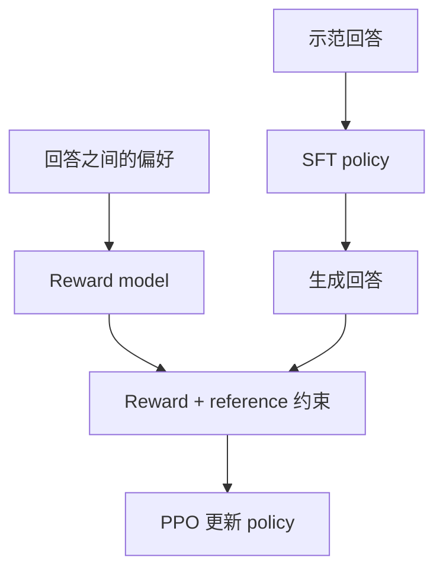

# GPT 精读：模型到底是怎么学会新任务的？

**中文** · [English](gpt.en.md)

> 阅读时间：约 15 分钟 · 类型：模型报告精读 · 最近审阅：2026-10

同样是让模型给一段文字分类，有人把样例放进 prompt，有人拿样例去微调，还有人收集回答之间的偏好。这几件事都可能让回答变好，但改动的不是同一个地方。

读 GPT 这条路线，最值得带走的不是一串型号，而是分清：**知识和行为是在训练时写进参数，还是在推理时由上下文临时指定？** 本篇按这个问题组织；gpt-oss 另作一个公开架构的例子，不把它当成闭源 GPT 的结构说明书。

## 先把四种“学习”放在一起

| 做法 | 数据长什么样 | 会更新参数吗？ | 最容易混淆的地方 |
| --- | --- | --- | --- |
| 预训练（pretraining） | 连续文本，前面的 token 预测后面的 token | 会 | 会续写不等于会按要求回答 |
| 任务微调 / SFT | 输入和希望模型给出的输出 | 会 | 不是往当前对话里多贴几个例子 |
| 上下文学习（in-context learning） | 当前 prompt 里的说明和示范 | 通常不会 | 这次答对不表示永久记住 |
| 偏好优化 | 同一问题下，哪些回答更合适 | 会 | “被偏好”不自动等于“事实正确” |

给自己做一个简单检查：**这一步有没有 backward 和 optimizer step？** 没有的话，先别说模型权重“又学了一遍”。上下文里的激活和 KV cache 会变化，但它们不等于参数。

## GPT-1：先读文本，再适应具体任务

GPT-1 的主线是生成式预训练，再用带标签的任务数据微调。它保留 causal self-attention；没有的是原始 encoder–decoder Transformer 中读取 encoder 输出的 cross-attention，不是把 multi-head attention 全删掉。[原论文 §3](https://cdn.openai.com/research-covers/language-unsupervised/language_understanding_paper.pdf)

假设要把一条反馈分成“功能问题”和“使用建议”。模型先通过大量文本学习语言规律，再用这项任务的数据调整参数。原论文的微调还可以保留语言模型辅助目标。换成最小化损失的写法：

$$
\mathcal L=\mathcal L_{\text{task}}+\lambda\mathcal L_{\text{LM}}.
$$

这里的 $\lambda$ 控制辅助目标的分量，不是“原模型记忆保留率”。它太大可能妨碍适应新任务，太小也不代表一定会遗忘。要用保留任务和新任务一起评估。

这个思路今天仍然有用：先问目标任务需要改什么，再决定更新哪些参数，而不是一看到 few-shot 数据就把它叫成 fine-tuning。

## GPT-2：任务也可以藏在文本里

GPT-2 在 WebText 上训练语言模型，考察不做任务专属微调时，能否通过合适的输入完成不同任务。不是为每个任务接一个分类头，也不是轮流优化一套显式的任务 loss。[GPT-2 报告 §2](https://cdn.openai.com/better-language-models/language-models.pdf)

想想同一句话：

> “会议改到周三下午，请重新发邀请。”

让模型接着写“英文翻译：”，与接着写“一句话摘要：”，预测的后续文本应该不同。输入里同时带着**内容**和**任务要求**，于是同一个 next-token 接口能表达不同任务。

这不意味着预训练文本就是一份干净的 instruction dataset。网页里也有错误、引用、互相矛盾的立场。学会它们的分布，和知道什么时候该采用哪一种回答，是两回事。

## GPT-3：示范放在上下文里，权重不动

GPT-3 的 few-shot 评估把任务说明与示例放入上下文，不在评估任务上更新梯度。few-shot 指少量示范，不是固定等于某个数量。[GPT-3 论文](https://arxiv.org/abs/2005.14165)

看一个自拟例子。我们临时规定两个标签：

| Prompt 里的示范 | 标签 |
| --- | --- |
| “付款后按钮一直转圈。” | A |
| “希望增加深色模式。” | B |
| “文件上传后一直显示处理中。” | ? |

模型可能从示范推断 A 是故障、B 是建议，再输出 A。为了检查它有没有真正使用示范，可以做三个小对照：

1. 去掉示范，只保留 A/B：标签含义还够清楚吗？
2. 对调 A/B，但保持其他文本不变：输出会跟着规则变吗？
3. 保留规则，换一种说法：模型依赖的是语义还是表面关键词？

这是测试方案，不是 GPT-3 的复现实验，也不保证任何模型一定答对。重点是：上下文的作用可以被单独测试；不能仅凭“多给例子后分数高了”就断言模型学会了稳定的新能力。

## InstructGPT：会续写之后，还得学会怎样回答

InstructGPT 用示范做 SFT，用比较数据训练 reward model，再用 PPO 调整策略。它基于 GPT-3；不要把 InstructGPT、最初的 ChatGPT 和后续所有 GPT 的训练流程画成同一张已知配方。[InstructGPT 论文](https://arxiv.org/abs/2203.02155)



还是前面的故障反馈。两个回答都像自然语言，但一个只重复用户的话，另一个先确认问题、说明不确定处，再提出下一步。偏好数据可以表达这种区别。

不过，打分器也可能偏爱更长、更肯定的语气。**优化 reward 会放大它奖励的东西，不会自动修正它漏掉的东西。** 所以要留独立的人评或可验证任务，并检查不同输入群体；不能只看训练 reward。

reference 是比较策略分布的基准，不是一条“参考答案”；reward model 也不是估计后续回报的 critic。四个角色的具体计算见 [RLHF 的模型分工](../../05-post-training/rlhf/README.md)。

## gpt-oss：公开结构里，哪些细节值得动手算？

2025 年发布的 gpt-oss 是公开权重的文本 MoE 模型。模型卡说明了 GQA、交替的局部 / 全局 attention，以及每头可学习的 softmax sink。这些是它自己的公开设计，不能据此反推 GPT-4 或 GPT-5。[模型卡 §2](https://deploymentsafety.openai.com/gpt-oss)

### 一个 sink 为什么会让模型“少读一点”？

普通 attention 必须把全部权重分给可见 token。设两个 token 的打分为 $s_1,s_2$，sink 的打分为 $b$，则：

$$
\alpha_j=\frac{\exp(s_j)}{\exp(b)+\sum_k\exp(s_k)},
\qquad
o=\sum_j\alpha_jv_j.
$$

分母多了一个位置，但输出里没有它的 value 项。把它想成额外的零 value，就能看到：真实 token 的权重和可以小于 1。

自拟算例：令 $\exp(s_1)=3$、$\exp(s_2)=1$、$\exp(b)=4$，并令两个 value 为 10 和 2：

| 情况 | 两个 token 的权重 | 输出 |
| --- | --- | --- |
| 没有 sink | $3/4,\;1/4$ | $8$ |
| 有 sink | $3/8,\;1/8$ | $4$ |
| 丢掉 sink 后错误地重新归一化 | 又变成 $3/4,\;1/4$ | 又变成 $8$ |

最后一行把 sink 的作用抵消了。它也不是稀疏加速：把输出压小，不代表前面的 QK 计算没做。

下面只验证这笔概率账，不实现完整 attention kernel：

```python
import math

def weights_with_sink(logits, sink_logit):
    offset = max([*logits, sink_logit])
    masses = [math.exp(logit - offset) for logit in logits]
    sink_mass = math.exp(sink_logit - offset)
    total = sum(masses) + sink_mass
    return [mass / total for mass in masses], sink_mass / total

weights, sink_weight = weights_with_sink([math.log(3), 0.0], math.log(4))
output = sum(weight * value for weight, value in zip(weights, [10, 2]))
assert all(math.isclose(actual, expected) for actual, expected in zip(weights, [0.375, 0.125]))
assert math.isclose(sink_weight, 0.5)
assert math.isclose(output, 4.0)
```

### 三种预算别混着看

- **权重预算**：MoE 没选中的专家通常仍要存放或调入，不能按 active parameters 估全部内存。
- **推理预算**：生成更多 reasoning tokens，意味着更多 decode 步骤；不能只比较一次 forward 的 FLOPs。
- **系统预算**：调用工具还包含工具本身的时间、失败和重试；“模型会用工具”不等于整套 agent 已经可靠。

读结构时问“计算在哪里”，读评估时问“给了多少计算”。这样比只记一个总分更容易比较公平。

### 后训练教了什么，公开到哪一步？

官方说明包含 SFT 和高计算量 RL，目标涉及推理、工具使用和行为对齐；提供 low / medium / high 三档 reasoning effort。公开资料没有给出可直接重跑的完整数据与训练配方，不能把它自行补成“用了某个 GRPO 配置”。[发布说明：Post-training](https://openai.com/index/introducing-gpt-oss/)

架构解释每步怎样算，训练目标解释怎样更新，effort 则改变回答时投入的计算。三者要分开比较。把同一模型从 low 切到 high 后答对更多题，不能称为“又训练了一次”；换了工具环境，也不能只归因于模型参数。

实际做一次小规模评估，可以先固定同一批题，设置下面四组。这里是实验设计，不是测得的结果：

| 组别 | Effort | 工具 | 要分离的影响 |
| --- | --- | --- | --- |
| A | low | 无 | 最低成本基线 |
| B | high | 无 | 多投入推理计算的收益 |
| C | low | 相同的受限工具集 | 工具能否替代部分内部推理 |
| D | high | 与 C 相同 | 两种计算是否互补 |

固定 checkpoint、精度、chat template、采样方式、输出上限与超时规则。每题保存是否成功、生成 token、工具调用和耗时；失败与超时也算进分母。再分别看数学、事实、工具任务，别把题目组成变了造成的差异当作模型进步。

### 多答对几题，值不值多出的等待？

用自拟的 4 道题说明：A 答对前 3 道，用时 `[1, 1, 1, 1]` 秒；B 全答对，用时 `[2, 3, 2, 3]` 秒。B 多解决 1 题，总耗时多 6 秒；逐题成功率升高，但每总秒完成的正确题数从 `3/4` 降到 `4/10`。这两个判断并不矛盾。

```python
import math

def compare_runs(baseline, candidate):
    if not baseline or baseline.keys() != candidate.keys():
        raise ValueError("runs must contain the same nonempty question set")
    for run in (baseline, candidate):
        for passed, seconds in run.values():
            if type(passed) is not bool or not math.isfinite(seconds) or seconds <= 0:
                raise ValueError("expected a boolean outcome and positive finite duration")
    gains = sum(not baseline[key][0] and candidate[key][0] for key in baseline)
    losses = sum(baseline[key][0] and not candidate[key][0] for key in baseline)
    extra_seconds = sum(candidate[key][1] - baseline[key][1] for key in baseline)
    return gains, losses, extra_seconds

baseline = {"a": (True, 1), "b": (True, 1), "c": (True, 1), "d": (False, 1)}
candidate = {"a": (True, 2), "b": (True, 3), "c": (True, 2), "d": (True, 3)}
assert compare_runs(baseline, candidate) == (1, 0, 6)
```

它不是吞吐 benchmark：真实系统还受并发、批处理、排队影响。小样本也不足以宣布显著提升。这里要练的是把收益、退步和成本分别记账；扩展到真实评估时，再重复采样、计算不确定性，记录尾延迟。

如果任务必须极少出错，增加等待可能值得；如果是交互里的简单分类，未必需要高 effort。决策取决于任务，而不是默认最长回答最好。协议与统计检查见 [Benchmark 评估](../../07-evaluation/benchmark-protocols.md)。

## GPT-4、GPT-5：架构与训练细节尚未完整公开

GPT-4 和 GPT-5 目前都没有公开完整的模型架构和训练细节。GPT-4 的技术报告明确省略了参数量、训练算力和数据集构建等信息；GPT-5 的 system card 介绍了系统组成、能力评估与安全测试，但没有给出完整的架构和训练配置。[GPT-4 技术报告](https://arxiv.org/abs/2303.08774)、[GPT-5 system card](https://openai.com/index/gpt-5-system-card/)

所以，这两代模型主要看公开的评估结果、测试条件和使用限制，暂时无法像开源模型那样逐层拆解。前面介绍的 gpt-oss 也不是它们的架构说明。

GPT-4 报告中的 scaling 实验仍值得读：研究者用较小规模的训练预测大模型的 loss 和部分任务表现。不过，这不代表所有任务的效果都能用同一条曲线预测。

## 下次遇到一个新模型，先问这五句

1. 它新增的是架构、训练信号，还是推理时的预算？
2. 比较时有没有固定 prompt、示例数量、工具和输出长度？
3. 会用示范，和更新参数，是不是被混在一起了？
4. 公开报告支持哪些判断？哪些只是推测？
5. 如果把示范标签对调、减少预算或换一个数据 slice，结论还成立吗？

想继续拆 block，去看 [Llama](llama.md)；想弄清偏好怎样改变概率，去看 [PPO 之后的方法](../../05-post-training/after-ppo.md)。前者回答“怎么算”，后者回答“为什么朝这个方向更新”。
