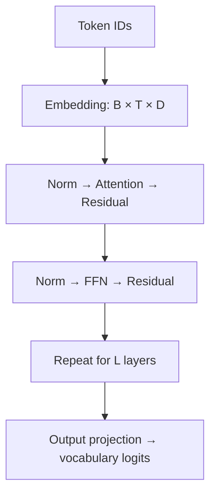

# How to read a model report

[中文](how-to-read.md) · **English**

Remembering that a model uses GQA or MoE is easy. More useful questions are: why here, which bottleneck would appear without it, and did the experiments actually isolate that change?

This is not a model ranking. We'll connect the prose, tensors, and experiments using a simplified decoder.

## Step 1: identify the exact model

One family may contain different generations, sizes, base and instruct checkpoints, and modalities. Record the report version, checkpoint, public config, and code revision. Don't use one version's architecture to explain another's results.

| Record first | Check later |
| --- | --- |
| Task and constraints | Is the goal quality, context length, memory, or latency? |
| Configuration | Layers, hidden size, Q / KV heads, FFN type |
| Training | Did data, objective, budget, and post-training change together? |
| Evaluation | Are prompts, samples, output budgets, and tool permissions comparable? |

## Step 2: follow one token through the computation



This sketches a common pre-norm decoder, not a universal template. Let $B$ denote batch, $T$ length, and $D$ hidden size. At each module ask: does the shape change, does information cross token boundaries, and what must persist for the next generation step?

For example, the FFN usually acts token by token, while attention aggregates information from visible tokens. Distinguishing their jobs is more useful than memorizing acronyms.

## Step 3: calculate a GQA example

Suppose there are 16 query heads, 4 KV heads, and head dimension 64. There are still 16 queries per position, with each KV head shared by 4 query heads. Reducing decoder KV overhead is one motivation for GQA; quality and speed claims depend on the paper's experimental settings. [Original GQA paper](https://arxiv.org/abs/2305.13245)

For a simplified model caching the full context at every layer, with equal K/V dimensions:

$$
M_{\mathrm{KV}}=2\,B\,T\,L\,H_{\mathrm{KV}}\,d_h\,s.
$$

The 2 accounts for K and V, and $s$ is bytes per value. Set $B=1,T=4096,L=24,d_h=64,s=2$:

```python
def kv_cache_mib(kv_heads):
    return 2 * 1 * 4096 * 24 * kv_heads * 64 * 2 / (1024 ** 2)

assert kv_cache_mib(16) == 384
assert kv_cache_mib(4) == 96
```

The KV cache becomes one quarter of its previous size, **not the whole model's memory use or request latency**. Weights, temporary activations, other computation, and implementation overhead remain. Sliding windows, quantization, or specialized caches need different accounting.

## Step 4: separate prefill and decode

- **Prefill:** process the existing prompt. Many tokens enter together; inspect sequence length, batch, attention implementation, and time to first token.
- **Decode:** generate further tokens while reading cached state. Memory access can matter especially with long contexts and small batches.

Fewer theoretical FLOPs do not guarantee lower latency. Parallelism, bandwidth, and kernels affect the result. Record workload, input/output lengths, batch, and hardware before comparing measurements.

## Step 5: separate observation from explanation

| Reported observation | Possible explanation | Missing evidence |
| --- | --- | --- |
| Higher scores after an architecture change | Architecture may improve learning | Same-data, same-budget ablation |
| Better long-context behavior | Long-context training may help | Rule out data and evaluation changes |
| Faster measured inference | Smaller caches may help | Stage-level profiling, not just total time |

“Uncertain” is a better answer than attributing every gain to the newest component. Close the report and explain in two minutes: the constraint, the key change, its cost, and an experiment that could falsify your explanation.

Now try a family: [Llama](llama.en.md) · [Qwen](qwen.en.md) · [DeepSeek](deepseek.en.md) · [Gemma](gemma.en.md).
