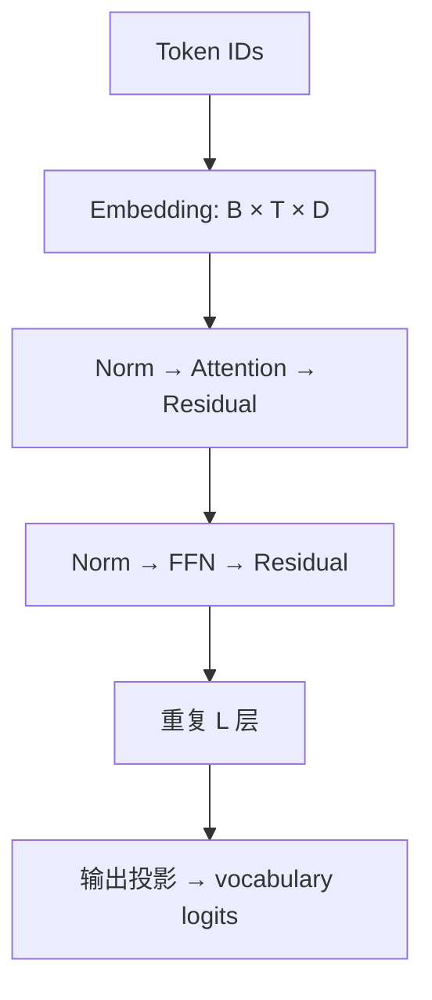

# 拿到一份模型报告，我会怎么读

**中文** · [English](how-to-read.en.md)

读完报告，记住“用了 GQA、用了 MoE”不难。更有用的是能回答：为什么在这里用？如果不这样做，哪个瓶颈会先出现？实验真的隔离了这个改动吗？

这篇不做模型排名。我们用一个简化 decoder 的例子，练习把文字、张量和实验连起来。

## 第一步：先认准你在读哪一个模型

同一家族可能有不同代、不同尺寸、base / instruct，以及不同模态版本。先写下报告版本、checkpoint、公开 config 和代码 revision。不要拿一个版本的结构解释另一个版本的成绩。

| 先记下来 | 后面要检查什么 |
| --- | --- |
| 任务与约束 | 主要改善质量、长度、显存，还是延迟？ |
| 结构配置 | 层数、hidden size、Q / KV heads、FFN 类型 |
| 训练过程 | 数据、目标、预算、Post-training 是否同时变化？ |
| 评估条件 | 提示词、采样次数、输出预算、工具权限是否一致？ |

## 第二步：沿着一个 token 看计算



这是一个常见 pre-norm decoder 的简图，不是所有模型的统一模板。记 $B$ 为 batch、$T$ 为长度、$D$ 为 hidden size。每到一个模块，就问：形状变了吗？有没有跨 token 交换信息？哪些状态需要留给下一次生成？

比如 FFN 通常逐 token 计算，而 attention 汇总可见 token 的信息。把这两个作用分清，比背住它们的缩写更有用。

## 第三步：用 GQA 算一次账

假设 query 有 16 个头，KV 有 4 个头，每个头维度为 64。一个位置仍有 16 组 query，但每组 KV 由 4 个 query 头共享。GQA 的目标之一是减少 decoder 推理中的 KV 开销；具体质量和速度结论应看它自己的实验条件。[GQA 原论文](https://arxiv.org/abs/2305.13245)

对于每层都缓存完整上下文、K/V 维度相同的简化模型：

$$
M_{\mathrm{KV}}=2\,B\,T\,L\,H_{\mathrm{KV}}\,d_h\,s.
$$

2 对应 K 和 V，$s$ 是每个数占的字节。设 $B=1,T=4096,L=24,d_h=64,s=2$：

```python
def kv_cache_mib(kv_heads):
    return 2 * 1 * 4096 * 24 * kv_heads * 64 * 2 / (1024 ** 2)

assert kv_cache_mib(16) == 384
assert kv_cache_mib(4) == 96
```

这个例子把 KV 缓存量降为四分之一，**不是把整个模型显存或请求延迟降为四分之一**。权重、临时激活、其他计算、实现开销都还在。滑动窗口、量化或特殊缓存结构也需要另算。

## 第四步：分开看 prefill 和 decode

- **Prefill**：处理已有 prompt。一次输入很多 token，重点看长度、batch、attention 实现和首 token 延迟。
- **Decode**：继续生成。每轮新增 token，会读取缓存；长上下文、小 batch 等情况下，内存访问可能很重要。

不要把“减少理论 FLOPs”直接翻译成“延迟一定更低”。并行度、带宽和 kernel 实现都可能改变结果。至少记录 workload、输入输出长度、batch 和硬件，再比较测量值。

## 第五步：把结论拆成三栏

| 报告观察到什么 | 可以提出的解释 | 还缺什么证据 |
| --- | --- | --- |
| 换结构后分数更高 | 结构可能改善了学习 | 同数据、同预算的消融 |
| 新模型长文本表现更好 | 长上下文训练可能有效 | 排除数据和评估设置的变化 |
| 实测速度更快 | 更小缓存可能有帮助 | 分阶段 profiling，而不只报总耗时 |

不知道就写“不确定”，比把每个成绩都归因给最新组件更专业。最后合上报告，用 2 分钟讲清：它解决什么约束、关键改动在哪里、代价是什么、什么实验能推翻你的解释。

接着选一个家族练习：[Llama](llama.md) · [Qwen](qwen.md) · [DeepSeek](deepseek.md) · [Gemma](gemma.md)。
