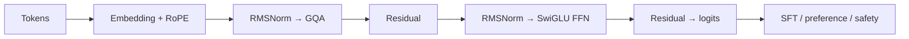

# Llama deep dive: the dense-decoder baseline

[中文](llama.md) · **English**

> Reading time: ~9 min · Type: model family deep dive · Last reviewed: 2026-09

  
Core question<strong>When the architecture is restrained, where does capability come from?</strong>

  
Main components<strong>Dense decoder · GQA · RoPE · RMSNorm · SwiGLU</strong>

  
Training line<strong>large-scale pretraining → SFT / preference optimisation → safety and tools</strong>

  
After reading<strong>separate the effects of architecture, data scale, and post-training</strong>

## One-sentence position

Llama is a useful **dense baseline** for modern open LLMs. Its importance is not one exotic block. It combines a fairly standard decoder-only architecture with serious training scale and a complete post-training stack in a family that can be studied, deployed, and adapted.

That is an important reminder: capability is not the same thing as architectural novelty. A familiar block can behave very differently once data, training stability, and post-training improve.

## Follow the data flow first

Llama 3 remains a dense Transformer: every token passes through the same FFN parameters. GQA reduces KV-cache size, RoPE supplies relative position information, and RMSNorm plus SwiGLU has become a common modern decoder recipe. All matter; none alone explains the model's capabilities.

## Three ideas worth keeping

1. **Dense is a clean control.** With no expert routing, the parameter path is easier to explain and the model is straightforward to quantise, tune, and deploy. The cost is paying for the full FFN on every token.
2. **Data and scale are central.** The Llama 3 report spends substantial space on data mixtures, quality filtering, scaling, and training stability. Do not stop at the architecture table.
3. **Base and instruct are different objects of study.** Tool use, refusal style, and preference behaviour mostly come from post-training. Inferring the base architecture from instruct-model behaviour usually breaks the causal story.

## Trade-offs

| Choice | What it buys | What it costs |
| --- | --- | --- |
| Dense FFN | Simple paths and mature training and deployment | Every token activates the full FFN |
| GQA | Smaller KV cache and higher decoding throughput | Sharing K/V may compress attention capacity |
| Longer context | Longer documents and multi-turn tasks | Harder cache, training data, and long-context evaluation |
| Full post-training stack | Better instruction, tool, and safety behaviour | Behaviour is harder to infer from base benchmarks |

## How I would use the family

Llama makes a strong experimental baseline. For work on data, SFT, preference optimisation, retrieval augmentation, or agent behaviour, establish a stable dense control first, then add MoE, MLA, or more involved reasoning training. That makes attribution much cleaner.

## Self-check

- Why can Llama's value not be judged only by architectural novelty?
- Which memory does GQA save, and why does it matter most during decoding?
- If an instruct model improves at tool use, what evidence would let you attribute that to architecture?
- When is a dense baseline better for an experiment than a larger MoE?

## Primary sources

- [The Llama 3 Herd of Models](https://arxiv.org/abs/2407.21783)
- [Meta AI: The Llama 3 Herd of Models](https://ai.meta.com/research/publications/the-llama-3-herd-of-models/)
- [LLaMA: Open and Efficient Foundation Language Models](https://arxiv.org/abs/2302.13971)
