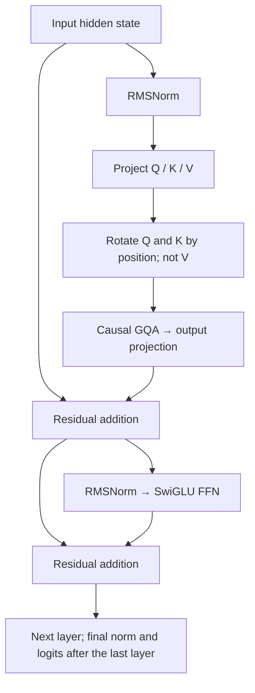
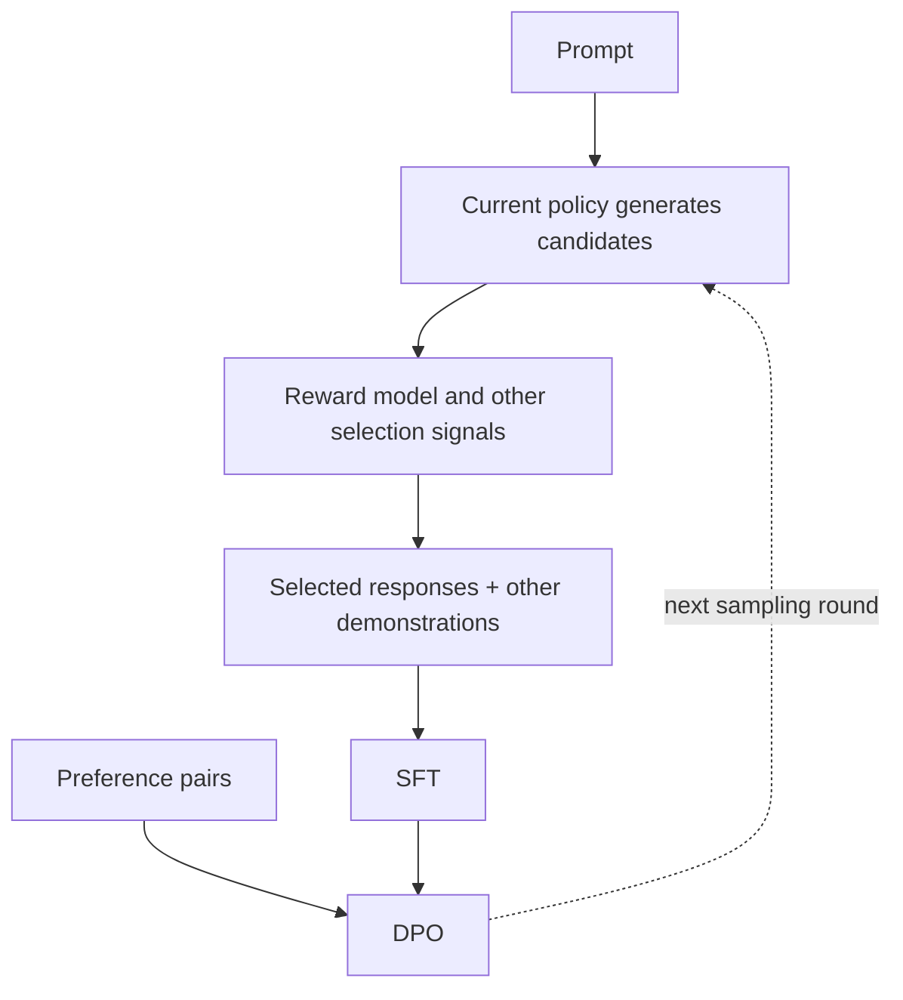

# Reading Llama: from one block to training and inference trade-offs

[中文](llama.md) · **English**

> Reading time: ~16 min · Type: model-report deep dive · Last reviewed: 2026-10

Recognizing RoPE, RMSNorm, GQA, and SwiGLU can make a Llama report feel familiar. Putting them together raises more useful questions: where does a token go, what consumes memory in a long conversation, and why can capability improve without a radically different block?

This article covers **Llama 1–3.1 text models**, using their dense decoder as a baseline before studying MoE, MLA, and multimodal designs. A configuration from one release is not a specification for the entire family.

<span id="one-sentence-position"></span>
<span id="primary-sources"></span>

## Align the versions before comparing tables

| Version | Distinction to retain here | What not to infer |
| --- | --- | --- |
| LLaMA 1 | Pre-RMSNorm, SwiGLU, RoPE | LLaMA invented all these components |
| Llama 2 | 4K context; the released 70B uses GQA | Every size has identical attention settings |
| Initial Llama 3 (2024-04) | GQA in 8B/70B, 128K vocabulary, 8K context | 128K vocabulary means 128K context |
| Llama 3.1 / 405B report (2024-07) | Context extension to 128K and a detailed post-training procedure | Earlier Llama 3 settings retroactively change |

Version sources: [LLaMA 1](https://arxiv.org/abs/2302.13971), [Llama 2](https://arxiv.org/abs/2307.09288), [initial Llama 3 announcement](https://ai.meta.com/blog/meta-llama-3), [Llama 3 report](https://arxiv.org/abs/2407.21783). **Vocabulary size** counts available token IDs; **context length** counts tokens processed in a sequence. The same number does not make them the same quantity.

<span id="follow-the-data-flow-first"></span>

## Follow a token through the block

This is a text decoder's computation, not its training pipeline. RoPE acts on attention's Q/K; it is not an addition to the input token embedding.


```mermaid
flowchart TD
    X["Input hidden state"] --> N["RMSNorm"]
    N --> Q["Project Q / K / V"]
    Q --> R["Rotate Q and K by position; not V"]
    R --> A["Causal GQA → output projection"]
    X --> S["Residual addition"]
    A --> S
    S --> F["RMSNorm → SwiGLU FFN"]
    S --> T["Residual addition"]
    F --> T
    T --> U["Next layer; final norm and logits after the last layer"]
```

In shorthand:

$$
h'=h+\operatorname{Attention}(\operatorname{RMSNorm}(h)),
\qquad
h_{\text{next}}=h'+\operatorname{FFN}(\operatorname{RMSNorm}(h')).
$$

Attention includes projections, Q/K rotation, masking, softmax, and the output projection. Residual addition requires both paths to return to the same hidden width. The FFN's intermediate representation can be wider, but cannot be added directly to the residual stream.

Separate the components:

- **RMSNorm** adjusts scale without subtracting the mean. Pre means before the sublayer, not normalizing the entire dataset first. [RMSNorm paper](https://arxiv.org/abs/1910.07467)
- **RoPE** introduces position through rotations in the Q/K dot product. Its relative-position property does not guarantee arbitrary-length generalization; frequency settings, training lengths, and tasks still matter. [RoFormer paper](https://arxiv.org/abs/2104.09864)
- **SwiGLU** multiplies two projected branches elementwise and projects back to hidden width. This gate does not select experts: the FFN is still dense. [GLU Variants](https://arxiv.org/abs/2002.05202)

[GPT-2 already uses pre-normalization](https://cdn.openai.com/better-language-models/language-models.pdf). “GPT uses Post-LN; Llama introduced Pre-LN” is therefore not a sound family-wide comparison. Specify the version and formula.

<span id="three-ideas-worth-keeping"></span>

## What does GQA save? Calculate the cache

GQA shares K/V across groups of Query heads. It does not reduce all queries to a single head, but compact KV storage no longer needs a separate pair for every Query head. [GQA paper](https://arxiv.org/abs/2305.13245)

Use an illustrative configuration: 32 layers, 32 Q heads, 8 KV heads, head dimension 128, BF16 cache at 2 bytes per element. For one request with 8192 cached tokens, excluding allocation and runtime overhead:

$$
M_{\mathrm{KV}}
=2\times B\times L\times T\times H_{\mathrm{KV}}\times d_h\times b
=2\times1\times32\times8192\times8\times128\times2
=1\ \mathrm{GiB}.
$$

The leading 2 counts K and V. $B$ is request count, $L$ layer count, $T$ cached length, $H_{\mathrm{KV}}$ KV-head count, $d_h$ head width, and $b$ bytes per element.

| Keeping other settings fixed | Raw KV cache |
| --- | --- |
| 32 KV heads (MHA) | 4 GiB |
| 8 KV heads (GQA) | 1 GiB |
| GQA at 131072 tokens | 16 GiB |
| GQA for four independent 8192-token requests | 4 GiB |

Fitting the weights and serving several long conversations are different constraints. A 4× cache reduction is not a 4× reduction in total memory or latency: weights, activations, kernel workspace, cache allocation, and parallel layout remain.

### Change a few numbers yourself

```python
def kv_bytes(batch, layers, tokens, kv_heads, head_dim, bytes_per_element):
    return 2 * batch * layers * tokens * kv_heads * head_dim * bytes_per_element

gqa = kv_bytes(1, 32, 8192, 8, 128, 2)
mha = kv_bytes(1, 32, 8192, 32, 128, 2)
long_context = kv_bytes(1, 32, 131072, 8, 128, 2)
assert gqa == 2**30
assert mha == 4 * gqa
assert long_context == 16 * gqa
assert kv_bytes(4, 32, 8192, 8, 128, 2) == mha
```

This is memory accounting, not a performance benchmark. An implementation that duplicates K/V to match the Query-head count may create large temporary tensors. Distinguish compact storage from materialized repetition during computation.

## Familiar architecture still leaves much to improve in training

The Llama 3 report emphasizes data quality, diversity, and training scale, and describes short-to-long context training and final annealing. It does not attribute all capability gains to a new block. [Report, §3](https://arxiv.org/html/2407.21783v3#S3)

What does that suggest for your own small training experiment?

| Problem | Candidate intervention | What to check alongside it |
| --- | --- | --- |
| Weak domain understanding | Add filtered domain text | Better terminology recall, or better answers to new problems? |
| Repeated webpages dominate | Deduplicate and adjust sampling | Are small languages or domains being removed disproportionately? |
| Weak long-document connections | Train on longer sequences and adjust positional settings | Do short tasks regress? Does cross-section reasoning improve? |
| Unstable late-training performance | Inspect learning rate, data order, and high-quality mixtures | A transient fluctuation or a reproducible improvement? |

These are experimental options, not guaranteed gains. Change one main factor at a time when possible, control the training budget, and retain evaluation data that did not participate in selection.

Increasing a maximum-length setting does not itself create long-context competence. Accepting input tests the software boundary; passing a needle task tests retrieval under that setup. Combining evidence, resolving long code dependencies, and following cross-turn instructions need separate evaluation.

## Post-training is not another decoder layer

The Llama 3 report describes iterative use of a reward model, rejection sampling, SFT, and DPO. This is a **data-generation, selection, and parameter-update workflow**, not four models that every inference request must traverse. [Report, §4](https://arxiv.org/html/2407.21783v3#S4)


```mermaid
flowchart TD
    P["Prompt"] --> C["Current policy generates candidates"]
    C --> R["Reward model and other selection signals"]
    R --> D["Selected responses + other demonstrations"]
    D --> S["SFT"]
    H["Preference pairs"] --> O["DPO"]
    S --> O
    O -. next sampling round .-> C
```

Consider an invented task: “List only the action items confirmed in these meeting notes.”

- Candidate A is fluent but invents an owner for an undecided task.
- Candidate B is shorter and preserves what is still unresolved.
- A scorer that favors completeness and confidence may choose A. Subsequent training can then reinforce that mistaken preference.

Generating data with a stronger model is not a proof of monotonically improving quality. Inspect selection criteria, duplication, refusal rates, and external evaluation. DPO's loss does not require an explicit RM; the broader data workflow can still use one.

### DPO changes relative preference; it does not certify an answer

For input $x$, let $y_w$ be the preferred answer and $y_l$ the other. Define the difference relative to a reference:

$$
\Delta=
\log\frac{\pi_\theta(y_w\mid x)}{\pi_{\mathrm{ref}}(y_w\mid x)}
-\log\frac{\pi_\theta(y_l\mid x)}{\pi_{\mathrm{ref}}(y_l\mid x)},
\qquad
\mathcal L_{\mathrm{DPO}}=-\log\sigma(\beta\Delta).
$$

Here $\beta$ is the objective coefficient and $\sigma$ is sigmoid. These are complete-answer conditional probabilities, typically computed by accumulating token log-probabilities. The objective favors a larger relative difference; it does not directly guarantee an increase in the absolute probability of $y_w$. [DPO paper](https://arxiv.org/abs/2305.18290)

For example, let the reference assign 0.1 to each answer. The new policy assigns 0.08 to the preferred answer and 0.02 to the other. The preferred answer becomes less likely, but their ratio rises from 1 to 4. With $\beta=1$, loss falls from approximately 0.6931 to 0.2231. This is a mathematical counterexample, not a measured Llama result.

<span id="how-i-would-use-the-family"></span>
<span id="trade-offs"></span>

## When is this baseline useful?

| Choice | Benefit | Cost or caution |
| --- | --- | --- |
| Dense FFN | No expert routing; simpler debugging of training and inference | Every token uses the full FFN |
| GQA | Compact K/V storage, useful for long-conversation cost analysis | Sharing K/V is a modeling trade-off; savings depend on implementation |
| Long context | More evidence in one request | Harder cache management, training data, and long-task evaluation |
| Full post-training | Separate improvements to format, preferences, tools, and safety | Simultaneous changes make causal attribution difficult |

For research on data, SFT, retrieval augmentation, or evaluation, a stable dense control can be easier to interpret than introducing MoE, long reasoning, and a complex router at once. Establish a credible baseline before adding structural complexity.

<span id="self-check"></span>

## Explain it back to yourself

- Why is architectural novelty an incomplete measure of a model's value?
- Why is a 4× GQA cache difference not a 4× end-to-end speedup?
- If tool use improves, how would you separate architecture, data, and post-training effects?
- When is a dense control more useful than a larger MoE?

Revisit [KV cache](../deep-dives/kv-cache-and-inference.en.md), [position encoding](../deep-dives/position-and-context.en.md), and [FFNs and gates](../core/ffn-and-gates.en.md) for component details. Carry the same questions into [Qwen](qwen.en.md), but verify its versions afresh.
