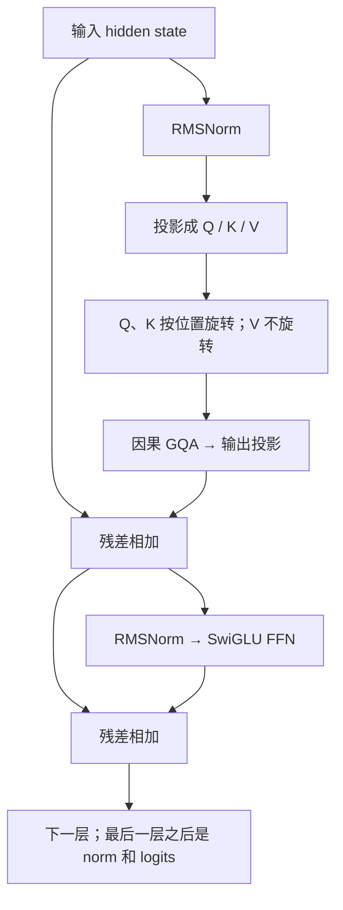
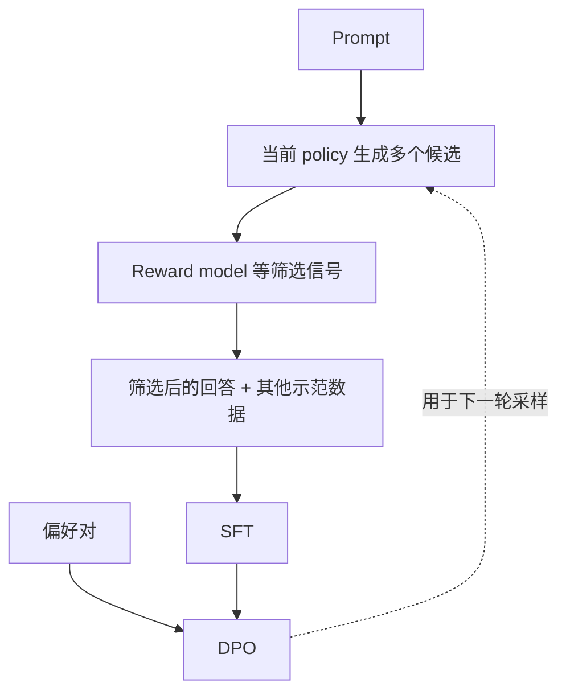

# Llama 精读：从一个 block，看到训练和推理的取舍

**中文** · [English](llama.en.md)

> 阅读时间：约 16 分钟 · 类型：模型报告精读 · 最近审阅：2026-10

如果已经认识 RoPE、RMSNorm、GQA 和 SwiGLU，读 Llama 时很容易觉得“这些我都会”。但把它们放在一起，还得回答几个具体问题：一个 token 经过哪里？长对话占的显存从哪儿来？为什么结构没大改，模型却更好用了？

本篇以 **Llama 1–3.1 的文本模型**为范围，重点拆 dense decoder。先拿它做清楚的基线，再去看 MoE、MLA 和多模态结构，会更容易判断每个改动解决了什么。这里不把某一代的配置套到整个 Llama 家族。

<span id="_7"></span>

## 先把版本对齐，不然参数表会越看越乱

| 版本 | 本篇要记住的区别 | 不要顺手推成 |
| --- | --- | --- |
| LLaMA 1 | Pre-RMSNorm、SwiGLU、RoPE | 这些组件都是 LLaMA 发明的 |
| Llama 2 | 4K 上下文；发布的 70B 使用 GQA | 所有尺寸都采用完全相同的 attention 配置 |
| 初版 Llama 3（2024-04） | 8B / 70B 使用 GQA，128K 词表，8K 上下文 | 128K 词表就是 128K context |
| Llama 3.1 / 405B 报告（2024-07） | 长上下文训练延伸到 128K，详细介绍后训练流程 | 早期 Llama 3 的所有数字也跟着改变 |

版本事实分别见 [LLaMA 1](https://arxiv.org/abs/2302.13971)、[Llama 2](https://arxiv.org/abs/2307.09288)、[初版 Llama 3 发布说明](https://ai.meta.com/blog/meta-llama-3)、[Llama 3 报告](https://arxiv.org/abs/2407.21783)。**词表大小**决定有多少种 token ID；**上下文长度**决定一次能处理多少个 token，它们恰好都写成 128K 也不是同一个量。

## 跟着一个 token 走过 block

下面是文本 decoder 的计算顺序，不是训练流程。RoPE 作用在 attention 的 Q/K 上，不能直接画成“先给 token embedding 加 RoPE”。



用简写表示一个 block：

$$
h'=h+\operatorname{Attention}(\operatorname{RMSNorm}(h)),
\qquad
h_{\text{next}}=h'+\operatorname{FFN}(\operatorname{RMSNorm}(h')).
$$

Attention 这个缩写包含投影、Q/K 的 RoPE、mask、softmax 和输出投影。残差相加要求两条路径最后回到相同的 hidden width；FFN 中间可以更宽，但不能把那个中间张量直接加回去。

三个组件可以分开理解：

- **RMSNorm** 调整输入尺度，不减去均值；Pre 指它放在子层之前，不是先归一化整个数据集。[RMSNorm 论文](https://arxiv.org/abs/1910.07467)
- **RoPE** 用旋转把位置信息带入 Q/K 的点积。相对位置性质不保证模型能处理任意长度；还要考虑频率、训练长度和任务。[RoFormer 论文](https://arxiv.org/abs/2104.09864)
- **SwiGLU** 是两个投影分支逐元素相乘，再投影回 hidden width。它的门控不是 MoE 选专家，仍然是 dense FFN。[GLU Variants](https://arxiv.org/abs/2002.05202)

[GPT-2 已经采用 pre-normalization](https://cdn.openai.com/better-language-models/language-models.pdf)，因此不能把 Llama 的变化一概说成“GPT 都是 Post-LN，Llama 才改成 Pre”。要比较具体版本和具体公式。

## GQA 省了哪里？算一次缓存就明白了

GQA 让多个 Query heads 共用一组 K/V。Query 没有因此少到一个；原始 KV cache 则不必为每个 Query head 各存一份。[GQA 论文](https://arxiv.org/abs/2305.13245)

做一个自拟配置：32 层、32 个 Q heads、8 个 KV heads、head dimension 为 128，缓存用 BF16，每个元素 2 bytes。单请求、8192 个 token，忽略分块和运行时额外开销：

$$
M_{\mathrm{KV}}
=2\times B\times L\times T\times H_{\mathrm{KV}}\times d_h\times b
=2\times1\times32\times8192\times8\times128\times2
=1\ \mathrm{GiB}.
$$

第一个 2 是 K 和 V 两份；$B$ 是请求数，$L$ 是层数，$T$ 是缓存长度，$H_{\mathrm{KV}}$ 是 KV 头数，$d_h$ 是每头宽度，$b$ 是每个元素的字节数。

| 其他条件不变 | 原始 KV cache |
| --- | --- |
| 32 个 KV heads（MHA） | 4 GiB |
| 8 个 KV heads（GQA） | 1 GiB |
| GQA，长度扩大到 131072 | 16 GiB |
| GQA，4 个独立的 8192-token 请求 | 4 GiB |

所以“能放下权重”和“能同时接多少条长对话”是两个问题。GQA 减少缓存，不代表整机显存或端到端延迟都下降 4 倍；权重、激活、kernel workspace、缓存分配和并行布局都还在。

### 自己改几个数试试

```python
def kv_bytes(batch, layers, tokens, kv_heads, head_dim, bytes_per_element):
    return 2 * batch * layers * tokens * kv_heads * head_dim * bytes_per_element

gqa = kv_bytes(1, 32, 8192, 8, 128, 2)
mha = kv_bytes(1, 32, 8192, 32, 128, 2)
long_context = kv_bytes(1, 32, 131072, 8, 128, 2)
assert gqa == 2**30
assert mha == 4 * gqa
assert long_context == 16 * gqa
assert kv_bytes(4, 32, 8192, 8, 128, 2) == mha
```

这只是内存账，不是性能 benchmark。如果实际实现先把 K/V 复制成与 Q 相同的头数，临时张量又会多起来；要区分紧凑缓存与计算时是否物化了重复数据。

## 结构接近，训练仍然有很多可改的地方

Llama 3 报告把数据质量、多样性和训练规模放在核心位置，并说明了短到长的上下文训练及末期 annealing。换句话说，它没有把能力提升全部归因于一个新 block。[报告 §3](https://arxiv.org/html/2407.21783v3#S3)

这对自己做实验有什么用？拿一个小型训练计划来说：

| 想解决的问题 | 可以试什么 | 同时要检查什么 |
| --- | --- | --- |
| 专业术语读不明白 | 增加经过筛选的领域文本 | 术语复述变好，是否也能解决新问题？ |
| 重复网页挤占训练 | 去重、调整采样权重 | 小语种或小领域是否被误删？ |
| 长文前后联系不上 | 长序列训练，调整位置设置 | 短任务是否退化，跨段推理是否真的改善？ |
| 训练后期表现不稳 | 检查学习率、数据顺序与高质量混合 | 是短期波动，还是可复现的改进？ |

表里是实验思路，不是声称这些操作必定有收益。每次最好只改变一个主要因素，固定训练预算，保留没参与筛选的数据。

一个常见误会是“把最大长度改大，模型就有了长上下文能力”。配置允许输入，只说明程序能接收；needle 测试成功，只说明它能在那个设定中找信息。多段证据综合、长代码依赖和跨回合指令还要另外测。

## 后训练不是 decoder 后面接的一层

Llama 3 报告描述了 reward model、rejection sampling、SFT 和 DPO 的迭代使用。这是一条**生成数据、筛选数据、更新参数**的流程，不是每次推理都依次经过四个模型。[报告 §4](https://arxiv.org/html/2407.21783v3#S4)



用一个自己编的任务看这条链：问题是“只根据这份会议记录列出已经确定的行动项”。

- 候选 A 很流畅，但补了会议里没确定的负责人。
- 候选 B 比较短，保留了待确认事项。
- 如果筛选器偏爱完整、肯定的表述，它可能选 A。后续训练只会更认真地学习这个错误偏好。

所以“每轮用更好的模型生成数据”不是质量单调上升的证明。还要检查筛选标准、重复样本、拒绝回答比例和外部评估。DPO 的 loss 不需要显式 RM，不意味着整条数据流程都不能使用 RM。

### DPO 改的是相对倾向，不是给答案盖章

对同一输入 $x$，记偏好回答为 $y_w$，另一个为 $y_l$。定义相对 reference 的差值：

$$
\Delta=
\log\frac{\pi_\theta(y_w\mid x)}{\pi_{\mathrm{ref}}(y_w\mid x)}
-\log\frac{\pi_\theta(y_l\mid x)}{\pi_{\mathrm{ref}}(y_l\mid x)},
\qquad
\mathcal L_{\mathrm{DPO}}=-\log\sigma(\beta\Delta).
$$

$\beta$ 是目标中的系数，$\sigma$ 是 sigmoid。概率指完整回答的条件概率，实际实现通常累计 token log-prob。这个目标鼓励相对差值变大，不直接保证 $y_w$ 的绝对概率增加。[DPO 论文](https://arxiv.org/abs/2305.18290)

例如 reference 对两个回答都给 0.1；新策略给 preferred 0.08、另一条 0.02。preferred 的概率下降了，但两者比值从 1 变成 4。取 $\beta=1$，loss 从约 0.6931 降到 0.2231。这是数学反例，不是 Llama 的实测结果。

## 这套基线什么时候值得用？

| 选择 | 好处 | 代价 / 需要留意 |
| --- | --- | --- |
| Dense FFN | 没有专家路由，容易定位训练和推理问题 | 每个 token 都经过全部 FFN |
| GQA | 更紧凑的 K/V 存储，适合长对话的成本分析 | 共享 K/V 是建模取舍，收益依赖实现 |
| 长上下文 | 能把更多证据放在同一次请求中 | 缓存、训练数据和长任务评估都更难 |
| 完整 post-training | 可以分别改善格式、偏好、工具与安全行为 | 多环节同时改变时，效果不好归因 |

如果研究的是数据、SFT、检索增强或评估，稳定的 dense baseline 往往比一上来同时加入 MoE、长推理和复杂 router 更好解释。先拿到可信的对照，再增加结构复杂度。

<span id="_6"></span>

## 读完后，试着自己说明白

- 为什么不能只根据架构有没有新东西判断一个模型的价值？
- GQA 的 4 倍缓存差异，为什么不是 4 倍端到端加速？
- 工具调用变好了，怎样区分结构、训练数据和后训练的贡献？
- 什么情况下 dense baseline 比一个更大的 MoE 更适合实验？

组件细节可以回到 [KV cache](../deep-dives/kv-cache-and-inference.md)、[位置编码](../deep-dives/position-and-context.md)和 [FFN 与门控](../core/ffn-and-gates.md)。读下一篇 [Qwen](qwen.md) 时，继续问同样的问题，但重新核对具体版本。
