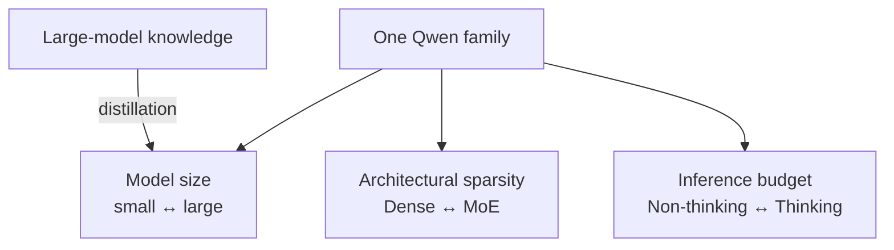

# Qwen deep dive: one family across scales and reasoning modes

[中文](qwen.md) · **English**

> Reading time: ~9 min · Type: model family deep dive · Last reviewed: 2026-09

  
Core question<strong>How can one family cover different budgets and workloads?</strong>

  
Main components<strong>Dense / MoE · GQA · QK-norm · multilingual</strong>

  
Training line<strong>pretraining → reasoning cold start / RL → thinking-mode fusion → distillation</strong>

  
After reading<strong>separate architectural sparsity, inference-time compute, and small-model distillation</strong>

## One-sentence position

What makes Qwen3 worth studying is not that it is another decoder-only model. It treats **family design** as the object: dense and MoE variants, many sizes, thinking and non-thinking modes, long context, and multilingual capability all sit in one spectrum that users can choose by budget.

## Separate three ways to spend less compute

- **Size** sets static capacity and the basic deployment threshold.
- **MoE** lets total parameters grow faster than active computation per token, at the cost of routing and communication.
- **Thinking budget** changes how much generation compute one request may spend. It is neither MoE nor a change in parameter count.

Mixing the three makes “larger,” “sparser,” and “thinking longer” all look like the same kind of scaling.

## Three ideas worth keeping

1. **The family covers workloads, not just parameter points.** Small dense models target cheap deployment, large MoEs add capacity, and thinking mode reserves extra compute for hard problems.
2. **Thinking and non-thinking form a behavioural interface.** Qwen3 places both in one model framework, so a user can switch budget by task. Evaluation must report quality, length, and latency for each mode.
3. **Distillation connects the family internally.** Knowledge and reasoning traces from large models can train smaller ones, so sizes are no longer isolated training runs.

## Trade-offs

| Choice | What it buys | What it costs |
| --- | --- | --- |
| Dense and MoE product line | One ecosystem across cost bands | More complex training, serving, and evaluation matrix |
| Thinking mode | More test-time compute for hard problems | Different latency, token cost, and output stability |
| Multilingual expansion | Wider language coverage and transfer | Harder data balance and long-tail evaluation |
| In-family distillation | Small models inherit part of large-model capability | The ceiling and biases depend on the teacher and data |

## How I would use the family

Qwen is useful when the research question includes a **dynamic compute budget**. The same task can compare dense against MoE and thinking against non-thinking. The discipline is not to report accuracy alone: also record generated tokens, latency, active parameters, and failure types.

## Self-check

- How is MoE sparsity fundamentally different from letting thinking mode run longer?
- Why must the evaluation protocol change when the same model switches modes?
- What does distillation give a model family, and which teacher biases can it propagate?
- If a small model approaches a large model on a benchmark, which cost and generalisation dimensions still matter?

## Primary sources

- [Qwen3 Technical Report](https://arxiv.org/abs/2505.09388)
- [Official Qwen3 code and models](https://github.com/QwenLM/Qwen3)
