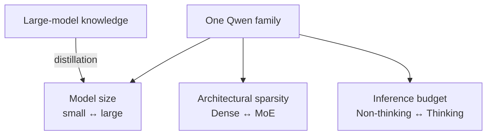

# Qwen deep dive: one family across scales and reasoning modes

[中文](qwen.md) · **English**

> Reading time: ~9 min · Type: model family deep dive · Last reviewed: 2026-10

  
Core question<strong>How can one family cover different budgets and workloads?</strong>

  
Main components<strong>Dense / MoE · GQA · QK-norm · multilingual</strong>

  
Training line<strong>four-stage large-model post-training; a separate strong-to-weak distillation route</strong>

  
After reading<strong>separate architectural sparsity, inference-time compute, and small-model distillation</strong>

Qwen 1–2.5 tokenizer, GQA, data, and post-training changes are covered in the [early-version walkthrough](qwen-early.en.md). This article follows Qwen3 through public Qwen3.8 releases, distinguishing checkpoints, hosted APIs, and complete training recipes. Version checks below are dated 2026-10-08.

## One-sentence position

What makes Qwen3 worth studying is not that it is another decoder-only model. It treats **family design** as the object: dense and MoE variants, many sizes, thinking and non-thinking modes, long context, and multilingual capability all sit in one spectrum that users can choose by budget.

Mode switching here mainly refers to the original Qwen3 hybrid checkpoints. Check the exact model: [Qwen3-235B-A22B-Instruct-2507](https://huggingface.co/Qwen/Qwen3-235B-A22B-Instruct-2507), for example, only supports non-thinking. The family name alone does not establish a shared interface.

## Separate three ways to spend less compute

```mermaid
flowchart TD
    A["One Qwen family"] --> B["Model size<br/>small ↔ large"]
    A --> C["Architectural sparsity<br/>Dense ↔ MoE"]
    A --> D["Inference budget<br/>Non-thinking ↔ Thinking"]
    E["Large-model knowledge"] -->|distillation| B
```

- **Size** sets static capacity and the basic deployment threshold.
- **MoE** lets total parameters grow faster than active computation per token, at the cost of routing and communication.
- **Thinking budget** changes how much generation compute one request may spend. It is neither MoE nor a change in parameter count.

Mixing the three makes “larger,” “sparser,” and “thinking longer” all look like the same kind of scaling.

## Three ideas worth keeping

1. **The family covers workloads, not just parameter points.** Small dense models target cheap deployment, large MoEs add capacity, and thinking mode reserves extra compute for hard problems.
2. **Original hybrid checkpoints support mode switching.** This is a checkpoint-specific interface, not a permanent promise for every family member. Report quality, length, and latency separately by mode.
3. **Distillation connects the family internally.** Knowledge and reasoning traces from large models can train smaller ones, so sizes are no longer isolated training runs.

## Trade-offs

| Choice | What it buys | What it costs |
| --- | --- | --- |
| Dense and MoE product line | One ecosystem across cost bands | More complex training, serving, and evaluation matrix |
| Thinking mode | More test-time compute for hard problems | Different latency, token cost, and output stability |
| Multilingual expansion | Wider language coverage and transfer | Harder data balance and long-tail evaluation |
| In-family distillation | Small models inherit part of large-model capability | The ceiling and biases depend on the teacher and data |

## Not every size follows the same training route

The [Qwen3 report, §4](https://arxiv.org/html/2505.09388v1#S4), describes four large-model stages: long-CoT cold start, reasoning RL, thinking-mode fusion, and general RL. Smaller models use strong-to-weak distillation, not a universal fifth stage.

Suppose the student has generated an imperfect prefix. Imitating a prewritten teacher response differs from querying the teacher on **the student's own prefix**. These correspond to the off-policy and on-policy distinction here. What matters is who generated the training context, not whether the teacher is deployed as an online service.

## Qwen3.5: recurrent state versus full history

For [Qwen3.5-397B-A17B](https://huggingface.co/Qwen/Qwen3.5-397B-A17B), the official layout repeats three Gated DeltaNet layers and one Gated Attention layer, with a vision encoder. Its MoE has 512 routed experts, activating ten plus one shared expert per token. These are model-specific numbers.

A recurrent state compresses history into a fixed-shape matrix; full attention still accesses historical KV. Combining them does not make the entire cache constant-size or full-sequence computation linear. Single-step decode and whole-sequence prefill also need separate accounting.

Updating memory along a key direction is not interference-free record deletion. Similar keys can be affected together. The [Gated DeltaNet derivation and numerical example](../deep-dives/gated-deltanet.en.md) works through this limitation and separates model parameters from forward-pass state.

## 2026 update: Qwen3.8 is not one uniform architecture

This table summarizes official model cards checked on 2026-10-08. Bind deployment settings to a checkpoint revision and inference-engine version.

| Public model | Token mixer / FFN | Input and deployment boundary |
| --- | --- | --- |
| [Qwen3.8-27B](https://huggingface.co/Qwen/Qwen3.8-27B) | Repeated 3 Gated DeltaNet + 1 Gated Attention layout; dense FFN | Public vision-language model, not renamed text-only Qwen3 |
| [Qwen3.8-2.4T-A95B](https://huggingface.co/Qwen/Qwen3.8-2.4T-A95B) | Related hybrid attention with MoE; 2.4T total, 95B active | Public weights are text-only; hosted Max's vision and built-in tools are not all properties of these weights |
| [Qwen3.8-Flash-Next](https://huggingface.co/Qwen/Qwen3.8-Flash-Next) | Gated DeltaNet + QSA, gated residuals, n-gram embeddings, and MoE | QSA selects micro-blocks rather than V3.2 DSA's individual positions; the card calls it an architecture preview |

The 27B model still has full-attention layers, so hybrid recurrence does not imply constant total history storage. Active parameters in the 2.4T model describe a per-token computational subset, not permission to omit other weights from memory budgets. Flash-Next adds n-gram table storage and reads too.

### Why is 6B not Flash-Next's complete resource budget?

Its card separates a 125B body, 51B n-gram embeddings, and 4B MTP, totaling roughly 180B, with about 6B active in the body per token. These numbers answer different questions:

- 6B describes the principal active computation, not all resident weights or communication.
- Table lookups do not execute a 51B-parameter dense matmul per token, but still require storage, transfers, and caching.
- MTP training and inference use must be accounted for separately. Having the module does not guarantee faster decoding.

A rough BF16 raw-weight estimate is 180B × two bytes, about 360 GB. Quantization, offloading, sharing, and buffers change actual requirements; this is not a deployable GPU-memory plan.

The QSA card specifies a budget of 512 micro-blocks, or 2,048 tokens. At a 32,768-token context, main read-pair counts are roughly 1/16 of dense attention. Indexing, block access, MoE, and recurrent updates remain, so this is **not a 16× model speedup**. Its depth gating is not automatically [Block AttnRes](../deep-dives/attention-residuals.en.md), nor is every hashed n-gram scheme [Engram](../deep-dives/engram.en.md). Similar motivations do not establish identical implementations.

### How should we interpret model-card scores?

Align harness, tool permissions, context, output budget, sample count, and benchmark revision first. The 27B card notes corrected coding tasks and re-evaluated baselines; the 2.4T page also reports hosted Max results. Downloading weights and running an arbitrary script does not establish the same evaluation conditions.

For a useful local comparison, fix a task set and record success, failure categories, total generated tokens, tool calls, and latency. Architecture helps explain costs but cannot replace measurement. We have not rerun these model benchmarks, and model cards do not disclose every training datum or recipe.

## How I would use the family

Qwen is useful when the research question includes a **dynamic compute budget**. The same task can compare dense against MoE and thinking against non-thinking. The discipline is not to report accuracy alone: also record generated tokens, latency, active parameters, and failure types.

## Self-check

- How is MoE sparsity fundamentally different from letting thinking mode run longer?
- Why must the evaluation protocol change when the same model switches modes?
- What does distillation give a model family, and which teacher biases can it propagate?
- If a small model approaches a large model on a benchmark, which cost and generalisation dimensions still matter?

## Primary sources

- [Qwen3 Technical Report](https://arxiv.org/abs/2505.09388)
- [Official Qwen3 code and models](https://github.com/QwenLM/Qwen3)
- [Gated Delta Networks](https://arxiv.org/abs/2412.06464)
